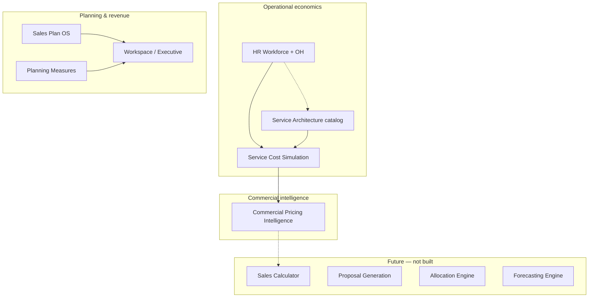
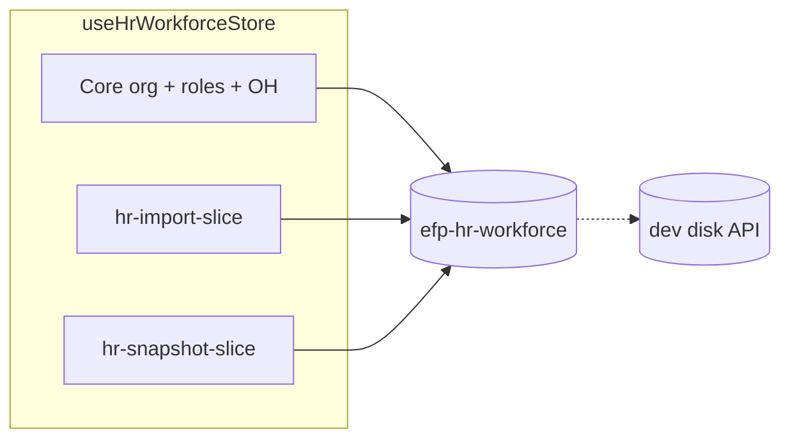
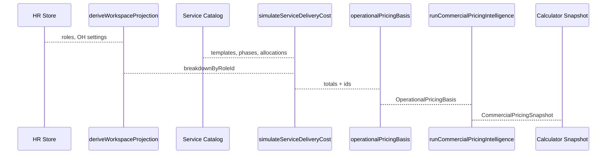

# Platform Architecture Master Report

**Project:** Enterprise Forecast Platform (`enterprise-forecast-platform`)  
**Stack:** Next.js 15 (App Router) · React 19 · TypeScript · Zustand · next-intl · Vitest · Tailwind · Supabase (scaffolded, not primary data plane)  
**Report date:** 2026-05-16  
**Status:** Single source of truth for **current implemented state** — not a roadmap-only document.

**Companion docs (deeper module focus):**

| Document | Scope |
|----------|--------|
| `docs/SALES-PLAN-OS-FULL.md` | Sales Plan OS |
| `docs/HR-WORKFORCE-MODULE.md` | HR module |
| `docs/hr-workforce-slice-import.md` | HR import slice |
| `docs/hr-workforce-slice-snapshot.md` | HR snapshot slice |
| `SERVICE_COST_SIMULATION_ARCHITECTURE.md` | Operational cost simulation |
| `COMMERCIAL_PRICING_INTELLIGENCE_ARCHITECTURE.md` | Commercial pricing intelligence |
| `SERVICE_ARCHITECTURE_VALIDATION_REPORT.md` | Service catalog stress validation |
| `docs/service-architecture-import-foundation.md` | Service catalog import rows |

**Governance & vision (platform evolution — target state vs as-built):**

| Document | Scope |
|----------|--------|
| `docs/MASTER_VISION.md` | North star, maturity ladder, capability map |
| `docs/RAW_FOUNDER_VISION.md` | Raw founder intent (canonical) |
| `docs/PLATFORM_PRINCIPLES.md` | Non-negotiable design rules |
| `docs/GOVERNANCE_RULES.md` | Change control, versioning, test gates |
| `docs/SYSTEM_BOUNDARIES.md` | IS / IS NOT per layer |
| `docs/DATA_OWNERSHIP.md` | Source of truth; Organization vs HrBusinessUnit |
| `docs/MULTI_TENANT_ARCHITECTURE.md` | SaaS tenant isolation and migration |
| `docs/PERMISSION_ARCHITECTURE.md` | RBAC and BU-scoped capabilities |
| `docs/KPI_ENGINE_ARCHITECTURE.md` | KPI governance and measure convergence |
| `docs/EVENT_SYSTEM_ARCHITECTURE.md` | Domain events, outbox, integrations |
| `docs/AI_ORCHESTRATION_VISION.md` | Reactive / proactive / executive AI |
| `docs/FUTURE_MODULES.md` | Calculator, CRM, incentives, proposals, workflow |
| `docs/IMPLEMENTATION_PHASES.md` | Phased roadmap + architecture audit checklist |
| `docs/PHASE_1_AUDIT.md` | Phase 1 pre-implementation audit (tenant spine) |
| `docs/PHASE_1_POST_IMPLEMENTATION_AUDIT.md` | Phase 1 pass/fail vs governance; Phase 2 prerequisites |
| `supabase/migrations/005_hr_workforce_catalog.sql` | Phase 1 HR catalog JSONB + RLS |
| `docs/PHASE_2_ARCHITECTURE.md` | Phase 2 target persistence (HR + service JSONB catalogs) |
| `docs/PHASE_2_MIGRATION_STRATEGY.md` | Phase 2 staged migration, dual-write, rollback |
| `docs/PHASE_2_API_PLAN.md` | Phase 2 org-scoped catalog API contract |
| `docs/PHASE_2_RLS_TEST_PLAN.md` | Phase 2 live RLS + API isolation tests |
| `docs/PHASE_2_STATE_MANAGEMENT_PLAN.md` | Phase 2 Zustand namespacing, hydrate, org switch |

---

# 1. Executive Platform Overview

## 1.1 Vision

The platform is an **enterprise planning and economics control tower** for agencies / multi-BU operators. It combines:

- **Executive & workbook planning** (demo workspace: companies, revenue streams, scenarios, tier matrices)
- **Sales Plan OS** (structured revenue / opportunity / tier modeling with wizard UX)
- **HR Workforce** (org structure, role economics, OH loading, imports, snapshots, intelligence)
- **Service Architecture** (operational service blueprints — not e-commerce)
- **Service Cost Simulation** (OH-loaded delivery cost from structure + allocations)
- **Commercial Pricing Intelligence** (price guidance from operational cost — not quotations)

Data today is predominantly **client-side persisted** (Zustand + `localStorage`), with **optional dev disk mirror** for HR and **Supabase** packages present for future backend auth/data.

## 1.2 Current maturity

| Area | Maturity | Notes |
|------|----------|--------|
| HR Workforce | **Production-shaped** | Full org model, engines, import dry-run, snapshots with version stamps, intelligence dashboard, hybrid persist |
| Service Architecture | **Foundation complete** | Catalog CRUD, matrix, cost + commercial layers |
| Sales Plan OS | **Feature-rich client** | Wizard store, engine tests, workspace append |
| Executive / Planning | **Demo + measures layer** | Unified measure catalog feeding executive dashboard |
| Backend / multi-user | **Early** | Supabase client/server helpers; primary state is local |
| Quotation / Calculator | **Deferred by design** | Adapters only (`ServiceCatalogSelection`, pricing snapshots) |

## 1.3 Architecture direction



**Core principle:** **Operational cost ≠ commercial price ≠ sales proposal.** Each layer has pure engines and thin UI orchestration.

---

# 2. Full Module Map

## 2.1 Module summary table

| Module | Purpose | Primary routes | Stores | Pure engines / libs | Upstream deps | Downstream consumers |
|--------|---------|----------------|--------|-------------------|---------------|----------------------|
| **Executive workspace** | Company/scenario KPIs, charts | `/`, `/forecasts`, `/scenarios`, `/pipeline`, `/grid` | `use-workspace-store` | `evaluateExecutiveWorkspaceMeasures`, `workbook-engine`, `calculations/*` | Demo seed data | Dashboard UI |
| **Sales Plan OS** | Revenue planning wizard | `/sales-plan` | `use-sales-plan-wizard-store` | `lib/sales-plan/*`, measure bridge | Workspace (optional save) | Executive measures |
| **HR Workforce** | Org, roles, OH, cost | `/hr-workforce/*` | `use-hr-workforce-store` | `workforce-cost-engine`, `oh-engine`, `selectors` | — | Service cost sim, intelligence |
| **Workforce Intelligence** | Alerts, segments, OH scenarios | `/hr-workforce/intelligence` | HR store (read) | `derive-workforce-intelligence` | `deriveHrWorkforceModel` | Intelligence UI |
| **Service Architecture** | Service blueprints | `/service-architecture/*` | `use-service-architecture-store` | `validation`, `selectors`, `import-plan` | HR (`businessUnitId`, `jobRoleId`) | Cost + commercial UIs |
| **Service Cost Simulation** | Operational delivery cost | `/service-architecture/cost-intelligence` | Catalog + `use-service-cost-simulation-prefs-store` | `simulateServiceDeliveryCost` | HR projection + catalog | Commercial pricing |
| **Commercial Pricing** | Price / margin intelligence | `/service-architecture/commercial-pricing` | `use-commercial-pricing-prefs-store` | `runCommercialPricingIntelligence` | Cost simulation basis | Future calculator adapter |
| **Planning API** | Matrix/import/export (server) | `/api/planning/*` | — | Route handlers | Workspace | External tooling |
| **Assistant** | AI route stub | `/assistant`, `/api/assistant` | — | API route | — | Chat UI |

## 2.2 Sales Planning module

**Why it exists:** Model portfolio revenue, opportunity tiers, fixed costs, and service mix in a structured wizard aligned to workbook thinking.

**Responsibilities:**

- Multi-step wizard UX (`SalesPlanWizard`)
- Persisted wizard state (`efp-sales-plan-wizard`)
- Build structured `SalesPlanModel` (`build-model.ts`)
- Run sales calculations (`engine.ts`)
- Optional **Save to workspace** (`appendSalesPlanSnapshot` on `use-workspace-store`)
- Bridge KPIs into planning measures (`sales-plan-measure-bridge.ts`)

**Key files:**

- `src/components/sales-plan/sales-plan-wizard.tsx`
- `src/stores/use-sales-plan-wizard-store.ts`
- `src/lib/sales-plan/build-model.ts`, `engine.ts`, `weighted-adv.ts`
- `src/types/sales-plan.ts`

**Integrations:** `use-workspace-store`, `lib/planning/measures/*`

**Not:** CRM pipeline execution, invoicing, or service delivery costing.

## 2.3 HR Workforce Planning module

**Why it exists:** Canonical **workforce economics** and **OH rate** per business unit; feeds all loaded-hourly downstream math.

**Responsibilities:**

- Org: `HrBusinessUnit` → `HrDepartment` → `HrTeam` → `JobRole`
- Per-role cost breakdown (`computeRoleCostBreakdown`, `computeAllRoleBreakdowns`)
- Per-BU OH manual settings + composed numerator (`resolveOhAnnualNumerator`)
- Import: parse → map columns → dry-run → apply deltas
- Snapshots: versioned JSON payloads with `engineVersion` / `formulaVersion`
- Demo seed + reset module
- Dev hybrid persist (localStorage + optional disk API)

**Key files:**

- `src/stores/use-hr-workforce-store.ts` (composes `hr-import-slice`, `hr-snapshot-slice`)
- `src/stores/hr-workforce/hr-workforce-store-types.ts`
- `src/lib/hr-workforce/*` (engines, import, migration, projection)
- `src/types/hr-workforce.ts`

**Pages:** See §4.

## 2.4 Workforce Intelligence layer

**Why it exists:** Operational **insights** on top of the same `HrWorkforceDerived` projection — alerts, segments, OH stress scenarios — without duplicating cost math.

**Key files:**

- `src/lib/hr-workforce/intelligence/derive-workforce-intelligence.ts`
- `src/lib/hr-workforce/intelligence/workforce-alerts.ts`
- `src/lib/hr-workforce/intelligence/oh-scenarios.ts`
- `src/components/hr-workforce/hr-workforce-intelligence-view.tsx`

**Depends on:** `deriveWorkspaceProjection` / `deriveHrWorkforceModel`

## 2.5 OH engine & economics

**Why it exists:** Convert annual overhead + billable FTE + calendar assumptions into **`ohRatePerHour`** applied to roles.

**Formula chain** (`src/lib/hr-workforce/oh-engine.ts`):

1. Annual hours/employee = days/week × hours/day × weeks/year  
2. Net available = annual − off-days hours  
3. Billable hours/year = net × utilization × billable headcount  
4. **OH rate/hour = total annual overhead ÷ billable hours/year**

**Role hourly** (`workforce-cost-engine.ts`):

- `standardHourlyCost` = loaded monthly role cost ÷ (monthly hours × headcount)  
- `ohAdjustedHourlyCost` = standard + `ohRatePerHour` (with optional skip for non-billable under composed OH)

**Per-BU:** `deriveHrWorkforceModel` builds `ohByBusinessUnitId` map; each role uses its `businessUnitId`.

## 2.6 Service Architecture module

**Why it exists:** **Operational service blueprints** — families, templates, tiers, phases, deliverables, role allocations — not product catalog / cart.

**Entity chain:**

```
ServiceFamily
  → ServiceTier (scoped to family)
  → ServiceTemplate (one family + one businessUnitId)
  → ServiceTemplateTier (which tiers this template offers)
  → ServiceTemplateTierPhase (ordered global DeliveryPhase)
  → ServiceDeliverable (optional, per phase row)
  → ServiceRoleAllocation (jobRoleId + hours, per phase row)
```

**Store:** `use-service-architecture-store.ts` — persist key `efp-service-architecture-v1`

**Key libs:** `src/lib/service-architecture/validation.ts`, `selectors.ts`, `import-plan.ts`, `demo-seed.ts`

**BU rule:** Templates store `businessUnitId`; matrix UI filters roles where `role.businessUnitId === template.businessUnitId`; allocations use stable `jobRoleId`.

## 2.7 Service Cost Simulation layer

**Why it exists:** Deterministic **operational delivery cost** from catalog + HR hourly economics.

**Engine:** `simulateServiceDeliveryCost` (`src/lib/service-cost-simulation/engine.ts`)

**Inputs:** Catalog slice, roles, `breakdownByRoleId` (from `deriveWorkspaceProjection`), template id, tier id, operational assumptions, delivery scenario modifiers.

**Outputs:** Phase blocks, role rollups, deliverable shares, totals (direct, loaded, OH contribution), warnings.

**Prefs store:** `efp-service-cost-simulation-prefs-v1`

**Not:** Sell price, quotes, profitability optimization.

## 2.8 Commercial Pricing Intelligence layer

**Why it exists:** Transform **OH-loaded operational cost** into **suggested commercial price** + margin analytics.

**Engine:** `runCommercialPricingIntelligence` (`src/lib/commercial-pricing-intelligence/engine.ts`)

**Models:** cost_plus, value_based, retainer_oriented, strategic_account, market_penetration, premium_positioning

**Stacks:** model anchor × commercial risk presets × commercial scenario presets

**Prefs store:** `efp-commercial-pricing-prefs-v1`

**Adapter:** `toCommercialPricingSnapshot` → future Sales Calculator

**Not:** Quotation PDFs, CRM, invoicing.

## 2.9 Import systems (cross-cutting)

| System | Entry | Preview-first | Persisted output |
|--------|-------|---------------|------------------|
| HR import | `/hr-workforce/import` | `importSessionRunDryRun` → `ImportPlanResult` | Applies deltas to HR store |
| Service catalog import | Lib only (`buildServiceCatalogImportPlan`) | Row validation + dedupe by codes | Plan object (UI import sheet TBD) |
| Commercial preset import | Lib (`buildCommercialPricingPresetImportPreview`) | Single-row merge | Merged into prefs in UI |
| Service cost assumptions | `buildServiceCostAssumptionImportPreview` | JSON array | Merged assumptions |
| Planning import | `POST /api/planning/import` | Server route | Workspace/planning |

## 2.10 Snapshot systems

| System | Version fields | Storage |
|--------|----------------|---------|
| HR snapshots | `engineVersion`, `formulaVersion` on payload v2 | Inside `efp-hr-workforce` → `snapshots[]` |
| Service architecture | Per-entity `version`, `lifecycle` on catalog rows | `efp-service-architecture-v1` |
| Sales Plan | Wizard state versioning implicit in store shape | `efp-sales-plan-wizard` |

HR restore: `parseHrSnapshotPayload` → `validateHrSnapshotRestore` (`snapshot-restore.ts`) with warnings if snapshot versions newer than app (`HR_WORKFORCE_ENGINE_VERSION`, `HR_WORKFORCE_FORMULA_VERSION` = **1**).

## 2.11 Calculation engines (inventory)

| Engine | Path | Pure? |
|--------|------|-------|
| Workforce cost | `lib/hr-workforce/workforce-cost-engine.ts` | Yes |
| OH rate | `lib/hr-workforce/oh-engine.ts` | Yes |
| OH numerator | `lib/hr-workforce/oh-numerator.ts` | Yes |
| HR derived model | `lib/hr-workforce/selectors.ts` → `deriveHrWorkforceModel` | Yes |
| Workspace projection | `lib/hr-workforce/workspace-projection.ts` | Thin wrapper |
| Workforce intelligence | `lib/hr-workforce/intelligence/derive-workforce-intelligence.ts` | Yes |
| Sales plan | `lib/sales-plan/engine.ts` | Yes |
| Workbook / tier lines | `lib/planning/workbook-engine.ts` | Yes |
| Executive measures | `lib/planning/measures/executive-workspace-measures.ts` | Yes |
| Forecast demo series | `lib/calculations/engine.ts`, `pipeline.ts` | Yes |
| Service cost simulation | `lib/service-cost-simulation/engine.ts` | Yes |
| Commercial pricing | `lib/commercial-pricing-intelligence/engine.ts` | Yes |
| Service catalog import plan | `lib/service-architecture/import-plan.ts` | Yes |

## 2.12 Adapters & bridges

| Adapter | From → To | File |
|---------|-----------|------|
| `ServiceCatalogSelection` | Stable template + tier ids | `lib/service-architecture/sales-plan-bridge.ts` |
| `operationalPricingBasisFromSimulation` | Cost success → pricing basis | `lib/commercial-pricing-intelligence/operational-basis.ts` |
| `buildServiceCostSimulationInput` | HR projection + catalog → sim input | `lib/service-cost-simulation/hr-input.ts` |
| `toServiceCostBaselineSnapshot` | Cost success → Sales Plan handoff | `lib/service-cost-simulation/sales-plan-cost-adapter.ts` |
| `toCommercialPricingSnapshot` | Pricing success → Calculator handoff | `lib/commercial-pricing-intelligence/sales-calculator-adapter.ts` |
| `mapSalesPlanModelToMeasureValues` | Sales plan → measure layer | `lib/planning/measures/sales-plan-measure-bridge.ts` |
| `useServiceCostCatalogSlice` | Zustand arrays → stable catalog slice | `src/hooks/use-service-cost-catalog-slice.ts` |

---

# 3. Routing & Navigation Map

## 3.1 Locale structure

- **Locales:** `en`, `ar` (`src/i18n/routing.ts`, `localePrefix: "always"`)
- **URLs:** `/{locale}/...` e.g. `/en/hr-workforce`, `/ar/service-architecture/templates`
- **Navigation:** `@/i18n/navigation` (`Link`, `usePathname`, `useRouter`)
- **Messages:** `messages/en.json`, `messages/ar.json` (namespaces: `nav`, `shell`, `hrWorkforce`, `serviceArchitecture`, `dashboard`, …)

## 3.2 App shell sidebar (`src/components/layout/app-shell.tsx`)

| Nav key | Path prefix | Icon |
|---------|-------------|------|
| Executive | `/` | LayoutDashboard |
| Companies | `/companies` | Building2 |
| Forecasts | `/forecasts` | LineChart |
| Scenarios | `/scenarios` | BarChart3 |
| Pipeline | `/pipeline` | Workflow |
| Sales plan OS | `/sales-plan` | Target |
| HR workforce | `/hr-workforce` | Users2 |
| Service architecture | `/service-architecture` | Layers |
| Forecast matrix | `/grid` | Grid3x3 |
| AI assistant | `/assistant` | MessageSquare |
| Settings | `/settings` | Settings2 |

**Active matching:** Special cases for `/`, `/sales-plan`, `/hr-workforce`, `/service-architecture` prefix.

## 3.3 Command palette (`src/components/command-menu.tsx`)

Same links as sidebar (no service-architecture sub-routes listed individually — lands on module root).

## 3.4 HR Workforce subnav (`hr-workforce-subnav.tsx`)

| Tab | Route |
|-----|-------|
| Overview | `/hr-workforce` |
| Intelligence | `/hr-workforce/intelligence` |
| Roles | `/hr-workforce/roles` |
| Settings (org) | `/hr-workforce/settings` |
| Import | `/hr-workforce/import` |

**Layout extras:** `HrWorkforcePersistBar` (disk mirror status / dev controls).

## 3.5 Service Architecture subnav

| Tab | Route |
|-----|-------|
| Families | `/service-architecture` |
| Templates | `/service-architecture/templates` |
| Phases | `/service-architecture/phases` |
| Deliverables | `/service-architecture/deliverables` |
| Role matrix | `/service-architecture/role-allocation-matrix` |
| Cost intelligence | `/service-architecture/cost-intelligence` |
| Commercial pricing | `/service-architecture/commercial-pricing` |

## 3.6 Route tree (dashboard)

```
src/app/[locale]/(dashboard)/
├── layout.tsx                    → AppShell
├── page.tsx                      → Executive overview
├── companies/page.tsx
├── forecasts/page.tsx
├── scenarios/page.tsx
├── pipeline/page.tsx
├── grid/page.tsx
├── sales-plan/page.tsx
├── assistant/page.tsx
├── settings/page.tsx
├── hr-workforce/
│   ├── layout.tsx
│   ├── page.tsx                  → Dashboard view
│   ├── intelligence/page.tsx
│   ├── roles/page.tsx            → Operational workspace (roles grid)
│   ├── settings/page.tsx         → Organization (BU/dept/team)
│   └── import/page.tsx
└── service-architecture/
    ├── layout.tsx
    ├── page.tsx                  → Families
    ├── templates/page.tsx
    ├── phases/page.tsx
    ├── deliverables/page.tsx
    ├── role-allocation-matrix/page.tsx
    ├── cost-intelligence/page.tsx
    └── commercial-pricing/page.tsx
```

**Auth:** `src/app/[locale]/login/page.tsx` exists; dashboard routes are not deeply gated in reviewed code (product may add middleware later).

---

# 4. Full Page Inventory

## 4.1 Executive & planning pages

| Route | Component | Data sources | Stores | Engines / libs | Outputs / UI |
|-------|-----------|--------------|--------|------------------|--------------|
| `/{locale}` | Inline in `page.tsx` | Demo companies, streams, scenarios | `use-workspace-store` | `evaluateExecutiveWorkspaceMeasures`, Recharts | KPI cards, revenue/OPEX charts, measure strip |
| `/{locale}/companies` | Companies management | Demo companies | `use-workspace-store` | — | Company list/edit |
| `/{locale}/forecasts` | Forecasts table | `buildDemoForecastSeries` | `use-workspace-store` | `calculations/engine` | Monthly revenue/OPEX table |
| `/{locale}/scenarios` | Scenarios UI | Demo scenarios | `use-workspace-store` | Scenario apply helpers | Scenario comparison |
| `/{locale}/pipeline` | Pipeline view | Demo opportunities | `use-workspace-store` | `calculations/pipeline` | Pipeline metrics |
| `/{locale}/grid` | Planning workbook panel | Streams, tier overrides | `use-workspace-store` | `workbook-engine` | Tier matrix grid |
| `/{locale}/settings` | Settings | Workspace + UI | `use-workspace-store`, `use-ui-store` | — | App preferences |

## 4.2 Sales Plan

| Route | Component | Stores | Engines | Notes |
|-------|-----------|--------|---------|-------|
| `/{locale}/sales-plan` | `SalesPlanWizard` (dynamic, no SSR) | `use-sales-plan-wizard-store` | `build-model`, `engine`, measure bridge | Multi-step wizard; charts via `sales-plan-charts.tsx` |

## 4.3 HR Workforce

| Route | Component | Stores | Engines | Notes |
|-------|-----------|--------|---------|-------|
| `/{locale}/hr-workforce` | `HrWorkforceDashboardView` | `use-hr-workforce-store` | `deriveHrWorkforceModel`, aggregates | KPIs + charts |
| `.../intelligence` | `HrWorkforceIntelligenceView` | HR store | `deriveWorkforceIntelligence` | Alerts, segments, OH scenarios, org distribution chart |
| `.../roles` | `HrWorkforceOperationalWorkspace` | HR store | `deriveWorkspaceProjection`, role analytics | Expandable BU/dept/team/role tree, compensation dialog |
| `.../settings` | `HrWorkforceOrganizationView` | HR store | — | **Create/edit Business Units**, departments, teams |
| `.../import` | `HrWorkforceImportView` | HR store + import slice | `import-parser`, `import-dry-run` | Column map, dry-run, apply |

## 4.4 Service Architecture

| Route | Component | Stores | Engines | Notes |
|-------|-----------|--------|---------|-------|
| `.../service-architecture` | `ServiceFamiliesView` | Service + HR (seed) | `demo-seed`, `resetServiceArchitecture` | Families, tiers, **Load sample** / **Clear catalog** |
| `.../templates` | `ServiceTemplatesView` | Service + HR BUs | `validateTemplateTierFamilyConsistency` | **BU dropdown from HR** |
| `.../phases` | `ServicePhasesView` | Service store | `getTemplateTierPhasesOrdered` | Global phases + assign to template×tier |
| `.../deliverables` | `ServiceDeliverablesView` | Service store | — | Deliverables per phase row |
| `.../role-allocation-matrix` | `ServiceRoleAllocationMatrixView` | Service + HR roles | `getJobRolesForTemplateBusinessUnit` | Hours per role per phase |
| `.../cost-intelligence` | `ServiceCostIntelligenceView` | Service, HR, cost prefs | `simulateServiceDeliveryCost` | Phase/role/deliverable cost, tier compare |
| `.../commercial-pricing` | `CommercialPricingIntelligenceView` | Above + commercial prefs | `runCommercialPricingIntelligence` | Waterfall, margins, sensitivity, strategy compare |

## 4.5 Other

| Route | Purpose |
|-------|---------|
| `/{locale}/assistant` | Assistant UI → `/api/assistant` |
| `/{locale}/login` | Login shell |

---

# 5. Database & Persistence Architecture

## 5.1 Persistence model (current)

**Primary:** Browser **`localStorage`** via Zustand `persist` middleware.  
**Secondary (dev):** HR hybrid mirror to `.data/hr-workforce-state.json` via `PUT/GET /api/dev/hr-workforce-disk`.  
**Future:** Supabase clients in `src/lib/supabase/*` — not the source of truth for module state today.

## 5.2 Persist keys

| Key | Store file | Partialize / notes |
|-----|--------------|-------------------|
| `efp-hr-workforce` | `use-hr-workforce-store.ts` | Org, roles, settings, OH map, snapshots, import logs; **not** import session UI |
| `efp-service-architecture-v1` | `use-service-architecture-store.ts` | Full catalog arrays |
| `efp-service-cost-simulation-prefs-v1` | `use-service-cost-simulation-prefs-store.ts` | Assumptions + scenario id |
| `efp-commercial-pricing-prefs-v1` | `use-commercial-pricing-prefs-store.ts` | Model, risks, scenario, thresholds |
| `efp-sales-plan-wizard` | `use-sales-plan-wizard-store.ts` | Wizard steps / model draft |
| `efp-workspace` | `use-workspace-store.ts` | Companies, streams, scenarios, tier overrides |
| UI (typical) | `use-ui-store.ts` | Sidebar, command palette — check file for persist |

## 5.3 HR store composition



- **`applyImportDeltas`:** Remains in main store file (mutates entities after dry-run).
- **Import session:** Ephemeral (slice state not in `partialize`).
- **Rehydrate:** `normalizePersistedState` + `hr-workforce-persist-migrate.ts` on load.

## 5.4 Service architecture rehydrate

`normalizeCatalogState` bumps `updatedAt` on merge — be aware for audit semantics (see risks §16).

## 5.5 Derived projection flow (HR → consumers)

```
useHrWorkforceStore (raw entities)
  → deriveHrWorkforceModel / deriveWorkspaceProjection
    → breakdownByRoleId, ohByBusinessUnitId, dashboard aggregates
      → HR UI / Intelligence
      → buildServiceCostSimulationInput → simulateServiceDeliveryCost
        → operationalPricingBasisFromSimulation
          → runCommercialPricingIntelligence
```

**Hook:** `useServiceCostCatalogSlice` avoids Zustand infinite loop by selecting arrays then `useMemo` for catalog slice.

---

# 6. Domain Model Documentation

## 6.1 HR domain (`src/types/hr-workforce.ts`)

| Entity | Key fields | Relationships | BU boundary |
|--------|------------|---------------|-------------|
| `HrBusinessUnit` | `id`, `name`, `code`, `isActive` | Parent of departments | **Root isolation key** |
| `HrDepartment` | `businessUnitId` | → teams, roles | Must match BU |
| `HrTeam` | `departmentId` | Optional layer (`useTeamLevel`) | Via department |
| `JobRole` | `businessUnitId`, `departmentId`, compensation fields, `operationalRoleType` | → cost breakdown | **Stable id for service allocations** |
| `OhManualSettings` | billable FTE source, utilization, lines | Per BU in `ohManualByBusinessUnitId` | Per BU |
| `HrGlobalSettings` | working calendar, `defaultCurrency` | Workspace-wide | — |
| `RoleCostBreakdown` | `standardHourlyCost`, `ohAdjustedHourlyCost` | Derived, not persisted as entity | Per role |

**Lifecycle:** Roles may be `archived`; depts/teams use `isActive`.

## 6.2 Service domain (`src/types/service-architecture.ts`)

| Entity | Scoped to | References |
|--------|-----------|------------|
| `ServiceFamily` | — | Has many `ServiceTier` |
| `ServiceTier` | **One** `serviceFamilyId` | Tiny/Standard/Big/Mega **per family** |
| `ServiceTemplate` | One `serviceFamilyId` + one `businessUnitId` | HR BU id |
| `ServiceTemplateTier` | Join template ↔ tier | Family consistency validated |
| `DeliveryPhase` | Global catalog | Reused across templates |
| `ServiceTemplateTierPhase` | `serviceTemplateTierId` + `deliveryPhaseId` + `sortOrder` | Ordered path |
| `ServiceDeliverable` | `serviceTemplateTierPhaseId` | Optional outputs |
| `ServiceRoleAllocation` | `serviceTemplateTierPhaseId` + **`jobRoleId`** + `allocatedHours` | HR role id only |

**Lifecycle meta:** `ServiceEntityMeta` — `draft | active | inactive | archived`, `version`, timestamps.

## 6.3 Commercial / calculator-ready (types only)

| Type | Purpose |
|------|---------|
| `OperationalPricingBasis` | Snapshot of operational costs + ids |
| `CommercialPricingSnapshot` | `ServiceCatalogSelection` + price + margins |
| `ServiceCostBaselineSnapshot` | Operational totals for Sales Plan bridge |
| `ServiceCatalogSelection` | `{ serviceTemplateId, tierId }` |

## 6.4 Sales Plan domain (`src/types/sales-plan.ts`)

Structured plan: meta, fixed costs, product/service lines, tier definitions, contribution cells — oriented to **revenue planning**, not service catalog entities (integration via future mapping, not automatic today).

## 6.5 Workspace demo domain (`src/types/domain.ts`)

`DemoCompany`, `DemoRevenueStream`, `DemoScenario`, `DemoOpportunity` — executive dashboard seed data.

---

# 7. Engine Architecture

## 7.1 HR workforce cost engine

**File:** `src/lib/hr-workforce/workforce-cost-engine.ts`

| Input | Output |
|-------|--------|
| `JobRole`, `HrGlobalSettings`, `ohRatePerHour` | `RoleCostBreakdown` |

**Key formulas:**

- Monthly loaded cost includes salary, SI, benefits annualized, additional costs, risk %  
- `standardHourlyCost = monthlyTotalCost / (monthlyWorkingHours × headcount)`  
- `ohAdjustedHourlyCost = standardHourlyCost + ohRatePerHour` (unless zeroed for non-billable under composed mode)

## 7.2 OH engine

**File:** `src/lib/hr-workforce/oh-engine.ts` — see §2.5.

**Consumer:** `deriveHrWorkforceModel` merges `HrGlobalSettings` + per-BU `OhManualSettings` + `resolveOhAnnualNumerator`.

## 7.3 Service cost simulation engine

**File:** `src/lib/service-cost-simulation/engine.ts`

| Input | Output |
|-------|--------|
| `ServiceCostSimulationInput` | `ServiceCostSimulationSuccess` \| `Failure` |

**Hour stack per allocation:**

`effectiveHours = baseHours × phaseTypeFactors × (inefficiency × coordination × management) × scenarioStack`

**Cost:**

- `directCost = effectiveHours × standardHourlyCost`  
- `loadedCost = effectiveHours × ohAdjustedHourlyCost`  
- BU mismatch → zero cost + warning (isolation)

**Deliverables:** Equal split of parent phase totals when multiple deliverables share a phase.

## 7.4 Commercial pricing engine

**File:** `src/lib/commercial-pricing-intelligence/engine.ts`

| Step | Behavior |
|------|----------|
| Model | `applyPricingModel` on `totalLoadedCost` only |
| Risks | Product of `COMMERCIAL_RISK_PRESETS` multipliers |
| Scenario | `COMMERCIAL_PRICING_SCENARIO_PRESETS` multiplier |
| Margins | `computeCommercialMargins`, `buildMarginWarnings` |

**Does not** call HR or mutate operational costs.

## 7.5 Scenario & assumptions systems

| Layer | Operational scenarios | Commercial scenarios |
|-------|----------------------|----------------------|
| File | `service-cost-simulation/scenarios.ts` | `commercial-pricing-scenarios.ts` |
| Affects | Hours / effort / coordination | Price multiplier |
| Store | `use-service-cost-simulation-prefs-store` | `use-commercial-pricing-prefs-store` |

| Assumptions | File | Affects |
|-------------|------|---------|
| Operational | `service-cost-simulation/defaults.ts` | QA/design/delivery phase hooks, wrap % |
| Commercial thresholds | `commercial-pricing-intelligence/defaults.ts` | Warning bands only |

## 7.6 Planning measures orchestration

**File:** `lib/planning/measures/executive-workspace-measures.ts`

Single evaluation path for executive KPIs — calls existing forecast/workbook/sales-plan paths; **measure catalog** defines ids, format, lineage (`measure-catalog.ts`, `measure-registry.ts`).

---

# 8. Relationship & Dependency Flows

## 8.1 Primary economics pipeline



## 8.2 HR ↔ Service Architecture (reference only)

- **BU:** Copied by id onto `ServiceTemplate.businessUnitId` at template creation (HR is master).
- **Roles:** `ServiceRoleAllocation.jobRoleId` → `JobRole.id`; UI filters by template BU.
- **No sync:** Changing HR role name does not break allocations (id-stable).

## 8.3 Sales Plan ↔ Workspace

- Wizard can **append** company/streams/scenarios to `use-workspace-store`.
- Measure bridge exposes sales plan KPIs to executive layer — **not** service catalog costs.

## 8.4 Orchestration boundaries

| Concern | Where it lives |
|---------|----------------|
| Entity CRUD | Zustand stores |
| Math | `src/lib/**` pure functions |
| Cross-module glue | `*-input.ts`, `*-adapter.ts`, hooks |
| UI | `src/components/**` |

---

# 9. Dashboard & Intelligence Documentation

## 9.1 Executive dashboard (`/`)

- **KPIs:** From `evaluateExecutiveWorkspaceMeasures` (revenue, OPEX, margin, ROI-style measures per catalog)
- **Charts:** Demo forecast series, scenario-aware
- **Insight bulbs:** Explain unified measures layer

## 9.2 HR Workforce dashboard (`/hr-workforce`)

- Headcount, operational monthly cost, delivery vs indirect split
- Department aggregates, OH load indicators
- Charts: `hr-workforce-dashboard-charts.tsx` (ECharts)

## 9.3 HR Intelligence (`/hr-workforce/intelligence`)

- **Segments:** delivery / indirect (and legacy normalization)
- **Alerts:** e.g. high indirect %, OH load vs payroll, inactive structure
- **OH scenarios:** Per-BU stress via `computeOhScenarioForBu`
- **Org distribution chart:** Headcount/cost by org slice

## 9.4 Service Cost Intelligence

- Totals: loaded, direct, OH contribution, effective hours
- Tables: by phase, by role, deliverables, tier comparison
- Assumption export/import JSON
- Sales Plan baseline JSON adapter panel

## 9.5 Commercial Pricing Intelligence

- Operational vs suggested price cards
- Model parameter editor (per model type)
- Risk toggle buttons, commercial scenario select
- Waterfall table, margin analytics, warnings
- Sensitivity on primary model parameter
- Six-model strategy comparison (default params)
- Tier price comparison (same commercial prefs)
- Family economics sample (heuristic)
- Calculator snapshot JSON

---

# 10. Import & Export Systems

## 10.1 HR import pipeline

1. Upload / parse sheet → `import-parser.ts`  
2. Column mapping → `ImportColumnKey`  
3. **Dry-run** → `buildImportPlan` in `import-dry-run.ts` (no mutations)  
4. User confirms → `applyImportDeltas`  
5. Log → `importLogs[]`

**Preview-first:** `importSessionRunDryRun` in `hr-import-slice.ts`.

## 10.2 Service catalog import

**`buildServiceCatalogImportPlan(rows)`** — wide rows required (family, tier, template, BU id, phase, deliverable per row). Dedupes by normalized **codes**. Detects tier-used-across-families and template BU drift.

**Gap:** Role allocations **not** in import plan yet.

## 10.3 Assumption / preset imports

- Service cost: `cost-assumption-import.ts` — key/value rows  
- Commercial: `import-pricing-presets.ts` — model id + JSON params + risk CSV + scenario id

## 10.4 Export patterns

- JSON download via UI (cost assumptions, calculator snapshots)  
- Planning export API: `/api/planning/export`  
- HR dev disk export: implicit via hybrid storage mirror  

---

# 11. Snapshot & Versioning Systems

## 11.1 HR snapshot payload v2

**Fields:** `businessUnits`, `departments`, `teams`, `roles`, `hrGlobalSettings`, `ohManualByBusinessUnitId`, `engineVersion`, `formulaVersion`

**Parse/migrate:** `snapshot-payload.ts` (v1 → v2 migration path)

**Restore:** `snapshot-restore.ts`

- Hard errors: invalid JSON, missing required arrays  
- Warnings: snapshot `engineVersion` / `formulaVersion` **newer than app** (constants in `workspace-versions.ts`)

## 11.2 Service catalog versioning

Per-entity `version` + `lifecycle` on each catalog row — **no** global snapshot bundle yet for service architecture.

## 11.3 Formula parity tests

- `workspace-projection.test.ts` — parity wrapper  
- `snapshot-roundtrip.test.ts`, `snapshot-restore.test.ts`  
- `persist-safety.test.ts` — hybrid storage guards  

---

# 12. Business Unit Isolation Rules

## 12.1 HR

- Every `JobRole` carries `businessUnitId` (denormalized).  
- OH settings are **per BU** (`ohManualByBusinessUnitId`).  
- `deriveHrWorkforceModel` computes OH **per BU** then maps rate to role by `role.businessUnitId`.

## 12.2 Service templates

- Exactly **one** `businessUnitId` per `ServiceTemplate`.  
- Created only via HR BU dropdown (`ServiceTemplatesView`).

## 12.3 Role allocation matrix

- `getJobRolesForTemplateBusinessUnit` — dropdown only shows roles where `role.businessUnitId === template.businessUnitId`.  
- Engine: cross-BU `jobRoleId` → **zero cost** + warning (does not block save in store — UI should prevent).

## 12.4 Commercial pricing

- Pricing basis carries `businessUnitId` for traceability.  
- Math uses aggregated operational totals — **no cross-BU mixing** if catalog and HR are consistent.

## 12.5 Future calculator

- Adapters use **stable** `serviceTemplateId` + `tierId` + `businessUnitId` in basis — calculator should reject mixing templates across BUs in one line item without explicit rules.

---

# 13. Testing Architecture

## 13.1 Runner

- **Vitest** (`npm test` → `vitest run`)  
- **32** test files observed in repo (integration of count may vary as tests added)

## 13.2 Coverage by area

| Area | Example tests |
|------|----------------|
| HR cost/OH | `workforce-cost-engine.test.ts`, `oh-engine.test.ts`, `oh-numerator.test.ts` |
| HR snapshots | `snapshot-restore.test.ts`, `snapshot-roundtrip.test.ts`, `persist-safety.test.ts` |
| HR intelligence | `derive-workforce-intelligence.test.ts` |
| HR import slice | `hr-import-slice.test.ts` |
| Service validation | `validation.test.ts`, `selectors.test.ts` |
| Service stress | `operational-stress-catalog.test.ts`, `import-stress.test.ts`, `edge-case-stress.test.ts` |
| Service cost | `engine.test.ts`, `cost-assumption-import.test.ts` |
| Commercial | `engine.test.ts`, `commercial-tier-monotonic.test.ts`, `margin-analytics.test.ts` |
| Sales plan | `engine.test.ts`, `build-model.test.ts` |
| Planning | `workbook-engine.test.ts`, `executive-workspace-measures.test.ts`, measure parity tests |
| Planning bridge | `sales-plan-bridge-parity.test.ts` |

## 13.3 Important validation logic (must stay green)

- Template–tier **family consistency**  
- BU-gated role selectors  
- Cost simulation **monotonic tier scaling** (stress catalog)  
- Commercial price monotonicity on same template (tier ladder)  
- Import **dedupe** and cross-family tier code collision detection  
- Snapshot **version warnings** on restore  

---

# 14. Current Architectural Boundaries

## 14.1 What each layer IS / IS NOT

| Layer | IS | IS NOT |
|-------|-----|--------|
| HR Workforce | Workforce economics, OH rate, org master for roles/BUs | Payroll system, GL, project time tracking |
| Service Architecture | Delivery blueprints, allocations | Product catalog, stock, cart |
| Service Cost Simulation | Internal delivery cost estimate | Quote price, invoice amount |
| Commercial Pricing | Price guidance, margin sensitivity | Proposal PDF, contract |
| Sales Plan OS | Revenue / tier planning model | Service delivery model |
| Executive workspace | Demo P&L control tower | Production ERP |
| Future Calculator | (planned) Quantity × price assembly | (not built) |

## 14.2 Intentional separations

```text
operational logic (HR + cost sim)
    ↓ read-only basis
commercial logic (pricing intelligence)
    ↓ snapshot adapters only
future calculator / proposal (not implemented)
```

**No** commercial margin logic inside `simulateServiceDeliveryCost`.  
**No** HR salary writes from service module.  
**No** service catalog mutations from pricing engine.

---

# 15. Future Planned Modules

| Module | Intended responsibility | Why deferred | Depends on |
|--------|-------------------------|--------------|------------|
| **Sales Calculator** | Template×tier pick, qty, discounts assembly, output lines | Separate product surface; adapters exist | Cost sim + commercial snapshots |
| **Sales Incentive Economics** | Comp plans tied to revenue/cost | Needs stable cost baselines | HR + sales actuals |
| **Profitability Intelligence** | Engagement-level profit over time | Needs allocation + actuals | Cost sim + calculator |
| **Allocation Engine** | FTE/capacity assignment across projects | No scheduling graph yet | HR headcount + service hours |
| **Forecasting & Capacity** | Time-phased demand vs supply | No calendar model | Allocation + pipeline |
| **Proposal Generation** | Branded quotes, terms, workflows | Explicitly out of scope | Calculator + CRM |

---

# 16. Current Risks & Technical Debt

| Risk | Severity | Description |
|------|----------|-------------|
| Client-only persistence | **High** | No multi-user source of truth; clearing browser data loses catalog |
| Service catalog rehydrate bumps `updatedAt` | **Medium** | `normalizeCatalogState` side effect on every load |
| No server-side validation of allocations | **Medium** | Cross-BU `jobRoleId` can persist if UI bypassed |
| Import gaps (service allocations) | **Medium** | Excel → hours not in `import-plan` |
| Duplicate `sortOrder` on phases | **Low** | Ordering ambiguous if users collide |
| Deliverable equal-split convention | **Low** | Not activity-based costing |
| Webpack cache EPERM (Windows) | **Low** | Dev environment file locking |
| Zustand selector object identity | **Low** | Mitigated by `useServiceCostCatalogSlice` — pattern must be repeated |
| Demo workspace vs real ERP | **Medium** | Executive pages still demo-seed heavy |
| Supabase unused for module state | **Medium** | Future migration effort |
| i18n coverage | **Low** | Some technical keys (model ids) English-only in UI |
| Family economics heuristic | **Low** | Commercial dashboard sample uses fixed cost-plus 32% |

---

# 17. Recommended Development Sequence

1. **Stabilize persistence story** — Supabase (or API) schema for HR + Service catalog; keep pure engines.  
2. **HR production hardening** — server validation, role allocation guards in service store.  
3. **Service catalog import v2** — allocations + hours columns; preview UI.  
4. **Sales Calculator module** — consume `CommercialPricingSnapshot` + `ServiceCatalogSelection`; still no proposal engine.  
5. **Link Sales Plan lines → service templates** (optional mapping table).  
6. **Allocation / capacity** — only after stable hours + headcount time axis.  
7. **Profitability & forecasting** — last; needs actuals + allocation.

**Architecture priority:** Preserve **pure lib boundaries**; add orchestration in thin hooks/API routes only.

---

# 18. Final Architecture Verdict

## 18.1 Quality assessment

The codebase shows **deliberate modularization** for a greenfield planning product:

- **Strengths:** Clear pure engines for HR, cost, and commercial layers; stable id contracts (`jobRoleId`, template/tier ids); extensive Vitest on math paths; slice-based HR store; documented adapters for future calculator.  
- **Weaknesses:** Split brain between demo workspace and operational modules; persistence is immature for enterprise multi-tenant; some UI/store validation gaps.

## 18.2 Scalability

- **Domain model** scales conceptually (families, tiers, phases, allocations).  
- **Runtime** will need server-side aggregation, indexing by BU/template, and background jobs for large catalogs.  
- **Client-only** approach will not scale past single-user / demo teams.

## 18.3 Modularity & future readiness

**High** for economics pipelines (HR → cost → commercial).  
**Medium** for revenue planning integration with service catalog.  
**Adapters are minimal and correct** — good foundation for Sales Calculator.

## 18.4 Enterprise readiness

**Not yet enterprise-ready** for multi-user, audit, or compliance — but **architecture is pointed correctly**: versioned HR snapshots, import dry-runs, explicit boundaries, BU isolation rules.

## 18.5 Maintainability

New engineers should:

1. Read this document.  
2. Trace one path: **Templates → Matrix → Cost intelligence → Commercial pricing**.  
3. Read `deriveHrWorkforceModel` once.  
4. Use module-specific architecture docs for depth.

**Verdict:** Strong **domain architecture** for an operational agency platform; next leap is **shared persistence + calculator module**, not more features in the pricing engine itself.

---

# Appendix A — Important file index

| Path | Role |
|------|------|
| `src/stores/use-hr-workforce-store.ts` | HR master store |
| `src/stores/use-service-architecture-store.ts` | Service catalog store |
| `src/stores/use-workspace-store.ts` | Executive demo workspace |
| `src/stores/use-sales-plan-wizard-store.ts` | Sales plan wizard |
| `src/lib/hr-workforce/selectors.ts` | `deriveHrWorkforceModel` |
| `src/lib/hr-workforce/workspace-projection.ts` | Canonical projection export |
| `src/lib/service-cost-simulation/engine.ts` | Operational cost sim |
| `src/lib/commercial-pricing-intelligence/engine.ts` | Commercial pricing sim |
| `src/hooks/use-service-cost-catalog-slice.ts` | Safe catalog subscription |
| `src/components/layout/app-shell.tsx` | Global nav |
| `messages/en.json`, `messages/ar.json` | i18n |

---

# Appendix B — Operational onboarding checklist

1. Create **Business Units** and roles in **HR → Settings** (organization) and **HR → Roles**.  
2. Define **Service families** and **tiers** (Service architecture home).  
3. Create **templates** with correct **BU** (Service templates page).  
4. Link tiers, assign **phases**, fill **allocation matrix**.  
5. Run **Cost intelligence**, then **Commercial pricing**.  
6. Use **Clear catalog** (not seed) when resetting service data.

---

*End of Platform Architecture Master Report.*
