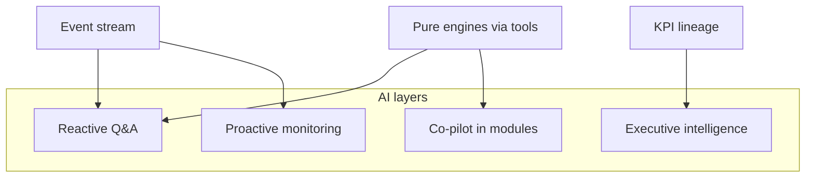

# AI Orchestration Vision

**Status:** AI layers and safety boundaries  
**Related:** [EVENT_SYSTEM_ARCHITECTURE.md](./EVENT_SYSTEM_ARCHITECTURE.md) · [KPI_ENGINE_ARCHITECTURE.md](./KPI_ENGINE_ARCHITECTURE.md)

---

## 1. Current state

| Component | Reality |
|-----------|---------|
| `/api/assistant` | Rule-based stub — not LLM orchestration |
| Context | No tenant-safe RAG, no event feed |
| Tools | No registry calling pure engines |
| Proactive | Not implemented |

**Implemented today:** Placeholder for UX experimentation.  
**Target:** Layered orchestration with strict tenancy and capability checks (Phase 6).

---

## 2. AI layers

### 2.1 Reactive

- User-initiated questions in context of current page (HR, service, cost, commercial, executive).  
- Retrieves: recent events, KPI values + lineage, read-only engine runs via tools.  
- **No silent writes.**

### 2.2 Proactive

- Scheduled and event-driven (threshold breach, margin drift, stale actuals).  
- Surfaces recommendations; human approves high-impact actions.  
- Subscription tier may gate frequency and depth.

### 2.3 Executive intelligence

- Cross-BU narrative: "why did consolidated margin drop?"  
- Combines KPI DAG explain output + plan vs actual facts.  
- Read-only by default; scenario simulation invokes engines with explicit user trigger.

### 2.4 Module co-pilot

- Embedded helpers (e.g. "suggest role mix", "explain pricing model risk").  
- Narrow tool set per module — see capability keys in [PERMISSION_ARCHITECTURE.md](./PERMISSION_ARCHITECTURE.md).

---

## 3. Tool registry (target)

Tools wrap **pure engines** and **read APIs** — never raw SQL from the model.

| Tool | Engine / API | Capabilities required |
|------|--------------|----------------------|
| `hr.get_workforce_summary` | `deriveHrWorkforceModel` | `hr.workforce.read` |
| `service.get_template_cost` | `simulateServiceDeliveryCost` | `cost.simulation.run` |
| `commercial.explain_pricing_run` | pricing intelligence output | `commercial.pricing.run` |
| `kpi.explain` | KPI executor lineage | `executive.workspace.read` |
| `plan.compare_scenarios` | sales plan engine | `sales.plan.read` |

Write tools (future, guarded):

- `kpi.set_target` — requires `kpi.target.write` + confirmation UI.  
- Never: `hr.update_compensation` without `hr.workforce.write` + audit event.

---

## 4. Context assembly (tenant-safe)

| Source | Rule |
|--------|------|
| Events | Last N days, `organizationId` filter |
| KPIs | Lineage JSON from executor |
| Catalog | IDs only; fetch via API with user's BU grants |
| Documents | Org-uploaded RAG corpus — isolated per tenant |
| Cross-tenant | **Forbidden** |

No training on customer data without contract (enterprise policy).

---

## 5. Subscription tiers (examples)

| Tier | Reactive | Proactive | Executive AI |
|------|----------|-----------|----------------|
| Standard | Limited turns/month | — | — |
| Professional | Higher limits | Weekly digest | — |
| Enterprise | Unlimited | Real-time alerts | Full narrative + scenarios |

Enforce in API route before model call.

---

## 6. Safety and governance

| Risk | Mitigation |
|------|------------|
| Hallucinated numbers | Tools must return engine output; cite lineage |
| Cross-tenant leak | Session-bound retrieval only |
| Unauthorized changes | Capability checks + confirmation |
| PII in logs | Redact; event payloads by id |
| Prompt injection via imports | Server-side validation before ingest |

Align with [PLATFORM_PRINCIPLES.md](./PLATFORM_PRINCIPLES.md) P9.

---

## 7. Implementation path

| Phase | Deliverable |
|-------|-------------|
| 5 | Event stream for context |
| 6 | Tool registry + reactive Q&A with lineage |
| 6+ | Proactive jobs + executive narratives |
| 7+ | Actuals-aware answers |

Depends on [IMPLEMENTATION_PHASES.md](./IMPLEMENTATION_PHASES.md) — do not bolt LLM onto client-only stores as SOA.

---

## 8. Implemented today vs target

| Item | Today | Target |
|------|-------|--------|
| Assistant endpoint | Rule stub | Orchestrated LLM |
| Tools | None | Registry |
| Lineage in answers | None | KPI + engine versions |
| Proactive | None | Event + schedule driven |
| Tier gating | None | Subscription metadata |

---

*Replace stub only when tenant spine and tool contracts exist — otherwise AI will amplify split-brain data issues.*
