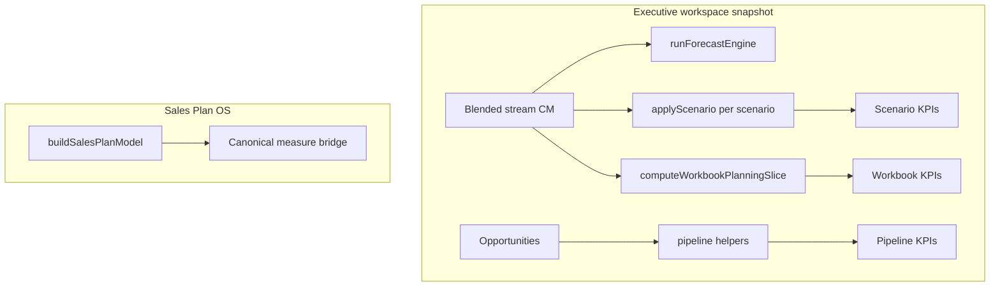

# Architecture convergence — migration & impact (Phase 1 kickoff)

This document satisfies the pre-change requirement: **migration strategy**, **impact analysis**, **dependency map**, **affected modules**, and **convergence strategy** before deeper refactors (formula DAG, dimensions, actuals).

---

## 1. Executive opinion (هل الطلب يضيف أم يعقّد؟)

**Adds real value** if executed **incrementally**: a thin **orchestration + naming** layer on top of existing engines removes silent drift between pages without rewriting math.

**Risk of complication** appears when teams mistake the new snapshot object for a *new* formula implementation — it is not. Guardrails: comments, lineage metadata, and tests that pin outputs to the legacy paths.

---

## 2. Problem statement (audit recap)

| Path | Role today |
|------|------------|
| `src/lib/calculations/engine.ts` | Monthly P&L-style scenario + `runForecastEngine` |
| `src/lib/planning/workbook-engine.ts` | LOTF sales target, blended CM from tiers |
| `src/lib/sales-plan/build-model.ts` + `engine.ts` | Sales Plan OS (annual SAR, funnel, capacity) |
| Ad-hoc `useMemo` in pages | Duplicated CM blending + scenario loops |

**Convergence strategy:** keep owners, add **facades** (`evaluateExecutiveWorkspaceMeasures`, `computeWorkbookPlanningSlice`, `mapSalesPlanModelToMeasureValues`) and a **measure registry** for IDs + dependencies + i18n keys.

---

## 3. Dependency map (logical, not npm)

**Important:** Sales Plan and Executive paths intentionally use **different grains** (annual SAR model vs monthly company demo) until **actuals** and a **facts store** unify them.

---

## 4. Affected modules (Phase 1–2)

| Module | Change |
|--------|--------|
| `src/lib/planning/measures/*` | IDs, orchestration, workbook slice, sales-plan bridge, **catalog + context + semantics + lineage + formatters + tests** |
| `src/app/[locale]/(dashboard)/page.tsx` | Uses `evaluateExecutiveWorkspaceMeasures`; InsightBulb strip |
| `src/app/[locale]/(dashboard)/scenarios/page.tsx` | Same evaluator + `tierLineOverrides` from store |
| `src/components/planning/planning-workbook-panel.tsx` | `computeWorkbookPlanningSlice` |
| `src/components/sales-plan/advanced-enterprise-panel.tsx` | Extra InsightBulb linking Sales Plan to measures |
| `messages/en.json`, `messages/ar.json` | `measures.labels` + `measures.registry` |

**Not changed:** formula bodies inside `calculations/engine`, `workbook-engine`, `sales-plan/engine`.

---

## 5. Migration strategy (incremental)

1. **Phase 1 (done):** Orchestration + page wiring; regression tests on Northwind.
2. **Phase 2 (this iteration):** `MEASURE_CATALOG` (metadata), `PlanningContext`, semantic modes, `valuesByMeasureId` + `measureLineageById`, `evaluatePlanningMeasures`, formatters, expanded Vitest parity. **Still not** inlining engine math into a DAG executor — absorption is metadata + snapshot first.
3. **Phase 2b (future):** Optional DAG executor over the same catalog.
4. **Phase 3+:** Dimensions, assumptions center, actuals — persistence.

**Rollback:** delete `measures/` usage in pages and restore local `useMemo` blocks (git revert); engines untouched.

---

## 6. Impact analysis

| Area | Risk | Mitigation |
|------|------|------------|
| KPI values | Low if evaluator mirrors old code | Vitest golden on Northwind demo |
| Performance | Low — same work, one object | Single `useMemo` per page |
| i18n | Missing keys break build | Added `measures` in en + ar |
| Type safety | `scenarioById` missing id | `flatMap` skips unknown |

---

## 7. Open gaps (honest)

- **Forecast accuracy** as a real measure requires **actuals** — placeholder IDs only in registry.
- **Full lineage UI** (Phase 6) not built; `measureLineageById` + `MEASURE_CATALOG.calculationPath` are ready for bulbs/drilldowns.
- **Zod / runtime validation** of workspace inputs — future.

---

*Document version: Phase 1–2 convergence (metadata + context + lineage seed).*
