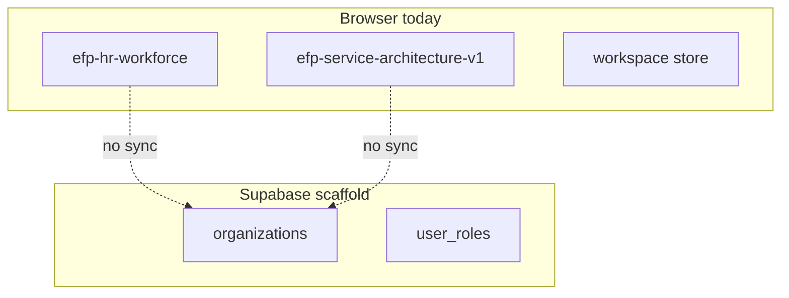

# Data Ownership

**Status:** Source-of-truth registry per entity  
**Critical naming decision:** `Organization` (tenant) ≠ `HrBusinessUnit` (operational scope)  
**Related:** [MULTI_TENANT_ARCHITECTURE.md](./MULTI_TENANT_ARCHITECTURE.md) · [SYSTEM_BOUNDARIES.md](./SYSTEM_BOUNDARIES.md)

---

## 1. Naming convention (mandatory)

| Term | Meaning | ID space | Example |
|------|---------|----------|---------|
| **Organization** / **Tenant** | SaaS customer, billing, RLS root | `organizations.id` (UUID, Supabase) | "Acme Holdings Ltd" |
| **HrBusinessUnit** | Operational division for workforce & service templates | HR store IDs (client today) | "Creative Studio BU" |
| **Member** | User belonging to a tenant | `auth.users` + `user_roles` | User Jane @ Acme |

**Rule:** APIs must accept `organizationId` for tenancy and `businessUnitId` only where HR/service rules apply. Never overload one ID for both.

**Mapping (target):** `hr_business_units` table with `organization_id` FK — not implemented; today BU lives only in HR Zustand/localStorage.

---

## 2. Entity registry

### 2.1 Tenant & membership

| Entity | Owner module | Source of truth today | Target SOA |
|--------|--------------|----------------------|------------|
| Organization | Platform | Supabase `organizations` | Supabase (authoritative) |
| User role | Platform | Supabase `user_roles` + `app_role` enum | Supabase + app middleware |
| Subscription / tier | Platform | Not stored | Billing provider + `organizations` metadata |

**Implemented today:** Schema in `supabase/migrations/001_initial_schema.sql`; app modules largely unaware.  
**Gap:** No `organization_id` on HR/service client stores.

---

### 2.2 HR Workforce

| Entity | Owner | SOA today | Target |
|--------|-------|-----------|--------|
| Business units | HR Workforce | `use-hr-workforce-store` / `efp-hr-workforce` | Server table scoped by `organization_id` |
| Roles, grades, departments | HR Workforce | Same store | Same |
| Compensation inputs | HR Workforce | Same store | Same |
| OH rules & loaded rates | HR engine (`deriveHrWorkforceModel`) | Derived in memory; snapshot slice | Versioned snapshots server-side |
| Import staging rows | HR import slice | Client | Server dry-run API |
| Workforce snapshots | HR snapshot slice | Client persist | Org-scoped archive |

**Persistence key (client):** `efp-hr-workforce` (and related slice keys per [hr-workforce-slice-import.md](./hr-workforce-slice-import.md)).

---

### 2.3 Service Architecture

| Entity | Owner | SOA today | Target |
|--------|-------|-----------|--------|
| Service families | Service Architecture | `efp-service-architecture-v1` | Org-scoped API |
| Templates (incl. `businessUnitId`) | Service Architecture | Same — **references HR BU id** | Validated FK to HR BU |
| Phases, deliverables | Service Architecture | Same | Same |
| Role allocation matrix | Service Architecture | Same | Same |
| Import plan rows | Service Architecture | Client import foundation | Server validation |

**Persistence key:** `efp-service-architecture-v1`.

**Rule:** Service module does **not** create BUs; it selects from HR-derived BU list.

---

### 2.4 Service cost simulation

| Entity | Owner | SOA today | Target |
|--------|-------|-----------|--------|
| User prefs (selected template, toggles) | Cost UI | `efp-service-cost-simulation-prefs-v1` | Org-scoped prefs |
| Simulation runs | Cost engine | Ephemeral; not persisted as SOA | Optional run history table |
| `ServiceCostBaselineSnapshot` | Cost engine output | Passed via adapters | Stored snapshot refs for calculator |

---

### 2.5 Commercial pricing intelligence

| Entity | Owner | SOA today | Target |
|--------|-------|-----------|--------|
| Pricing model config | Commercial module | In-session / prefs | Org-scoped config |
| `CommercialPricingSnapshot` | Engine output | Adapter handoff | Versioned commercial decisions |

---

### 2.6 Sales Plan OS

| Entity | Owner | SOA today | Target |
|--------|-------|-----------|--------|
| Wizard plans / versions | Sales Plan | `use-sales-plan-wizard-store` + persist keys | Org-scoped API |
| Built model outputs | Sales Plan engine | Client | Server |

**Doc:** [SALES-PLAN-OS-FULL.md](./SALES-PLAN-OS-FULL.md)

---

### 2.7 Executive workspace (demo)

| Entity | Owner | SOA today | Target |
|--------|-------|-----------|--------|
| Forecasts, scenarios, pipeline demo | Executive UI | `use-workspace-store` | Facts store + KPI engine |
| Opportunities (demo) | Executive UI | Workspace store | CRM module (future) |

**Explicit:** Demo data is **not** organizational truth for SaaS.

---

### 2.8 Planning measures / KPI (partial)

| Entity | Owner | SOA today | Target |
|--------|-------|-----------|--------|
| `MEASURE_CATALOG` definitions | Planning lib | Code catalog | KPI registry DB |
| Evaluated measure values | Engine | Computed at runtime | Facts + actuals feed |

**Doc:** [KPI_ENGINE_ARCHITECTURE.md](./KPI_ENGINE_ARCHITECTURE.md)

---

### 2.9 Cross-module bridge types (not SOA)

These are **contracts**, not databases:

- `ServiceCatalogSelection`
- `ServiceCostBaselineSnapshot`
- `CommercialPricingSnapshot`
- Planning measure bridge types

Ownership: **platform architecture** — version with `engineVersion` when shape changes.

---

## 3. Split-brain risk (localStorage vs Supabase)

**Risk:** Two truths with no migration strategy.  
**Remediation (Phase 1–2):** See [MULTI_TENANT_ARCHITECTURE.md](./MULTI_TENANT_ARCHITECTURE.md) and [IMPLEMENTATION_PHASES.md](./IMPLEMENTATION_PHASES.md).

---

## 4. Read/write authority matrix

| Data | Who may write (today) | Who may write (target) |
|------|----------------------|------------------------|
| HR master | Any user with app access (unguarded) | `hr_admin` + tenant scope |
| Service catalog | Same | `service_admin` + BU scope |
| Commercial pricing runs | Same | `commercial_analyst` |
| Sales plan | Same | `planning_editor` |
| Organization settings | N/A in UI | `tenant_admin` |
| KPI definitions | Code deploy | `kpi_admin` |

See [PERMISSION_ARCHITECTURE.md](./PERMISSION_ARCHITECTURE.md).

---

## 5. Implemented today vs target

| Area | Today | Target |
|------|-------|--------|
| Tenant SOA | Postgres schema only | All shared data org-scoped |
| HR/service SOA | localStorage + Zustand | Server APIs + optional offline cache |
| BU ↔ tenant link | None | Explicit FK + validation |
| Audit trail | HR snapshots partial | All economics mutations |
| Actuals | None | External ingest → facts |

---

## 6. Stakeholder decisions required

1. **Table naming:** `hr_business_units` vs `business_units` with `type` column.  
2. **Migration:** Big-bang import vs dual-write period for existing demo keys.  
3. **Dev mode:** Global bypass flag vs per-dev synthetic org.

Record decisions in [IMPLEMENTATION_PHASES.md](./IMPLEMENTATION_PHASES.md) when made.

---

*When adding a new entity, update this registry before merging code.*
