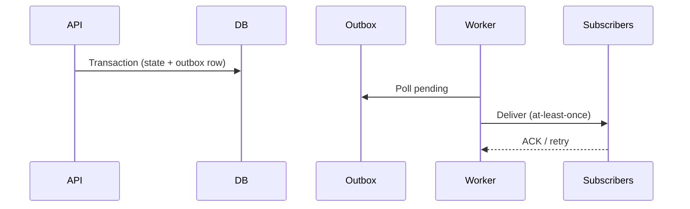

# Event System Architecture

**Status:** Event-driven platform design  
**Related:** [AI_ORCHESTRATION_VISION.md](./AI_ORCHESTRATION_VISION.md) · [KPI_ENGINE_ARCHITECTURE.md](./KPI_ENGINE_ARCHITECTURE.md)

---

## 1. Why events

A multi-tenant OS needs:

- **Audit** — who changed OH rules, pricing assumptions, or catalog templates  
- **Reactive AI** — subscribe to meaningful domain changes  
- **Proactive monitoring** — KPI threshold breaches, delivery drift  
- **Integrations** — webhooks to Slack, accounting, data warehouse  

**Implemented today:** No domain event bus, outbox, or subscribers. State changes are synchronous in Zustand.  
**Target:** Domain events + transactional outbox + pluggable handlers (Phase 5).

---

## 2. Event envelope (canonical)

```typescript
// Conceptual — not implemented
interface DomainEvent {
  id: string;
  organizationId: string;
  type: string;           // e.g. hr.workforce.snapshot.created
  aggregateType: string;
  aggregateId: string;
  occurredAt: string;     // ISO
  actorUserId?: string;
  payload: Record<string, unknown>;
  schemaVersion: number;
  correlationId?: string;
}
```

All events are **tenant-scoped**. Payloads avoid PII beyond ids; large blobs referenced by snapshot id.

---

## 3. Domain event catalog (initial)

| Event type | When emitted | Consumers (target) |
|------------|--------------|-------------------|
| `hr.workforce.import.completed` | Import slice success | Audit, AI summary |
| `hr.workforce.snapshot.created` | Snapshot saved | Audit, KPI refresh |
| `hr.overhead.rule.changed` | OH config change | Cost recalc hint, alert |
| `service.catalog.template.updated` | Template save | Audit, cost invalidation |
| `service.cost.simulation.run` | User runs simulation | Analytics (optional) |
| `commercial.pricing.run` | Pricing intelligence run | Audit, calculator cache |
| `sales.plan.version.published` | Plan finalized | KPI, executive |
| `kpi.threshold.breached` | Alert rule fires | Notification, proactive AI |
| `tenant.member.role.changed` | RBAC update | Security audit |

Extend catalog in code review when adding mutating APIs.

---

## 4. Outbox pattern



**Rules:**

- Same DB transaction as business write (Postgres).  
- Idempotent handlers (`eventId` dedup).  
- Dead-letter queue for poison messages.

**Implemented today:** N/A.  
**Client-only era:** Optionally queue events in memory for dev — not production pattern.

---

## 5. Subscribers

| Subscriber | Purpose |
|------------|---------|
| Notification service | Email / Slack / in-app |
| KPI engine | Invalidate or recompute affected KPIs |
| AI context indexer | Tenant-safe summaries (future) |
| Webhook dispatcher | External integrations |
| Audit log projector | Immutable read model |

Handlers **must not** call foreign module stores directly — invoke engines or APIs.

---

## 6. Integration webhooks (target)

| Direction | Use |
|-----------|-----|
| Outbound | Customer systems on `kpi.threshold.breached` |
| Inbound | Actuals from accounting (signed, tenant-scoped) |

Verify `organizationId` + HMAC on inbound.

---

## 7. Reactive vs proactive AI linkage

| Mode | Event usage |
|------|-------------|
| Reactive | User asks; assistant loads recent events + KPI lineage |
| Proactive | Scheduler + event stream triggers agent workflows |

See [AI_ORCHESTRATION_VISION.md](./AI_ORCHESTRATION_VISION.md).

---

## 8. Implemented today vs target

| Capability | Today | Target |
|------------|-------|--------|
| Domain events | No | Yes |
| Outbox | No | Postgres table |
| Audit trail | HR snapshots partial | All economics mutations |
| Webhooks | No | Phase 5+ |
| Client emit | No | Server authoritative |

---

## 9. Phase 5 deliverables

1. `domain_events` + `outbox` tables with RLS.  
2. Emit from first server API: HR catalog update.  
3. One subscriber: audit log projector.  
4. Vitest: handler idempotency.

---

*Do not block Phase 1–2 on full event system — design APIs event-ready per [PLATFORM_PRINCIPLES.md](./PLATFORM_PRINCIPLES.md).*
