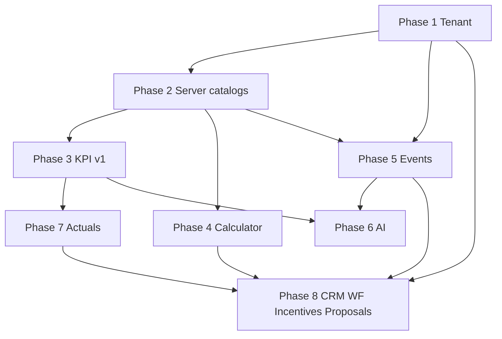

# Future Modules

**Status:** Module roadmap and dependencies  
**Related:** [MASTER_VISION.md](./MASTER_VISION.md) · [IMPLEMENTATION_PHASES.md](./IMPLEMENTATION_PHASES.md) · [SYSTEM_BOUNDARIES.md](./SYSTEM_BOUNDARIES.md)

---

## 1. Overview

These modules are **specified in founder vision** but **not implemented** (or only demo/scaffold). Dependencies reflect the approved phase order — do not bundle into economics foundation PRs.

| Module | Priority (founder) | Phase | Status |
|--------|-------------------|-------|--------|
| Commercial Calculator | High | 4 | Adapters only |
| Incentive schemes | High (strategic) | 8 | Not built |
| Planned vs actual / actuals | High | 7 | Not built |
| KPI governance (full) | Medium | 3 | Partial (measures) |
| Event bus + audit | Medium | 5 | Not built |
| AI orchestration | Medium | 6 | Stub only |
| CRM | Later | 8 | Demo in workspace |
| Proposal generation | Later | 8 | Not built |
| Workflow / tasks / SOP | Later | 8 | Not built |
| Integrations | Later | 8+ | Not built |

---

## 2. Commercial Calculator

**Purpose:** BD-facing pricing UI — quantities, packaging, line structure, explainable margin — consuming approved snapshots.

| Depends on | Why |
|------------|-----|
| Service cost simulation | `ServiceCostBaselineSnapshot` |
| Commercial pricing intelligence | `CommercialPricingSnapshot`, models |
| Tenant spine (Phase 1–2) | Org-scoped configs |
| KPI engine v1 (Phase 3) | Optional list-price governance metrics |

**IS NOT:** Proposal PDF, e-sign, CRM opportunity stages.

**Outputs:** Calculator run records (versioned) → future proposal module.

---

## 3. Incentive schemes

**Purpose:** Explainable compensation linked to PO, collection, delivery milestones.

| Depends on | Why |
|------------|-----|
| CRM / delivery signals (future) or manual actuals | Performance facts |
| KPI / facts store | Payout thresholds |
| Event system | Audit and recalculation triggers |
| Tenant + permissions | BU-scoped schemes |

**IS NOT:** HR payroll system of record.

**Risk:** Building before actuals/CRM creates fake incentives — defer to Phase 8.

---

## 4. Planned vs actual (actuals layer)

**Purpose:** Executive control tower with real performance data.

| Depends on | Why |
|------------|-----|
| KPI registry + facts | Storage and evaluation |
| Sales plan / forecast versions | Plan side of bridge |
| Integrations or Sheets ingest | Actuals source |
| Tenant spine | Org isolation |

**Doc:** [ARCHITECTURE-CONVERGENCE-MIGRATION.md](./ARCHITECTURE-CONVERGENCE-MIGRATION.md)

---

## 5. CRM (operational)

**Purpose:** Accounts, opportunities, delivery tracking, collections — operational lifecycle.

| Depends on | Why |
|------------|-----|
| Tenant + permissions | Multi-tenant CRM |
| Events | Stage changes, notifications |
| Service catalog (read) | Delivery blueprint link |
| Calculator (optional) | Won deal → priced engagement |

**IS NOT:** HR or service blueprint editor. Demo `opportunities` in workspace are **not** this module.

---

## 6. Proposal generation

**Purpose:** Templates, approvals, e-sign, branded outputs.

| Depends on | Why |
|------------|-----|
| Commercial Calculator | Priced structure |
| Permissions | Approval chains |
| Audit / events | Legal traceability |

**IS NOT:** Pricing model definition (commercial pricing intel).

---

## 7. Workflow / tasks / SOP

**Purpose:** Execution layer — assignments, checklists, escalations.

| Depends on | Why |
|------------|-----|
| Event system | Triggers and SLAs |
| CRM (partial) | Account/opportunity context |
| Permissions | Task ownership |

**IS NOT:** Financial engines.

---

## 8. Integrations

| Integration | Feeds | Phase |
|-------------|-------|-------|
| Google Sheets / Excel | Actuals, plan imports | 7 |
| Accounting (QBO, Xero) | Actuals | 8+ |
| Slack / Teams | Notifications | 5+ |
| E-sign (DocuSign, etc.) | Proposals | 8 |

---

## 9. Dependency graph

---

## 10. Preserved foundations (do not re-build)

When shipping future modules, **consume**:

- HR: `deriveHrWorkforceModel`, OH engines  
- Service: catalog + matrix  
- Cost: `simulateServiceDeliveryCost`  
- Commercial: pricing intelligence engines  
- Measures: `MEASURE_CATALOG` bridge  

See [PLATFORM_PRINCIPLES.md](./PLATFORM_PRINCIPLES.md).

---

## 11. Implemented today vs target

| Module | Today | Next milestone |
|--------|-------|----------------|
| Calculator | Adapters | Phase 4 UI + API |
| Incentives | — | Phase 8 after CRM/actuals |
| Actuals | — | Phase 7 ingest |
| CRM | Workspace demo | Phase 8 module |
| Proposals | — | Phase 8 |
| Workflow | — | Phase 8 |
| Integrations | — | Phased per table |

---

*Scope changes require update to this file and [IMPLEMENTATION_PHASES.md](./IMPLEMENTATION_PHASES.md).*
