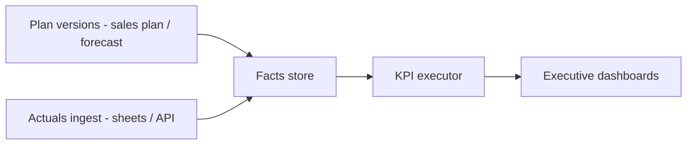

# KPI Engine Architecture

**Status:** KPI governance and measure convergence design  
**Related:** [ARCHITECTURE-CONVERGENCE-MIGRATION.md](./ARCHITECTURE-CONVERGENCE-MIGRATION.md) · [DATA_OWNERSHIP.md](./DATA_OWNERSHIP.md)

---

## 1. Problem statement

The platform has:

- **Executive measures** — `evaluateExecutiveWorkspaceMeasures`, `MEASURE_CATALOG` in `src/lib/planning/measures/**`  
- **Sales plan measures** — bridge via sales plan engine  
- **Module-local metrics** — HR intelligence, cost/commercial run summaries  
- **Founder vision** — full KPI governance (targets, owners, alerts, actuals)

Without a **KPI Engine**, formulas drift and dashboards disagree.

**Implemented today:** Measure catalog + evaluation for executive workspace; parity tests. No KPI registry DB, no actuals feed, no alert rules.  
**Target:** Single registry, phased DAG executor, actuals binding, alert subscriptions.

---

## 2. Relationship to planning measures

| Layer | Responsibility |
|-------|----------------|
| **Measure catalog (code)** | Canonical definitions, units, lineage metadata — seed for registry |
| **KPI registry (DB)** | Tenant-configurable KPIs, targets, owners, thresholds |
| **Facts store** | Time-series actuals and plan versions |
| **Executor** | DAG evaluation with caching and explainability |
| **Presentation** | Executive, BU dashboards, AI explanations |

**Rule:** New executive-facing metrics **register** in catalog first, then promote to KPI registry when governance is needed.

Do not duplicate formula paths warned in [ARCHITECTURE-CONVERGENCE-MIGRATION.md](./ARCHITECTURE-CONVERGENCE-MIGRATION.md).

---

## 3. KPI entity model (target)

| Field | Purpose |
|-------|---------|
| `id`, `organization_id` | Tenant scope |
| `code` | Stable key (matches measure catalog where possible) |
| `name`, `description` | UI + AI |
| `formula_ref` | Pointer to pure engine function or measure id |
| `formula_version` | Audit |
| `unit`, `polarity` | Display (higher-is-better, etc.) |
| `owner_user_id` | Accountability |
| `business_unit_id` | Optional BU scope |
| `target_value`, `threshold_warning`, `threshold_critical` | Governance |
| `cadence` | daily / weekly / monthly |
| `source_modules` | Lineage tags (hr, service, sales_plan, actuals) |

---

## 4. Actuals and planned vs actual

**Implemented today:** Gap explicitly noted in convergence doc; workspace demo only.  
**Target:** Phase 7 actuals ingest; Phase 3 registry + stub actuals.

---

## 5. Phased DAG executor

| Phase | Capability |
|-------|------------|
| v0 | Synchronous `evaluateExecutiveWorkspaceMeasures` (today) |
| v1 | Registry DB + bridge from `MEASURE_CATALOG` |
| v2 | Dependency graph between KPIs (margin = f(revenue, cost)) |
| v3 | Incremental recompute on fact updates |
| v4 | Alert evaluation job on schedule + event triggers |

**Purity:** Formulas remain in `src/lib`; executor calls functions, does not embed math in SQL.

---

## 6. Alerts and ownership

| Alert type | Trigger |
|------------|---------|
| Threshold | Actual or projected vs target |
| Trend | N periods declining |
| Data quality | Missing actuals for cadence |
| Cross-KPI | Derived breach (e.g. margin + utilization) |

Notifications via [EVENT_SYSTEM_ARCHITECTURE.md](./EVENT_SYSTEM_ARCHITECTURE.md) — not ad-hoc toasts only.

---

## 7. Lineage and explainability

Each KPI evaluation returns:

- Input fact ids and versions  
- Engine versions  
- Intermediate nodes (for drill-down)  

Required for AI layer and audit.

---

## 8. Implemented today vs target

| Feature | Today | Target |
|---------|-------|--------|
| Measure catalog | Code | + DB registry |
| Executive evaluation | Yes | Uses executor v2+ |
| Targets / owners | No | KPI registry |
| Actuals | No | Facts ingest |
| Alerts | No | Event-driven |
| BU-scoped KPIs | No | `business_unit_id` |
| Tests | Parity tests exist | + registry contract tests |

---

## 9. Anti-patterns

- Defining `revenue` differently in sales plan page and executive grid.  
- Storing formula strings only in DB without `src/lib` implementation.  
- KPI definitions only in UI state.

---

*Phase mapping: [IMPLEMENTATION_PHASES.md](./IMPLEMENTATION_PHASES.md) Phase 3 and 7.*
