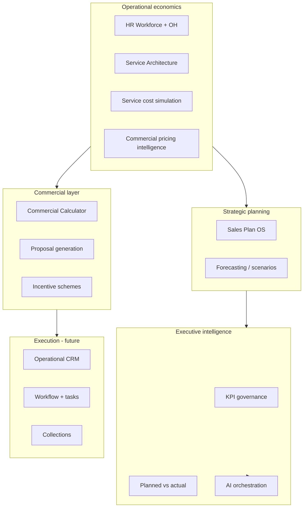

# Master Vision

**Status:** North-star product document  
**Audience:** Founders, architects, senior engineers, investors  
**Supersedes nothing** — synthesizes [RAW_FOUNDER_VISION.md](./RAW_FOUNDER_VISION.md) and [PLATFORM_ARCHITECTURE_MASTER_REPORT.md](../PLATFORM_ARCHITECTURE_MASTER_REPORT.md)

---

## 1. What we are building

We are building a **multi-tenant Enterprise Intelligence & Operating System** for:

- Holding companies and portfolio operators  
- Agencies, consultancies, and creative / service organizations  
- Multi–business-unit operators that need **unified governance** with **localized execution**

This is **not** a traditional CRM. CRM-style capabilities (accounts, pipeline, delivery, collections) are **one future module** inside a broader operating system.

The platform must eventually:

| Capability | Meaning |
|------------|---------|
| **Understand** | Structure, economics, delivery, forecasts, KPIs, risks |
| **Measure** | Every major activity becomes measurable and traceable |
| **Explain** | Numbers, KPIs, and recommendations are auditable |
| **Warn** | Proactive detection of drift, margin risk, delivery failure |
| **Recommend** | Scenario simulation and prescriptive guidance (with human approval) |

Long-term positioning: an **enterprise cognitive operating system** — not a dashboard collection.

---

## 2. Strategic layers (conceptual stack)

**Rule:** Upper layers consume lower layers through **adapters and facts** — never by rewriting lower-layer math inside UI.

---

## 3. Maturity ladder

| Level | Name | Description | Platform today |
|-------|------|-------------|------------------|
| L0 | **Demo shell** | Local state, rich UX, partial backend | Executive workspace, optional Supabase |
| L1 | **Economics foundation** | Trustworthy workforce + service + cost + price intelligence | **Achieved** (client-persisted) |
| L2 | **Server truth** | Org-scoped persistence, RLS, APIs | Schema exists; app wiring partial |
| L3 | **Governed KPIs** | Registry, targets, actuals, alerts | Measure catalog seed only |
| L4 | **Actuals loop** | Planned vs actual, executive control tower | Not built |
| L5 | **Calculator + incentives** | BD-safe pricing, explainable comp | Adapters only / not built |
| L6 | **Event + proactive AI** | Domain events, monitoring, co-pilot | Stub assistant only |
| L7 | **Full OS** | CRM, workflow, proposals, integrations | Vision only |

**Current honest position:** solid **L1** on economics modules; **L0–L2** mixed on planning/tenant; **L3+** largely documented but not implemented.

---

## 4. Capability map

| Domain | Implemented today | Target state | Primary docs |
|--------|-------------------|--------------|--------------|
| HR workforce economics | Yes | Attendance, capacity, scheduling | [HR-WORKFORCE-MODULE.md](./HR-WORKFORCE-MODULE.md) |
| Service blueprints | Yes | CRM/proposal/calculator integration | [service-architecture-import-foundation.md](./service-architecture-import-foundation.md) |
| Operational cost simulation | Yes | Allocation engine input | [SERVICE_COST_SIMULATION_ARCHITECTURE.md](../SERVICE_COST_SIMULATION_ARCHITECTURE.md) |
| Commercial pricing intelligence | Yes | Not quotations | [COMMERCIAL_PRICING_INTELLIGENCE_ARCHITECTURE.md](../COMMERCIAL_PRICING_INTELLIGENCE_ARCHITECTURE.md) |
| Sales planning | Yes | Linked to actuals + service catalog | [SALES-PLAN-OS-FULL.md](./SALES-PLAN-OS-FULL.md) |
| Executive / measures | Partial | AI-aware control tower | [ARCHITECTURE-CONVERGENCE-MIGRATION.md](./ARCHITECTURE-CONVERGENCE-MIGRATION.md) |
| Multi-tenant SaaS | Scaffold | Production isolation + billing | [MULTI_TENANT_ARCHITECTURE.md](./MULTI_TENANT_ARCHITECTURE.md) |
| Permissions | Scaffold | BU-scoped RBAC | [PERMISSION_ARCHITECTURE.md](./PERMISSION_ARCHITECTURE.md) |
| KPI governance | Partial | Full registry + alerts | [KPI_ENGINE_ARCHITECTURE.md](./KPI_ENGINE_ARCHITECTURE.md) |
| Events / audit | No | Event bus + outbox | [EVENT_SYSTEM_ARCHITECTURE.md](./EVENT_SYSTEM_ARCHITECTURE.md) |
| AI | Stub | Reactive + proactive + executive | [AI_ORCHESTRATION_VISION.md](./AI_ORCHESTRATION_VISION.md) |
| Commercial Calculator | No | Separate module | [FUTURE_MODULES.md](./FUTURE_MODULES.md) |
| Incentives | No | Explainable comp engine | [FUTURE_MODULES.md](./FUTURE_MODULES.md) |
| CRM / delivery / collections | Demo only | Enterprise CRM | [FUTURE_MODULES.md](./FUTURE_MODULES.md) |
| Proposals | No | Template + approval + e-sign | [FUTURE_MODULES.md](./FUTURE_MODULES.md) |
| Workflow / SOP | No | Orchestration + accountability | [FUTURE_MODULES.md](./FUTURE_MODULES.md) |

---

## 5. Founder's current strategic focus (reconciled with code)

[RAW_FOUNDER_VISION.md](./RAW_FOUNDER_VISION.md) lists:

1. HR Workforce — **built**  
2. Service Catalog / Architecture — **built**  
3. Incentive Scheme — **not built** (Phase 6+)  
4. Commercial Calculator — **not built** (pricing intel + adapters exist; Phase 4)  
5. Sales Planning — **built** (partial link to service economics)  
6. Planned vs Actual dashboards — **not built** (Phase 7)

Treat items 3–6 as **roadmap priorities**, not as shipped features.

---

## 6. SaaS direction (non-negotiables)

Future SaaS requires:

- **Tenant isolation** at persistence and API boundaries  
- **Subscription tiers** (including AI feature gating)  
- **Role-based access** at tenant and optionally business-unit scope  
- **Configurable modules** per organization  
- **Scalable, auditable infrastructure**

These are architectural commitments documented in [MULTI_TENANT_ARCHITECTURE.md](./MULTI_TENANT_ARCHITECTURE.md) and [PERMISSION_ARCHITECTURE.md](./PERMISSION_ARCHITECTURE.md) — not optional add-ons.

---

## 7. What success looks like (12–24 months)

1. A holding company runs **multiple BUs** on one tenant with isolated data and consolidated executive KPIs.  
2. Business development uses a **Commercial Calculator** fed by approved service templates and HR-backed cost baselines — no spreadsheet pricing.  
3. Leadership sees **planned vs actual** with drill-down to BU, service family, and delivery health.  
4. **AI** explains KPI movement using lineage from engines — and proactively warns before month-end surprises.  
5. **CRM, workflow, and proposals** share the same facts store and event stream — no duplicate definitions of margin or pipeline.

---

## 8. Document map (governance suite)

| Document | Role |
|----------|------|
| [PLATFORM_PRINCIPLES.md](./PLATFORM_PRINCIPLES.md) | Non-negotiable design rules |
| [GOVERNANCE_RULES.md](./GOVERNANCE_RULES.md) | How we change the platform safely |
| [SYSTEM_BOUNDARIES.md](./SYSTEM_BOUNDARIES.md) | What each layer IS / IS NOT |
| [DATA_OWNERSHIP.md](./DATA_OWNERSHIP.md) | Source of truth per entity |
| [IMPLEMENTATION_PHASES.md](./IMPLEMENTATION_PHASES.md) | Phased delivery + audit checklist |
| [FUTURE_MODULES.md](./FUTURE_MODULES.md) | Module backlog and dependencies |

**As-built reference:** [PLATFORM_ARCHITECTURE_MASTER_REPORT.md](../PLATFORM_ARCHITECTURE_MASTER_REPORT.md)  
**Raw intent:** [RAW_FOUNDER_VISION.md](./RAW_FOUNDER_VISION.md)

---

*This document is stable intent. Implementation status changes are recorded in IMPLEMENTATION_PHASES.md and the master report.*
