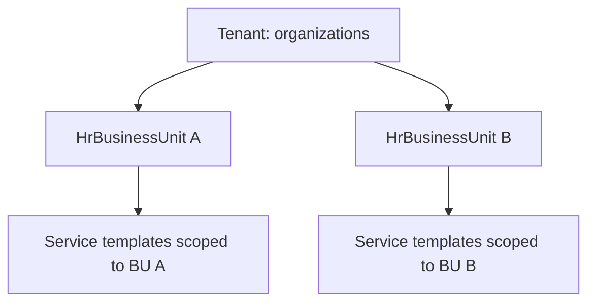

# Multi-Tenant Architecture

**Status:** SaaS isolation design  
**Related:** [DATA_OWNERSHIP.md](./DATA_OWNERSHIP.md) · [PERMISSION_ARCHITECTURE.md](./PERMISSION_ARCHITECTURE.md)

---

## 1. Tenant model

**Tenant** = one paying customer organization (holding company or agency group).

| Concept | Implementation |
|---------|----------------|
| Tenant root | `organizations` table (Supabase) |
| Membership | `organization_members` linking `auth.users` → `organization_id` (canonical; RLS) |
| Role enum | `app_role` (`tenant_admin`, `member`, … per migration) |
| Sub-scope | `HrBusinessUnit` under tenant (operational, not a second tenant) |

**Implemented today:** Schema + RLS in `supabase/migrations/001_initial_schema.sql`. Application state is **browser-local** and not keyed by `organization_id`.  
**Target:** Every API request carries `tenantId` from session; all shared rows include `organization_id`.

---

## 2. Isolation strategy

### 2.1 Database (RLS)

- Row Level Security on tenant-scoped tables: `organization_id = auth.jwt() claim or membership lookup`.  
- Service role bypass only for admin jobs — never for user-facing API.  
- BU-scoped tables add `business_unit_id` with policy: user must have BU grant or tenant-wide role.

### 2.2 Application

- Session middleware resolves `organizationId` after Supabase auth.  
- Engines remain pure; **repositories** inject tenant filter.  
- Dev bypass: explicit `DEV_TENANT_ID` or single-org mode — logged and disabled in production.

### 2.3 Client

- Deprecate global `localStorage` keys as SOA for shared catalogs.  
- Optional: encrypted offline cache keyed by `orgId` after server migration.

---

## 3. Business unit vs tenant



| Question | Answer |
|----------|--------|
| Can a user belong to multiple tenants? | Yes — separate memberships |
| Can a user see all BUs in a tenant? | Role-dependent ([PERMISSION_ARCHITECTURE.md](./PERMISSION_ARCHITECTURE.md)) |
| Is BU a billing unit? | Optional metadata — not required for v1 isolation |

---

## 4. Migration from localStorage

**Phases (summary):**

| Step | Action |
|------|--------|
| 1 | Introduce session `tenantId`; read-only org APIs |
| 2 | Dual-write HR + service catalog to server |
| 3 | Server becomes SOA; client cache read-through |
| 4 | Remove unscoped persist keys or namespace as `efp-{orgId}-...` |

**Risks:**

- Importing demo data into wrong tenant — require explicit org picker on first sync.  
- ID collision between client-generated BU ids and server UUIDs — migration mapping table.

**No big-bang** without export/import tool for existing demos.

---

## 5. Subscriptions and modules (target)

| Tier (example) | Modules |
|----------------|---------|
| Core | HR + Service + Cost |
| Growth | + Commercial pricing + Sales plan |
| Enterprise | + Calculator, KPI, AI, CRM |

Store entitlements on `organizations` or `organization_subscriptions` — enforce at route and API layer, not only UI hide.

---

## 6. API boundary (target)

```text
Client → Next.js API route → validate session.tenantId → Supabase (RLS) → DTO → UI
```

Planning routes today (`src/app/api/...`) become the pattern for HR/service catalogs.

**Implemented today:** Optional auth middleware when Supabase env set; modules unguarded.  
**Target:** 401 without tenant; 403 on BU violation.

---

## 7. Implemented today vs target

| Capability | Today | Target |
|------------|-------|--------|
| Org table | Yes | Yes |
| App scoped by org | No | Yes |
| RLS enforced in app | Partial schema | Full |
| BU under tenant | HR client only | FK + policies |
| Billing | No | Provider integration |
| localStorage SOA | Yes | Deprecated for shared data |

---

## 8. Phase 1 spike (first code — after docs)

1. Session middleware attaches `organizationId`.  
2. Read-only `GET /api/org/hr-catalog` (design only until approved).  
3. Vitest integration test: user A cannot read org B rows.

Do **not** refactor engines in Phase 1.

---

*See [IMPLEMENTATION_PHASES.md](./IMPLEMENTATION_PHASES.md) Phase 1 for gates.*
