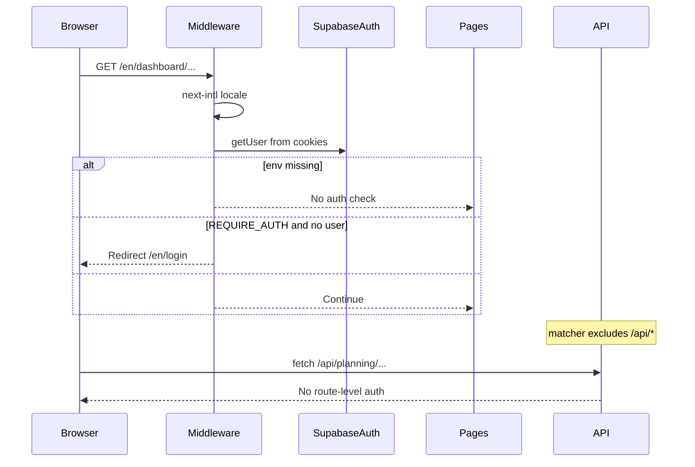

# Phase 1 Audit — Tenant Spine Architecture

**Status:** Pre-implementation audit (read-only analysis)  
**Date:** 2026-05-17  
**Scope:** Phase 1 only — tenant context, API boundary, RLS alignment; **no code changes in this document**  
**Governance inputs:** [MULTI_TENANT_ARCHITECTURE.md](./MULTI_TENANT_ARCHITECTURE.md) · [PERMISSION_ARCHITECTURE.md](./PERMISSION_ARCHITECTURE.md) · [DATA_OWNERSHIP.md](./DATA_OWNERSHIP.md) · [IMPLEMENTATION_PHASES.md](./IMPLEMENTATION_PHASES.md)  
**As-built reference:** [PLATFORM_ARCHITECTURE_MASTER_REPORT.md](../PLATFORM_ARCHITECTURE_MASTER_REPORT.md)

---

## 1. Executive summary

Phase 1 goal: introduce a **tenant spine** so every server request can resolve `organizationId`, membership roles, and (later) BU grants — without rewriting economics engines or migrating full HR/service catalogs to Postgres yet.

| Dimension | Today | Phase 1 target |
|-----------|-------|----------------|
| Auth | Optional Supabase session; redirect only if `NEXT_PUBLIC_REQUIRE_AUTH=true` | Session required for protected APIs (configurable dev bypass) |
| Tenant in session | **Absent** | `organizationId` + roles from `organization_members` |
| Economics SOA | Browser `localStorage` (global keys) | Still client SOA; **read-only** org-scoped HR API spike |
| Planning SOA | Split: demo Zustand + partial Supabase | Explicit org selection; no `orgs[0]` guess |
| RLS | Defined on planning tables via `organization_members` | Verified by integration tests; membership model clarified |
| HR / Service in DB | **No tables** | Minimal new table(s) for Phase 1 read path only |

**Maturity:** Platform is **L1 economics on client** with **L0–L2 mixed** tenant scaffolding ([MASTER_VISION.md](./MASTER_VISION.md)). Phase 1 moves tenant from “schema only” to “runtime enforced on APIs,” not full server persistence (Phase 2).

**Top risks:** global localStorage, wrong-org planning workspace selection, unauthenticated `/api/*` routes, three different “business unit” concepts, ID remap blocker for Phase 2.

---

## 2. Current auth / session flow

### 2.1 Flow diagram



### 2.2 Components

| File | Role | Tenant awareness |
|------|------|------------------|
| [src/middleware.ts](../src/middleware.ts) | `createMiddleware` (intl) + `createServerClient` + `getUser()` | **None** — only login redirect |
| [src/app/auth/callback/route.ts](../src/app/auth/callback/route.ts) | `exchangeCodeForSession` | No org bootstrap |
| [src/app/[locale]/login/page.tsx](../src/app/[locale]/login/page.tsx) | `signInWithPassword` → `router.replace("/")` | No org picker |
| [src/lib/supabase/client.ts](../src/lib/supabase/client.ts) | Browser client | Used by login only |
| [src/lib/supabase/server.ts](../src/lib/supabase/server.ts) | Server Components client | No tenant helper |
| [src/lib/supabase/route-handler.ts](../src/lib/supabase/route-handler.ts) | Route handlers client | No tenant helper |

### 2.3 Environment variables

| Variable | Effect |
|----------|--------|
| `NEXT_PUBLIC_SUPABASE_URL` / `NEXT_PUBLIC_SUPABASE_ANON_KEY` | Enables Supabase clients; if missing, app runs fully offline/demo |
| `NEXT_PUBLIC_REQUIRE_AUTH` | When `"true"`, middleware redirects unauthenticated users away from dashboard (not `/api`) |
| `NODE_ENV` / `VERCEL_ENV` | Controls HR dev disk API ([persist-safety.ts](../src/lib/hr-workforce/persist-safety.ts)) |

### 2.4 Gaps for Phase 1

- No `getTenantContext()` returning `{ userId, organizationId, roles, businessUnitIds? }`.
- Middleware `config.matcher` **excludes** `/api`, `/auth`, static files — API auth must be explicit per route or a shared wrapper.
- Post-login flow does not set active organization (multi-org users undefined).
- No JWT custom claim for `organization_id` (membership resolved via DB query is sufficient for Phase 1).

---

## 3. Current Supabase usage

### 3.1 Active server code paths

| Route / module | Auth | Tenant filter | Notes |
|----------------|------|---------------|-------|
| `GET /api/planning/workspace` | None | Implicit via RLS on `organizations` | [loadPlanningWorkspace](../src/server/planning/workspace.ts) uses `orgs?.[0]` after `.limit(5)` |
| `POST /api/planning/matrix/cell` | None | RLS on `planning_matrix_cells` | Upsert by `row_id` |
| `POST /api/planning/import` | None | N/A | Parses XLSX only |
| `POST /api/planning/export` | None | N/A | Generates export |
| `POST /api/assistant` | None | N/A | Rule-based stub |
| `GET|PUT|DELETE /api/dev/hr-workforce-disk` | Dev gate only | **Global** single file | Not org-scoped |

### 3.2 Schema summary ([001_initial_schema.sql](../supabase/migrations/001_initial_schema.sql))

**Tenant root**

- `organizations` — SaaS customer
- `organization_members` — `(organization_id, user_id, role)` — **used by all RLS policies**
- `user_roles` — `(user_id, role, organization_id?)` — RLS enabled, **no policies** → effectively inaccessible via anon/authenticated clients

**Planning hierarchy (org-aware)**

- `companies.organization_id` → `portfolios`, `business_units` (SQL), `revenue_streams`, `scenarios`, `forecasts`, `opportunities`, `planning_matrix_rows`, `planning_matrix_cells`, `kpi_snapshots` (via company join)
- `deal_size_tiers.organization_id`, `reports.organization_id`, `activities.organization_id` (nullable)

**Not in schema (economics modules)**

- HR workforce (BUs, departments, roles, OH settings, snapshots)
- Service architecture catalog
- Cost/commercial prefs and run history

### 3.3 RLS model

Helper: `has_org_role(user, org, roles[])` queries **`organization_members`**.

Policies pattern: `exists (select 1 from organization_members m where m.organization_id = … and m.user_id = auth.uid())`.

**Doc drift:** [MULTI_TENANT_ARCHITECTURE.md](./MULTI_TENANT_ARCHITECTURE.md) mentions `user_roles` as membership; **runtime RLS uses `organization_members` only**. Phase 1 should treat `organization_members` as canonical and deprecate or add policies for `user_roles`.

### 3.4 Planning workspace tenant bug

```35:47:src/server/planning/workspace.ts
  const { data: orgs, error: orgErr } = await supabase
    .from("organizations")
    .select("id,name")
    .limit(5);
  // ...
  const organization = orgs?.[0] ?? null;
```

- RLS returns orgs the user belongs to, but application **always picks the first row** (order undefined).
- Multi-org users can load the **wrong tenant** without an explicit picker.
- Unauthenticated calls with anon key may return zero orgs or fail depending on seed data.

### 3.5 Dual planning truth

| Source | Used by | Org key |
|--------|---------|---------|
| `use-workspace-store` (`efp-workspace`) | Dashboard, companies, pipeline, forecasts, scenarios, sales plan save | String `DEMO_ORG_ID` in [demo-seed.ts](../src/data/demo-seed.ts) — not Supabase UUID |
| Supabase planning tables | Grid page status probe; matrix cell API | Real `organizations.id` |

Modules do not reconcile these two graphs today.

---

## 4. Client persistence inventory

### 4.1 Zustand persist keys

| Key | Store file | Contents | Multi-tenant risk |
|-----|------------|----------|-------------------|
| `efp-hr-workforce` | [use-hr-workforce-store.ts](../src/stores/use-hr-workforce-store.ts) | BUs, depts, teams, roles, OH, import session, snapshots | **Critical** — global SOA |
| `efp-service-architecture-v1` | [use-service-architecture-store.ts](../src/stores/use-service-architecture-store.ts) | Full service catalog; `businessUnitId` → HR ids | **Critical** |
| `efp-service-cost-simulation-prefs-v1` | [use-service-cost-simulation-prefs-store.ts](../src/stores/use-service-cost-simulation-prefs-store.ts) | Assumptions, scenario id | Medium |
| `efp-commercial-pricing-prefs-v1` | [use-commercial-pricing-prefs-store.ts](../src/stores/use-commercial-pricing-prefs-store.ts) | Model, risk, scenario prefs | Medium |
| `efp-sales-plan-wizard` | [use-sales-plan-wizard-store.ts](../src/stores/use-sales-plan-wizard-store.ts) | Wizard state, built plans | Medium |
| `efp-workspace` | [use-workspace-store.ts](../src/stores/use-workspace-store.ts) | Demo companies, streams, scenarios, opportunities | High — parallel universe |

### 4.2 HR hybrid dev persistence

- [hr-workforce-hybrid-persist-storage.ts](../src/lib/hr-workforce/hr-workforce-hybrid-persist-storage.ts): reads/writes `localStorage`, optionally mirrors to `PUT /api/dev/hr-workforce-disk`.
- File: `data/hr-workforce-persist.json` at repo root — **one file for all dev sessions**, no `organization_id`.
- Disabled in production ([persist-safety.ts](../src/lib/hr-workforce/persist-safety.ts)).

### 4.3 Phase 1 store strategy (recommended, not implemented)

- Introduce namespaced keys: `efp-{organizationId}-hr-workforce` (feature-flagged).
- Hydrate read-only from `GET /api/org/hr-catalog` when server has data; fall back to namespaced local.
- Do **not** change engine inputs — only how stores are populated.

---

## 5. Entity registry — `organization_id` requirements

### 5.1 Already in Postgres (must respect in Phase 1 APIs)

| Table | `organization_id` | Access path |
|-------|-------------------|-------------|
| `organizations` | PK | Tenant root |
| `organization_members` | FK | Membership |
| `companies` | Required FK | Planning |
| `deal_size_tiers` | Required FK | Tier config |
| `reports` | Required FK | Reporting |
| `activities` | Optional FK | Activity feed |
| `user_roles` | Optional FK | **Unused by RLS** |

Company-scoped children inherit org via `companies.organization_id` join (streams, scenarios, opps, forecasts, matrix, kpi_snapshots, SQL `business_units`).

### 5.2 Client-only today (need `organization_id` when persisted)

| Entity group | Store | Fields needing tenant scope |
|--------------|-------|----------------------------|
| HR | `efp-hr-workforce` | `HrBusinessUnit`, `HrDepartment`, `HrTeam`, `JobRole`, `hrGlobalSettings`, `ohManualByBusinessUnitId`, snapshots |
| Service | `efp-service-architecture-v1` | families, templates (`businessUnitId`), tiers, phases, deliverables, allocations |
| Prefs | cost/commercial prefs keys | assumptions, selected template/tier, pricing model |
| Sales plan | `efp-sales-plan-wizard` | plan versions, wizard steps |
| Workspace demo | `efp-workspace` | companies (has string `organizationId` in types, not Supabase UUID) |

### 5.3 Phase 1 minimal DB additions (recommended)

**Option A — document blob (fastest spike)**

```sql
-- Conceptual
hr_workforce_catalog (
  organization_id uuid PK references organizations(id),
  payload jsonb not null,
  engine_version text,
  updated_at timestamptz,
  updated_by uuid references auth.users(id)
)
```

RLS: `organization_id` in user's `organization_members`.

**Option B — normalized tables (Phase 2)**

`hr_business_units`, `hr_departments`, `hr_teams`, `hr_job_roles`, etc., each with `organization_id`.

Phase 1 audit recommends **Option A for read-only spike**; normalization in Phase 2.

### 5.4 Net-new tables (Phase 2+, not Phase 1)

- Full service catalog tables with `organization_id` + `hr_business_unit_id` on templates
- KPI registry, domain events, actuals facts

---

## 6. Business unit boundary analysis

Three distinct concepts must not be conflated ([DATA_OWNERSHIP.md](./DATA_OWNERSHIP.md)).

| Concept | Storage | ID type | Consumed by |
|---------|---------|---------|-------------|
| **HrBusinessUnit** | Zustand / future `hr_*` tables | Client string or UUID after migration | HR UI, service template picker, cost engine |
| **public.business_units** | Postgres | UUID, `company_id` FK | Planning schema only (not wired to HR module UI) |
| **serviceTemplate.businessUnitId** | Service store | References **HrBusinessUnit.id** | Templates, import validation, cost simulation |

### 6.1 Enforcement points (preserve after migration)

| Location | Rule |
|----------|------|
| [engine.ts](../src/lib/service-cost-simulation/engine.ts) | Rejects role allocation when `role.businessUnitId !== template.businessUnitId` |
| [import-plan.ts](../src/lib/service-architecture/import-plan.ts) | Validates template BU on import rows |
| [structure-utils.ts](../src/lib/hr-workforce/structure-utils.ts) | Department/role BU consistency |
| [selectors.ts](../src/lib/service-architecture/selectors.ts) | Filters roles by template BU |

### 6.2 Future `business_unit_id` security (post–Phase 1)

- `organization_members` + optional `member_business_unit_grants (user_id, organization_id, hr_business_unit_id)`
- API: deny template read/write when `template.businessUnitId` not in grants (unless tenant-wide role)
- Phase 1 may ship **tenant-only** isolation; BU-scoped AuthZ can follow in Phase 1b or Phase 2

---

## 7. Multi-tenant breakage matrix

### 7.1 API routes

| Route | Breaks because |
|-------|----------------|
| `/api/planning/workspace` | No auth; wrong org via `orgs[0]` |
| `/api/planning/matrix/cell` | No auth; UUID guessing if RLS misconfigured |
| `/api/planning/import`, `/export` | No tenant; stateless |
| `/api/assistant` | No tenant context for future AI |
| `/api/dev/hr-workforce-disk` | Global file shared across dev tenants |

### 7.2 Dashboard routes (App Router)

All `src/app/[locale]/(dashboard)/**` pages assume **single global client state**. Switching org without namespaced keys shows wrong HR/service data.

| Area | Path pattern | Risk |
|------|--------------|------|
| HR Workforce | `/hr-workforce/*` | Full R/W on global store |
| Service Architecture | `/service-architecture/*` | Catalog + BU link to HR |
| Cost / Commercial | `cost-intelligence`, `commercial-pricing` | Multi-store coupling |
| Executive | `/`, `/companies`, `/pipeline`, `/forecasts`, `/scenarios`, `/grid` | Demo workspace vs Supabase split |
| Sales Plan | `/sales-plan/*` | Wizard + workspace append |
| Assistant | `/assistant` | Client sends ad-hoc context |

### 7.3 Components (high coupling)

| Component | Stores touched |
|-----------|----------------|
| [service-cost-intelligence-view.tsx](../src/components/service-architecture/service-cost-intelligence-view.tsx) | SA, HR, cost prefs |
| [commercial-pricing-intelligence-view.tsx](../src/components/service-architecture/commercial-pricing-intelligence-view.tsx) | SA, HR, cost prefs, commercial prefs |
| [service-templates-view.tsx](../src/components/service-architecture/service-templates-view.tsx) | SA, HR (BU list) |
| [service-role-allocation-matrix-view.tsx](../src/components/service-architecture/service-role-allocation-matrix-view.tsx) | SA, HR (roles) |
| [hr-workforce-* views](../src/components/hr-workforce/) | HR only (but SOA is global) |

### 7.4 Middleware blind spot

```63:68:src/middleware.ts
export const config = {
  matcher: [
    "/",
    "/(ar|en)/:path*",
    "/((?!api|_next|_vercel|auth|.*\\..*).*)",
  ],
};
```

**All `/api/*` bypass middleware auth.** Phase 1 must add route-level `requireTenantContext()` (or narrow matcher change).

---

## 8. Cross-module coupling risks

| Pattern | Example | Phase 1 mitigation |
|---------|---------|-------------------|
| UI imports multiple stores | Cost/commercial views | Introduce thin hooks that accept `organizationId`; defer full orchestration service to Phase 2 |
| `useServiceCostCatalogSlice` | Stable selector over SA store | Keep; ensure SA hydrate is org-scoped |
| Pure adapters (`hr-input.ts`, snapshot types) | `buildServiceCostSimulationInput` | **Keep unchanged** — pass tenant-scoped DTOs from callers |
| Sales plan → workspace | `appendSalesPlanSnapshot` | Document as demo-only until planning API unified |
| Planning measures | `evaluateExecutiveWorkspaceMeasures` | No tenant in inputs today; register org when KPI Phase 3 lands |
| Grid probes Supabase but edits local | [grid/page.tsx](../src/app/[locale]/(dashboard)/grid/page.tsx) | Phase 1: org-aware workspace loader |

**Principle:** Add tenant at **repository / API / persist key** boundaries, not inside `src/lib/**` engines ([PLATFORM_PRINCIPLES.md](./PLATFORM_PRINCIPLES.md)).

---

## 9. Migration risks and blockers

| Risk / blocker | Severity | Notes |
|----------------|----------|-------|
| Client-generated IDs → server UUIDs | **Blocker** (Phase 2) | Service templates reference HR BU ids; need mapping table or one-shot import |
| Global `localStorage` keys | **Critical** | Same browser, two tenants = data leak |
| `orgs[0]` workspace selection | **Critical** | Wrong tenant for planning API |
| Unauthenticated APIs | **Critical** | Must fix in Phase 1 |
| Dual workspace (Zustand demo vs Supabase) | High | Product confusion until converged |
| Demo seed import to prod org | High | Require explicit confirmation + `organization_id` |
| `user_roles` vs `organization_members` | Medium | Operational / doc alignment |
| SQL `business_units` vs `HrBusinessUnit` naming | High | Use `hr_business_units` table name in Phase 2 |
| Dev disk mirror | Medium | Namespace by org or disable when tenant spine on |
| Two tabs, two orgs | High | Session org cookie + namespaced keys |
| RLS untested in CI | Medium | Add integration tests in Phase 1 |

---

## 10. Required database changes

### 10.1 Phase 1 (minimal)

1. **Canonical membership** — use `organization_members` only; either drop `user_roles` or add matching RLS policies and migration script to copy rows.
2. **`hr_workforce_catalog` (or equivalent)** — `organization_id` PK, `payload jsonb`, audit columns, RLS via `organization_members`.
3. **Optional: `user_active_organization`** — `(user_id, organization_id)` for last-selected org, or store in secure httpOnly cookie only (no table).

### 10.2 Not required in Phase 1

- Normalized HR entity tables (Phase 2)
- Service catalog tables (Phase 2)
- `member_business_unit_grants` (Phase 1b/2)
- Event/outbox tables (Phase 5)

### 10.3 RLS verification checklist

- [ ] New `hr_workforce_catalog` policies deny cross-org read/write
- [ ] Existing planning policies still pass with `organization_members` seed data
- [ ] `user_roles` either removed from path or policies added

### 10.4 Seed / dev data

- Document required seed: at least one `organizations` row, one `organization_members` row linking test user, optional `companies` for planning tests.

---

## 11. Required middleware changes

| Change | Purpose |
|--------|---------|
| Resolve active `organizationId` after `getUser()` | From cookie `efp-active-org` or DB default membership |
| Optional: redirect to org picker when user has multiple orgs and no selection | UX |
| Consider extending matcher to `/api/planning/*` OR mandate wrapper in each route | Close auth gap |
| Set request headers `x-organization-id` for Server Components (internal only) | Propagate tenant |
| Dev bypass: `DEV_TENANT_ID` env when auth disabled | Local demo only; **fail closed in production** |

**Do not** embed HR/service logic in middleware — only identity + tenant resolution.

---

## 12. Required API structure

### 12.1 Shared server module (new)

```
src/server/tenant/
  context.ts      # getTenantContext(), requireTenantContext()
  errors.ts       # 401 Unauthorized, 403 Forbidden
  types.ts        # TenantContext type
```

`TenantContext` shape (recommended):

```typescript
type TenantContext = {
  userId: string;
  organizationId: string;
  roles: AppRole[];           // from organization_members.role
  businessUnitIds?: string[]; // Phase 1b+ optional
};
```

### 12.2 Route conventions

| Pattern | Use |
|---------|-----|
| `GET /api/tenant/context` | Returns active org + roles (for org picker UI) |
| `POST /api/tenant/switch` | Body `{ organizationId }` — validates membership, sets cookie |
| `GET /api/org/hr-catalog` | Read-only HR payload for active org (Phase 1 spike) |
| Existing `/api/planning/*` | Wrap with `requireTenantContext()`; pass `organizationId` into `loadPlanningWorkspace` |

**Avoid** `/api/org/[orgId]/...` with client-supplied orgId without membership check — prefer session-bound active org.

### 12.3 Routes to harden first

1. `/api/planning/workspace`
2. `/api/planning/matrix/cell`
3. `/api/org/hr-catalog` (new)
4. Later: `/api/planning/import`, `/export`, `/api/assistant`

### 12.4 Dev routes

- Keep `/api/dev/*` disabled in production.
- If HR disk mirror remains, path must include `organizationId`: `data/tenants/{orgId}/hr-workforce-persist.json`.

---

## 13. Required store changes

| Store | Phase 1 change | Phase 2 change |
|-------|----------------|----------------|
| `use-hr-workforce-store` | Namespaced persist key; optional fetch hydrate from API | Server SOA; local cache only |
| `use-service-architecture-store` | Namespaced key only (no server yet) | Server CRUD |
| Cost/commercial prefs | Namespaced keys | Org prefs table optional |
| `use-sales-plan-wizard-store` | Namespaced key | Org-scoped API |
| `use-workspace-store` | Document demo mode; pass real `organizationId` when Supabase linked | Converge with planning API |

**Implementation notes:**

- Zustand `persist.name` must be dynamic: `` `efp-${organizationId}-hr-workforce` `` — requires store re-init or custom storage adapter on org switch.
- On org switch: clear in-memory state, load namespaced key or fetch server catalog.
- Export `useHrWorkforceStore` / `useServiceArchitectureStore` only through hooks that assert tenant context in Phase 1b (optional).

---

## 14. Safest migration strategy


### Stage 0 — Today

Global keys; planning API picks first org; economics modules unaware of tenant.

### Stage 1a — Tenant spine (no data migration)

- `getTenantContext()` + API auth wrapper
- Fix `loadPlanningWorkspace(organizationId)` — explicit org only
- Org picker + membership seed
- Integration tests for RLS

### Stage 1b — Read-only server mirror

- `hr_workforce_catalog` populated by export tool or manual JSON upload
- Client hydrates on login; **writes still go to localStorage** (namespaced)
- Feature flag: `NEXT_PUBLIC_TENANT_SPINE=1`

### Stage 2 — Dual-write (separate phase)

- HR/SA mutations POST to API and localStorage
- Conflict resolution: server wins on load; last-write-wins with version column

### Stage 3 — Server SOA

- Remove global unscoped keys
- Import flows require server dry-run

**Rules:**

- Never auto-import demo seed into a production org without confirmation.
- Maintain ID mapping table during UUID migration: `legacy_id → uuid` per `organization_id`.
- Keep engines pure; version bumps on payload shape change (`engineVersion`).

---

## 15. Recommended implementation order

Aligned with [IMPLEMENTATION_PHASES.md](./IMPLEMENTATION_PHASES.md) Phase 1.

| Step | Task | Deliverable |
|------|------|-------------|
| 1 | Canonical membership | Docs + seeds use `organization_members`; resolve `user_roles` drift |
| 2 | `getTenantContext()` / `requireTenantContext()` | [src/server/tenant/context.ts](../src/server/tenant/context.ts) |
| 3 | Fix planning workspace org selection | Required `organizationId` param; remove `orgs[0]` |
| 4 | API auth wrapper on planning + new routes | 401/403 consistent JSON |
| 5 | Migration: `hr_workforce_catalog` + RLS | SQL migration file |
| 6 | `GET /api/org/hr-catalog` read-only | DTO matches store shape |
| 7 | Org picker UI + active org cookie | Login/post-login flow |
| 8 | Namespaced persist keys (feature flag) | `efp-{orgId}-*` |
| 9 | Vitest + Supabase integration tests | User A ≠ org B |
| 10 | Update [MULTI_TENANT_ARCHITECTURE.md](./MULTI_TENANT_ARCHITECTURE.md) | `organization_members` canonical |

**Explicitly out of Phase 1 scope**

- Service catalog server write
- KPI registry, event bus, AI orchestration
- Engine refactors (OH, cost, pricing)
- CRM / calculator modules
- BU-level permission matrix (can defer to Phase 1b)

---

## 16. Phase 1 audit checklist

Use before marking Phase 1 complete (subset of [IMPLEMENTATION_PHASES.md](./IMPLEMENTATION_PHASES.md) §11).

- [ ] **Tenant:** Every server read/write includes `organization_id` from session (or documented dev bypass disabled in prod).
- [ ] **Membership:** `organization_members` is canonical; test users seeded.
- [ ] **No org guessing:** `loadPlanningWorkspace` does not use `orgs[0]`.
- [ ] **API auth:** `/api/planning/*` and `/api/org/*` require authenticated user + active org.
- [ ] **RLS tests:** Cross-tenant read/write fails in integration tests.
- [ ] **localStorage:** Keys namespaced by org when feature flag on; documented behavior on org switch.
- [ ] **HR read API:** `GET /api/org/hr-catalog` returns only caller's org data.
- [ ] **Engine purity:** No business rules added to middleware or route handlers beyond authZ.
- [ ] **Docs:** Master report + IMPLEMENTATION_PHASES link to this audit; MULTI_TENANT doc corrected.
- [ ] **i18n:** Org picker strings in en + ar (when UI added).
- [ ] **No scope creep:** No service catalog CRUD, no KPI DB, no calculator.

---

## 17. Open decisions (stakeholder)

| # | Decision | Options | Recommendation |
|---|----------|---------|----------------|
| 1 | Canonical membership table | `organization_members` only vs sync `user_roles` | **`organization_members` only** |
| 2 | Phase 1 HR storage shape | JSONB catalog vs early normalization | **JSONB for Phase 1 read spike** |
| 3 | Active org selection | Cookie vs DB vs JWT claim | **httpOnly cookie + membership validation** |
| 4 | Auth required in dev | `REQUIRE_AUTH` default | **false in dev, true in staging/prod** |
| 5 | BU grants in Phase 1 | Tenant-only vs BU matrix | **Tenant-only in Phase 1**; BU in Phase 1b/2 |
| 6 | Workspace convergence | Keep demo store vs force Supabase | **Keep demo; document split until Phase 7** |
| 7 | API path naming | `/api/org/hr-catalog` vs `/api/tenant/hr-workforce` | **`/api/org/hr-catalog`** (session-bound org) |

Record decisions in [IMPLEMENTATION_PHASES.md](./IMPLEMENTATION_PHASES.md) decision log when approved.

---

## Appendix A — File reference index

| Category | Paths |
|----------|-------|
| Middleware | `src/middleware.ts` |
| Supabase clients | `src/lib/supabase/{client,server,route-handler}.ts` |
| Planning server | `src/server/planning/workspace.ts` |
| API routes | `src/app/api/**` |
| Stores | `src/stores/use-*-store.ts` |
| HR persist | `src/lib/hr-workforce/hr-workforce-hybrid-persist-storage.ts` |
| Schema | `supabase/migrations/001_initial_schema.sql` |
| Governance | `docs/MULTI_TENANT_ARCHITECTURE.md`, `docs/DATA_OWNERSHIP.md`, `docs/PERMISSION_ARCHITECTURE.md` |

---

*This audit is the mandatory pre-flight for Phase 1 code. Do not start tenant middleware or HR API implementation without stakeholder sign-off on §17 open decisions.*
