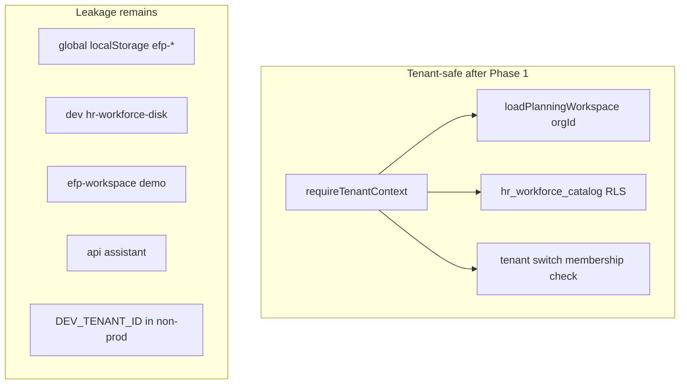

# Phase 1 Post-Implementation Audit

**Status:** Review of completed tenant spine implementation  
**Date:** 2026-05-17  
**Pre-flight reference:** [PHASE_1_AUDIT.md](./PHASE_1_AUDIT.md)  
**Governance inputs:** [PLATFORM_PRINCIPLES.md](./PLATFORM_PRINCIPLES.md) · [MULTI_TENANT_ARCHITECTURE.md](./MULTI_TENANT_ARCHITECTURE.md) · [GOVERNANCE_RULES.md](./GOVERNANCE_RULES.md) · [IMPLEMENTATION_PHASES.md](./IMPLEMENTATION_PHASES.md)

---

## 1. Executive summary

Phase 1 delivered a **server-side tenant spine**: session-bound organization context, hardened planning and HR read APIs, JSONB `hr_workforce_catalog` with RLS, and httpOnly active-org cookie switching. Implementation aligns with governance intent for **API/repository boundaries** without refactoring economics engines or demo workspace.

Phase 1 is **complete for the server spine** but **not complete for multi-tenant economics SOA** — client `localStorage` remains globally scoped and is intentionally deferred to Phase 2.

### Confidence scores

| Dimension | Score | Summary |
|-----------|-------|---------|
| **Architecture** | **7.5 / 10** | Correct layering (`src/server/tenant`, route guards); dual workspace and client SOA cap maturity |
| **Security** | **6.5 / 10** | In-scope APIs tenant-gated + RLS on new table; client bleed, dev bypass, and unauthenticated routes remain |
| **Scalability** | **5.5 / 10** | JSONB catalog viable for spike; global client persistence and no BU grants limit scale-out |

---

## 2. Review methodology

This audit verified the implementation against:

1. [PHASE_1_AUDIT.md](./PHASE_1_AUDIT.md) — pre-implementation risks, checklist §16, recommended order  
2. [PLATFORM_PRINCIPLES.md](./PLATFORM_PRINCIPLES.md) — P1–P12 (modularity, engine purity, tenant isolation, layer separation)  
3. [MULTI_TENANT_ARCHITECTURE.md](./MULTI_TENANT_ARCHITECTURE.md) — tenant model, `organization_members`, cookie strategy  
4. [GOVERNANCE_RULES.md](./GOVERNANCE_RULES.md) — change control, test gates, scope boundaries  

**Method:** Static review of `src/server/tenant/**`, `src/server/hr/**`, `src/app/api/**`, `supabase/migrations/005_*`, Vitest tests; grep for store imports in server code; route inventory.

**Out of scope for this review:** Penetration testing, production Supabase deployment verification, load testing.

---

## 3. Passed checks

### 3.1 Architecture boundaries (no violations)

| Check | Result | Evidence |
|-------|--------|----------|
| No engine refactors | **Pass** | No Phase 1 changes under `src/lib/**` (HR, service-cost, commercial-pricing, planning measures) |
| No service catalog server writes | **Pass** | No service architecture API routes added |
| No KPI / event / AI modules | **Pass** | `/api/assistant` unchanged |
| Demo workspace separated | **Pass** | `use-workspace-store` / `efp-workspace` untouched |
| Layer separation (operational ≠ commercial) | **Pass** | Tenant logic only in server + API layers |
| Scope creep | **Pass** | No calculator, CRM, proposals, or KPI registry |

### 3.2 Tenant isolation (server paths)

| Check | Result | Evidence |
|-------|--------|----------|
| Canonical membership | **Pass** | `getTenantContext()` queries `organization_members` + `organizations` join — [context.ts](../src/server/tenant/context.ts) |
| No `orgs[0]` guessing | **Pass** | `loadPlanningWorkspace(organizationId)` uses `.eq("id", organizationId).maybeSingle()` — [workspace.ts](../src/server/planning/workspace.ts) |
| Session-bound HR catalog | **Pass** | `GET /api/org/hr-catalog` loads `tenant.organizationId` only — [hr-catalog/route.ts](../src/app/api/org/hr-catalog/route.ts) |
| Active org cookie | **Pass** | httpOnly `efp-active-org`; validated against memberships — [cookies.ts](../src/server/tenant/cookies.ts), [resolve-active-org.ts](../src/server/tenant/resolve-active-org.ts) |
| Org switch guarded | **Pass** | `assertOrganizationMembership()` on `POST /api/tenant/switch` |
| RLS on new table | **Pass** | `hr_workforce_catalog_select_member` policy — [005_hr_workforce_catalog.sql](../supabase/migrations/005_hr_workforce_catalog.sql) |
| Dev bypass fail-closed in prod | **Pass** | `isProductionDeployment()` blocks `DEV_TENANT_ID` bypass |

### 3.3 Engine purity

| Check | Result | Evidence |
|-------|--------|----------|
| No business rules in routes | **Pass** | Routes: authZ, JSON mapping, Supabase I/O only |
| No Zustand in server | **Pass** | No `src/stores` imports under `src/server/**` |
| HR loader is I/O only | **Pass** | [load-hr-catalog.ts](../src/server/hr/load-hr-catalog.ts) |

### 3.4 No new hidden coupling

| Check | Result | Evidence |
|-------|--------|----------|
| New modules isolated | **Pass** | `src/server/tenant/*` → Supabase route client only |
| UI not wired to HR API yet | **Pass** | No new client fetch to `/api/org/hr-catalog` in components (no added store coupling) |
| Pre-existing UI coupling unchanged | **Pass** | Cost/commercial views still use HR+SA stores (pre-Phase 1 pattern) |

### 3.5 APIs tenant-safe (in-scope)

| Route | Guard | Tenant-safe |
|-------|-------|-------------|
| `GET /api/planning/workspace` | `requireTenantContext` + explicit org id | Yes |
| `POST /api/planning/matrix/cell` | `requireTenantContext` + RLS `planning_cells_via_row` | Yes |
| `POST /api/planning/import` | `requireTenantContext` | Yes (auth gate) |
| `POST /api/planning/export` | `requireTenantContext` | Yes (auth gate) |
| `GET /api/org/hr-catalog` | `requireTenantContext` + RLS | Yes |
| `GET /api/tenant/context` | `getTenantContext` | Yes |
| `POST /api/tenant/switch` | membership check + cookie | Yes |

### 3.6 Tests and docs

| Check | Result | Evidence |
|-------|--------|----------|
| Unit tests added | **Pass** | `context.test.ts`, `resolve-active-org.test.ts`, `load-hr-catalog.test.ts` |
| Governance docs updated | **Pass** | `MULTI_TENANT_ARCHITECTURE.md`, `IMPLEMENTATION_PHASES.md` |
| Typecheck / test suite | **Pass** | `npm run typecheck`, 100 Vitest tests (at implementation time) |

---

## 4. Failed checks

These items were listed in [PHASE_1_AUDIT.md](./PHASE_1_AUDIT.md) §16 or were explicit Phase 1 goals but are **not satisfied** in the current codebase.

| Item | Severity | Finding |
|------|----------|---------|
| **localStorage namespaced by org** | Critical (deferred) | All `efp-*` keys remain global (`efp-hr-workforce`, `efp-service-architecture-v1`, etc.). Same browser can show wrong tenant’s economics data after org switch. |
| **Live RLS integration tests** | High | Cross-tenant denial tested via **mocks only**; no Supabase-local or CI job proving RLS denies user A → org B. IMPLEMENTATION_PHASES outcome “RLS policies verified with integration tests” is **not fully met**. |
| **Role-based capabilities** | Medium | `TenantContext.role` is loaded but **not enforced** on module actions ([PERMISSION_ARCHITECTURE.md](./PERMISSION_ARCHITECTURE.md) deferred). |
| **Org picker UI + i18n** | Low (explicit defer) | APIs exist; no dashboard UI for multi-org users. Checklist item marked N/A for UI. |

---

## 5. Warnings

Issues that do not fail Phase 1 server-spine goals but require attention before production multi-tenant use.

| Warning | Severity | Detail | Recommendation |
|---------|----------|--------|----------------|
| **Global client persistence** | Critical | HR/service SOA still browser-global | Phase 2: `efp-{orgId}-*` keys + hydrate from API |
| **Dev bypass on auth failure** | Medium (dev) | When Supabase is configured but `getUser()` fails, code falls through to `devBypassContext()` if `DEV_TENANT_ID` is set — [context.ts](../src/server/tenant/context.ts) L105–106 | Only set `DEV_TENANT_ID` when Supabase auth is intentionally disabled |
| **`/api/dev/hr-workforce-disk`** | High (dev) | Single `data/hr-workforce-persist.json`; not org-scoped | Namespace by org or disable when tenant spine enabled |
| **`/api/assistant` unauthenticated** | Medium | Out of Phase 1 scope; no tenant context | Gate in Phase 5/6 or sooner if exposed publicly |
| **`loadMemberships` throws generic Error** | Low | DB errors surface as 500, not structured 503 | Map to `tenantErrorResponse` or service-unavailable type |
| **Middleware excludes `/api/*`** | Low (mitigated) | Auth only on routes that call `requireTenantContext` | New APIs must use guard; consider shared wrapper in Phase 2 |
| **Pre-existing multi-store UI** | Low | Cost/commercial views read HR + SA + prefs directly | Not introduced by Phase 1; address via orchestration hooks in Phase 2 |
| **`user_roles` table orphaned** | Low | RLS enabled, no policies; code uses `organization_members` only | Migration to deprecate or add policies |
| **`004_hr_workforce_planning.sql` tables** | Low | Normalized HR schema without RLS; not used by app | Stakeholder: retire vs secure before any wire-up |
| **Dual planning truth** | Medium | Demo `efp-workspace` vs Supabase planning | Documented; convergence Phase 7 |

---

## 6. Deferred risks

### 6.1 Remaining Phase 1 risks (open)

| Risk | Status | Owner phase |
|------|--------|-------------|
| Cross-tenant bleed via localStorage | Open | Phase 2 |
| No production RLS proof | Open | Phase 2 (CI + Supabase local) |
| Matrix cell write without app-level org check on `row_id` | Mitigated by RLS | Monitor in integration tests |
| Authenticated user with zero memberships → 401 | By design | Onboarding flow TBD |
| `DEV_TENANT_ID` mis-set in staging | Operational | Deploy checklist |

### 6.2 Technical debt intentionally deferred to Phase 2+

| Debt | Phase | Notes |
|------|-------|-------|
| Namespaced Zustand persist keys | 2 | `efp-{organizationId}-hr-workforce` |
| HR catalog **write** API + dual-write | 2 | Server becomes SOA |
| Client hydrate from `GET /api/org/hr-catalog` | 2 | Read-through cache |
| Service architecture server persistence | 2 | Separate tables, `organization_id` |
| ID remap (client string ids → UUID) | 2 | Blocker for FK integrity on templates |
| BU-scoped AuthZ (`member_business_unit_grants`) | 2 / 1b | Tenant-only in Phase 1 |
| Shared API auth middleware / wrapper | 2 | Reduce per-route boilerplate |
| Live Supabase RLS integration tests | 2 | Prove deny user A → org B |
| `requireCapability()` per [PERMISSION_ARCHITECTURE.md](./PERMISSION_ARCHITECTURE.md) | 2+ | Role loaded but unused |
| Org picker UI (en/ar) | 2+ | APIs ready |
| Demo workspace ↔ Supabase convergence | 7 | Per IMPLEMENTATION_PHASES |
| Events, KPI registry, AI tool registry | 5–6 | Out of Phase 1 |

---

## 7. Cross-tenant leakage matrix (post-implementation)

| Surface | Cross-tenant risk | Phase 1 addressed? |
|---------|-------------------|-------------------|
| `GET /api/planning/workspace` | Low (if auth + RLS) | Yes |
| `POST /api/planning/matrix/cell` | Low (RLS via row → company → org) | Yes (auth + RLS) |
| `GET /api/org/hr-catalog` | Low (session org + RLS) | Yes |
| HR Zustand / localStorage | **High** | No (Phase 2) |
| Service architecture store | **High** | No (Phase 2) |
| Dev disk mirror | **High** (dev) | No |
| Executive demo workspace | Medium (demo only) | Unchanged (by design) |
| `/api/assistant` | Medium | No |

---

## 8. Governance alignment

### 8.1 [PLATFORM_PRINCIPLES.md](./PLATFORM_PRINCIPLES.md)

| Principle | Alignment |
|-----------|-----------|
| P1 Modularity | Pass — tenant module isolated |
| P2 Pure engines | Pass — no engine edits |
| P3 Explainability | Pass — no regression |
| P4 Layer separation | Pass |
| P5 BU ≠ tenant | Pass — no conflation in new code |
| P6 Tenant isolation | Partial — server yes, client no |
| P7 Single KPI lineage | N/A — no KPI changes |
| P8 Event-ready | N/A — no events yet |
| P9 AI safety | N/A |
| P10 i18n | N/A for Phase 1 APIs |
| P11 Preserve strengths | Pass |
| P12 Doc-first spine | Pass |

### 8.2 [GOVERNANCE_RULES.md](./GOVERNANCE_RULES.md) PR checklist

| Gate | Met? |
|------|------|
| Tenant/BU scope considered | Partial — tenant on APIs only |
| No duplicate KPI formulas | Pass (no KPI changes) |
| Engine purity | Pass |
| Adapter for cross-module | Pass (no new cross-store server joins) |
| en + ar for new UI | N/A (API-only) |
| Docs updated | Pass |
| No scope creep | Pass |

### 8.3 [MULTI_TENANT_ARCHITECTURE.md](./MULTI_TENANT_ARCHITECTURE.md)

| Target | Status |
|--------|--------|
| `organizationId` in session | Implemented via `TenantContext` |
| API routes require org | Implemented for planning + org + tenant |
| RLS aligned | New catalog yes; live proof pending |
| Client deprecate global keys | **Not started** (Phase 2) |
| `organization_members` canonical | **Implemented** in code |

---

## 9. PHASE_1_AUDIT.md §16 scorecard (final)

| Checklist item | Result |
|----------------|--------|
| Tenant: every server read/write includes `organization_id` | **Partial** — APIs yes; client writes no |
| `organization_members` canonical | **Pass** |
| No `orgs[0]` | **Pass** |
| API auth on `/api/planning/*` and `/api/org/*` | **Pass** |
| RLS integration tests | **Fail** (mocked unit tests only) |
| localStorage namespaced | **Fail** (deferred Phase 2) |
| HR read API org-scoped | **Pass** |
| Engine purity | **Pass** |
| Docs updated | **Pass** |
| i18n org picker | **N/A** (no UI) |
| No scope creep | **Pass** |

**Score: 7 pass, 2 fail, 1 partial, 1 N/A** — acceptable for **server spine** gate; not acceptable for **full Phase 1 economics migration** gate.

---

## 10. Recommended Phase 2 prerequisites (ordered)

1. **Deploy migration** — Apply [005_hr_workforce_catalog.sql](../supabase/migrations/005_hr_workforce_catalog.sql) in all environments; seed `organizations` + `organization_members` for test users ([seed.sql](../supabase/seed.sql)).
2. **RLS proof** — Add Supabase-local (or CI) integration tests: user A cannot `SELECT` org B from `hr_workforce_catalog` and `organizations`.
3. **Namespaced persistence** — Feature-flag `efp-{organizationId}-hr-workforce` (and service key); clear state on `POST /api/tenant/switch`.
4. **HR catalog hydrate** — Optional client read on login from `GET /api/org/hr-catalog`; fallback to namespaced localStorage.
5. **HR catalog write** — `PUT /api/org/hr-catalog` with `engine_version`, dual-write period documented.
6. **Stakeholder decision** — Retire vs secure [004_hr_workforce_planning.sql](../supabase/migrations/004_hr_workforce_planning.sql) normalized tables; avoid two HR schemas.
7. **Capability enforcement** — `requireCapability('hr.workforce.read')` etc. per [PERMISSION_ARCHITECTURE.md](./PERMISSION_ARCHITECTURE.md).
8. **Dev disk** — Org-scoped path or disable when `NEXT_PUBLIC_TENANT_SPINE=1`.
9. **Service catalog API** — Phase 2 scope per [IMPLEMENTATION_PHASES.md](./IMPLEMENTATION_PHASES.md) §4.

---

## 11. Sign-off recommendation

| Question | Recommendation |
|----------|----------------|
| Is Phase 1 **server tenant spine** acceptable to merge? | **Yes** — meets plan scope: context, APIs, migration, cookie, tests |
| Is Phase 1 **complete** per original IMPLEMENTATION_PHASES outcomes? | **Partial** — RLS “verified” only by mocks; client SOA unchanged |
| Safe for production multi-tenant economics? | **No** — until Phase 2 namespaced persistence + RLS integration tests |
| Safe for continued single-tenant / dev demo use? | **Yes** — with `DEV_TENANT_ID` or single org membership |

**Verdict:** Proceed to **Phase 2 (server persistence for economics modules)** after applying migration `005`, seeding memberships, and adding live RLS denial tests. Do not treat Phase 1 as eliminating client-side cross-tenant risk.

---

## Appendix — Implementation inventory

| Artifact | Path |
|----------|------|
| Tenant context | `src/server/tenant/context.ts` |
| Active org cookie | `src/server/tenant/cookies.ts` |
| Org resolution | `src/server/tenant/resolve-active-org.ts` |
| HR catalog loader | `src/server/hr/load-hr-catalog.ts` |
| Migration | `supabase/migrations/005_hr_workforce_catalog.sql` |
| Planning workspace | `src/server/planning/workspace.ts` |
| Tests | `src/server/tenant/*.test.ts`, `src/server/hr/load-hr-catalog.test.ts` |

---

*Next review: after Phase 2 dual-write or first production Supabase deployment with multi-org users.*
