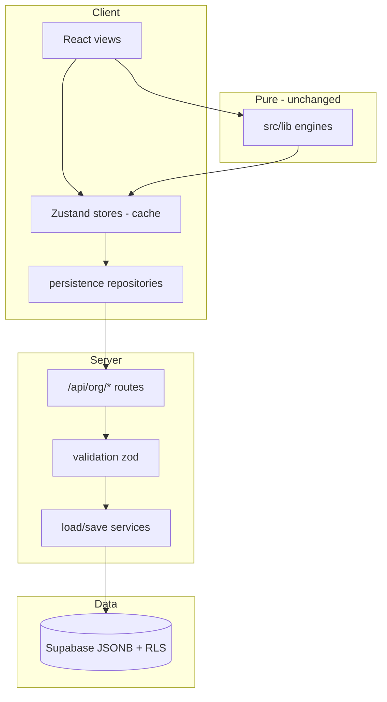
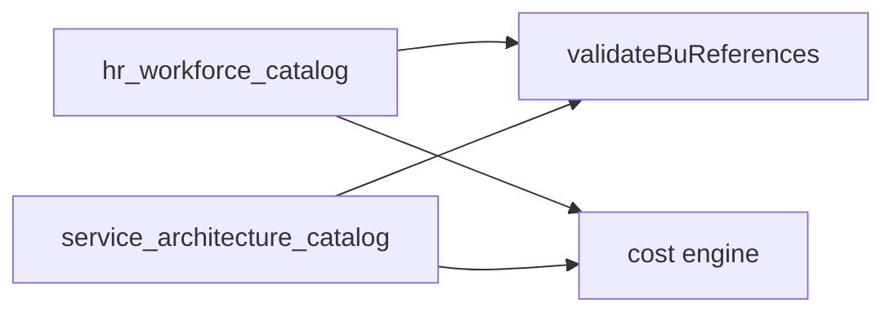

# Phase 2 Architecture — Server Persistence (Economics Modules)

**Status:** Target architecture (documentation only — not yet implemented)  
**Depends on:** Phase 1 tenant spine ([PHASE_1_POST_IMPLEMENTATION_AUDIT.md](./PHASE_1_POST_IMPLEMENTATION_AUDIT.md))  
**Related:** [PHASE_2_MIGRATION_STRATEGY.md](./PHASE_2_MIGRATION_STRATEGY.md) · [PHASE_2_API_PLAN.md](./PHASE_2_API_PLAN.md) · [PHASE_2_STATE_MANAGEMENT_PLAN.md](./PHASE_2_STATE_MANAGEMENT_PLAN.md) · [DATA_OWNERSHIP.md](./DATA_OWNERSHIP.md)

---

## 1. Purpose

Phase 2 moves **HR Workforce** and **Service Architecture** from global browser `localStorage` (source of truth today) to **tenant-scoped server persistence**, while:

- Preserving all pure engines under `src/lib/**`
- Preserving modular boundaries ([PLATFORM_PRINCIPLES.md](./PLATFORM_PRINCIPLES.md), [SYSTEM_BOUNDARIES.md](./SYSTEM_BOUNDARIES.md))
- **Not** merging CRM, KPI, event, or AI concerns into economics modules
- **Not** changing demo executive workspace SOA (`efp-workspace`)

---

## 2. Problem statement (today)

| Issue | Impact |
|-------|--------|
| Global persist keys | Cross-tenant bleed on shared browsers |
| No server SOA for economics | Cannot audit, backup, or enforce RLS on catalog data |
| Service → HR id references | `serviceTemplate.businessUnitId` points to `HrBusinessUnit.id` in client memory only |
| Phase 1 read-only HR API | `GET /api/org/hr-catalog` exists; no write path |

Phase 1 solved **who** the tenant is; Phase 2 solves **where** economics data lives.

---

## 3. Target storage model

### 3.1 Recommended: org-scoped JSONB catalogs (Phase 2)

Mirrors existing Zustand `partialize` shapes — minimizes engine and UI churn.

| Domain | Table | PK | Payload source |
|--------|-------|-----|----------------|
| HR Workforce | `hr_workforce_catalog` | `organization_id` | [use-hr-workforce-store.ts](../src/stores/use-hr-workforce-store.ts) `partialize` |
| Service Architecture | `service_architecture_catalog` (**new migration 006**) | `organization_id` | [use-service-architecture-store.ts](../src/stores/use-service-architecture-store.ts) `partialize` |
| Module prefs (optional 2.5) | `user_module_prefs` | `(organization_id, user_id, module_key)` | cost/commercial prefs stores |

**Row shape (both catalogs):**

```sql
-- Conceptual — see 005 (HR) and proposed 006 (Service)
organization_id uuid PRIMARY KEY REFERENCES organizations(id),
payload jsonb NOT NULL,
engine_version text,
updated_at timestamptz NOT NULL,
updated_by uuid REFERENCES auth.users(id)
```

### 3.2 Explicitly not used in Phase 2

| Artifact | Reason |
|----------|--------|
| [004_hr_workforce_planning.sql](../supabase/migrations/004_hr_workforce_planning.sql) normalized tables | No RLS today; large remap project; defer to Phase 2b+ |
| Merging HR + Service into one JSONB blob | Violates module boundaries; complicates independent versioning |
| `public.business_units` (planning SQL) | Different concept from `HrBusinessUnit` — see [DATA_OWNERSHIP.md](./DATA_OWNERSHIP.md) |

---

## 4. Layered architecture



### 4.1 Layer responsibilities

| Layer | Location (proposed) | May do | Must not do |
|-------|---------------------|--------|-------------|
| UI | `src/components/**` | Render, dispatch store actions | Pricing/OH math, persist keys |
| Zustand | `src/stores/**` | In-memory state, call repository hooks | Direct `fetch` scattered in components |
| Persistence repo | `src/lib/persistence/**` | Namespaced localStorage, debounced PUT, hydrate | Import HR store into service repo |
| API routes | `src/app/api/org/**` | AuthZ, HTTP codes | Business formulas |
| Validation | `src/server/validation/**` | Shape + BU reference checks | OH/cost simulation |
| Load/save | `src/server/hr/**`, `src/server/service/**` | Supabase I/O | Zustand |
| Engines | `src/lib/**` | Deterministic computation | Supabase, tenant cookies |

---

## 5. HR → Service dependency



| Rule | Enforcement |
|------|-------------|
| Service templates reference HR BU ids | Server `PUT /api/org/service-catalog` loads HR row, validates every `template.businessUnitId` ∈ `payload.businessUnits[].id` |
| Cost engine BU match | Unchanged — [engine.ts](../src/lib/service-cost-simulation/engine.ts) |
| Service module does not create BUs | Unchanged — HR Settings / organization view only |

**No store-to-store persistence:** service repository receives `hrBusinessUnitIds: string[]` as an argument from orchestration layer (e.g. `persistServiceCatalog({ hrBuIds })`).

---

## 6. ID strategy (Phase 2)

| Topic | Decision |
|-------|----------|
| Entity ids inside JSONB | **Retain** prefixed strings (`bu_<uuid>`, `svc_template_<uuid>`) from [newHrId](../src/lib/hr-workforce/id.ts) / [newServiceId](../src/lib/service-architecture/id.ts) |
| Postgres row identity | `organization_id` only |
| UUID remap to normalized tables | **Deferred** — optional `entity_id_map` in Phase 2b |

---

## 7. Versioning and snapshots

| Concern | Approach |
|---------|----------|
| HR `engineVersion` / `formulaVersion` | Stored in snapshot records inside JSONB `snapshots[]`; catalog row has top-level `engine_version` for catalog schema |
| Server `engine_version` column | Bumped when payload shape changes ([GOVERNANCE_RULES.md](./GOVERNANCE_RULES.md)) |
| Optimistic concurrency | `updated_at` + optional `If-Match` / `expectedUpdatedAt` on PUT ([PHASE_2_API_PLAN.md](./PHASE_2_API_PLAN.md)) |

Snapshots are **not** a separate table in Phase 2 — they remain part of HR catalog payload per [hr-snapshot-slice.ts](../src/stores/hr-workforce/slices/hr-snapshot-slice.ts).

---

## 8. Persistence mode (feature flag)

| Mode | Behavior |
|------|----------|
| `local_only` | Namespaced localStorage only (rollback) |
| `dual_write` | Local + debounced server PUT (Phase 2 default rollout) |
| `server_authoritative` | Load from server; local is cache only (Phase 2.6) |

Env: `NEXT_PUBLIC_PERSIST_MODE` (documented in [PHASE_2_STATE_MANAGEMENT_PLAN.md](./PHASE_2_STATE_MANAGEMENT_PLAN.md)).

---

## 9. Out of scope (Phase 2)

| Item | Phase |
|------|-------|
| Engine refactors | Never in Phase 2 |
| Service cost / commercial **engines** | Unchanged |
| KPI registry, events, AI | 3+ / 5+ / 6+ |
| CRM, proposals, calculator | 4+ / 8+ |
| `use-workspace-store` server SOA | 7+ |
| Sales plan server SOA | 3+ |
| Normalized HR tables (004) wire-up | 2b+ optional |
| BU-scoped AuthZ matrix | 2b / [PERMISSION_ARCHITECTURE.md](./PERMISSION_ARCHITECTURE.md) |

---

## 10. Proposed schema: `006_service_architecture_catalog.sql`

```sql
-- PROPOSED — not applied until Phase 2.3 implementation
create table if not exists public.service_architecture_catalog (
  organization_id uuid primary key references public.organizations (id) on delete cascade,
  payload jsonb not null default '{}'::jsonb,
  engine_version text,
  updated_at timestamptz not null default now(),
  updated_by uuid references auth.users (id)
);

alter table public.service_architecture_catalog enable row level security;

-- Policies: mirror hr_workforce_catalog (organization_members)
```

HR catalog **write policies** to add on `hr_workforce_catalog` when PUT is implemented (Phase 1 is SELECT-only).

---

## 11. Governance alignment

| Document | Phase 2 alignment |
|----------|-------------------|
| [PLATFORM_PRINCIPLES.md](./PLATFORM_PRINCIPLES.md) P1–P2 | Repositories + adapters; engines pure |
| [PLATFORM_PRINCIPLES.md](./PLATFORM_PRINCIPLES.md) P5 | Organization ≠ HrBusinessUnit preserved |
| [PLATFORM_PRINCIPLES.md](./PLATFORM_PRINCIPLES.md) P6 | Tenant isolation via RLS + session APIs |
| [GOVERNANCE_RULES.md](./GOVERNANCE_RULES.md) | Version bumps on catalog shape change |
| [DATA_OWNERSHIP.md](./DATA_OWNERSHIP.md) | SOA moves to server per entity registry |
| [MULTI_TENANT_ARCHITECTURE.md](./MULTI_TENANT_ARCHITECTURE.md) | Namespaced keys + server catalogs |
| [IMPLEMENTATION_PHASES.md](./IMPLEMENTATION_PHASES.md) §4 | Gate: BU validation on template save |

---

## 12. Phase 2 sub-stages (summary)

| Stage | Deliverable |
|-------|-------------|
| 2.0 | Namespaced client keys |
| 2.1 | HR hydrate (GET) |
| 2.2 | HR dual-write (PUT) |
| 2.3 | Service table + GET |
| 2.4 | Service dual-write + BU validation |
| 2.5 | Prefs namespaced |
| 2.6 | Server authoritative mode |

Detail: [PHASE_2_MIGRATION_STRATEGY.md](./PHASE_2_MIGRATION_STRATEGY.md).

---

## 13. Success criteria

- [ ] No unscoped writes to global `efp-*` keys in `dual_write` or `server_authoritative` mode  
- [ ] Org switch loads correct tenant catalogs (no stale cross-tenant state)  
- [ ] Service PUT rejects invalid `businessUnitId` references  
- [ ] Live RLS tests pass ([PHASE_2_RLS_TEST_PLAN.md](./PHASE_2_RLS_TEST_PLAN.md))  
- [ ] All existing engine Vitest suites green without modification  
- [ ] Demo workspace (`efp-workspace`) behavior unchanged  

---

*Implementation must follow [PHASE_2_MIGRATION_STRATEGY.md](./PHASE_2_MIGRATION_STRATEGY.md) staging — no big-bang cutover.*
