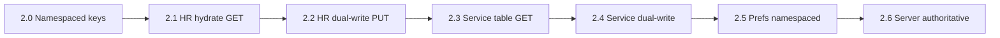

# Phase 2 Migration Strategy

**Status:** Controlled migration plan (documentation only)  
**Related:** [PHASE_2_ARCHITECTURE.md](./PHASE_2_ARCHITECTURE.md) · [PHASE_2_STATE_MANAGEMENT_PLAN.md](./PHASE_2_STATE_MANAGEMENT_PLAN.md) · [PHASE_1_AUDIT.md](./PHASE_1_AUDIT.md) · [PHASE_1_POST_IMPLEMENTATION_AUDIT.md](./PHASE_1_POST_IMPLEMENTATION_AUDIT.md)

---

## Part A — Migration analysis (read before implementation)

### A.1 Exact migration risks

| Risk | Severity | Description |
|------|----------|-------------|
| **Cross-tenant localStorage bleed** | Critical | Global keys `efp-hr-workforce`, `efp-service-architecture-v1` show wrong tenant data after org switch or on shared machines |
| **Service → HR BU id coupling** | Critical | `serviceTemplate.businessUnitId` must exist in HR `businessUnits[]`; remap without coordinated update orphans templates and breaks [cost engine BU check](../src/lib/service-cost-simulation/engine.ts) |
| **Dual-write divergence** | High | Local succeeds, server fails (or vice versa); user sees inconsistent state across tabs/devices |
| **Org switch without store reset** | High | In-memory Zustand retains previous org after `POST /api/tenant/switch` |
| **Prefixed string IDs vs Postgres UUID** | High | `bu_<uuid>` is not a UUID type; blocks naive FK to [004](../supabase/migrations/004_hr_workforce_planning.sql) normalized tables |
| **Two HR schemas in repo** | Medium | JSONB `005` vs normalized `004` without RLS — wrong adoption path causes rework |
| **Snapshot / engine version drift** | Medium | [HR_WORKFORCE_ENGINE_VERSION](../src/lib/hr-workforce/workspace-versions.ts) must align with server `engine_version` |
| **Client-only imports** | Medium | HR/service import commits without server dry-run |
| **Dev disk mirror** | Medium (dev) | `data/hr-workforce-persist.json` is global |
| **Prefs hold stale template ids** | Medium | `efp-service-cost-simulation-prefs-v1` after catalog migration |

**Explicitly out of Phase 2 server migration:** `efp-workspace` (demo), `efp-sales-plan-wizard` (namespaced only).

### A.2 Safest migration sequence

| Stage | Action | Why this order |
|-------|--------|----------------|
| **2.0** | Dynamic keys `efp-{orgId}-hr-workforce`, `efp-{orgId}-service-architecture-v1`; reset stores on org switch | Stops bleed before server writes |
| **2.1** | Hydrate HR from `GET /api/org/hr-catalog` when server `updated_at` newer | Establish server baseline read path |
| **2.2** | Debounced `PUT /api/org/hr-catalog` + shape validation | HR is dependency for service BU checks |
| **2.3** | Apply `006_service_architecture_catalog.sql`; `GET /api/org/service-catalog` | Service read path |
| **2.4** | `PUT /api/org/service-catalog` + `validateBuReferences` | Enforce HR→SA integrity at boundary |
| **2.5** | Namespace cost/commercial prefs; invalidate on org switch if ids missing | Prevent wrong template selection |
| **2.6** | `server_authoritative` mode; optional one-time uplift script | Cutover |

**Rationale:** HR before Service; namespaced keys before dual-write; read before write. No big-bang rewrite.

### A.3 Rollback strategy

| Level | Trigger | Action |
|-------|---------|--------|
| **L1 — Feature flag** | Production incident | Set `NEXT_PUBLIC_PERSIST_MODE=local_only`; APIs become optional reads |
| **L2 — Per org** | Corrupt server payload | Restore from `*_catalog_revisions` audit table (optional) or manual JSON backup |
| **L3 — Client** | User blocked | Clear `efp-{orgId}-*` keys; reload from export |
| **L4 — Schema** | Bad migration | Keep global keys until 2.6 stable one release; do not drop columns |

**Rule:** Do not delete global `efp-hr-workforce` / `efp-service-architecture-v1` until:
1. Per-org uplift script has run, and  
2. One release cycle at `dual_write` or `server_authoritative` with no P0 incidents.

### A.4 Data consistency strategy

| Rule | Mechanism |
|------|-----------|
| Single writer per domain per org | Separate DB rows: `hr_workforce_catalog`, `service_architecture_catalog` |
| Authoritative timestamp | `updated_at` on server; optional `localSavedAt` in client meta |
| Load precedence | On login/org switch: if `server.updated_at > local.savedAt` → hydrate server; else one-time uplift PUT local → server |
| Conflict policy (Phase 2) | **Last-write-wins** using server `updated_at` |
| Conflict policy (Phase 2b) | Optional revision table + `If-Match` |
| BU integrity | Service PUT rejected if template BU ∉ HR catalog (server validator, not engine) |
| Engine inputs unchanged | Server stores same JSON as Zustand `partialize`; engines read Zustand after hydrate |

### A.5 Dual-write risks

| Risk | Mitigation |
|------|------------|
| Duplicate mutation paths | Store action → single `persistHrCatalog()` / `persistServiceCatalog()` |
| Local ok, server 500 | `syncStatus: 'pending' \| 'synced' \| 'error'`; retry queue |
| Debounce races | ~500ms debounce; flush on `beforeunload` and org switch |
| Wrong org on PUT | `requireTenantContext()`; never accept `organizationId` in body |
| Shape drift | Zod contract tests mirroring `partialize` output |

### A.6 ID migration risks

**Current formats:**

- HR: `newHrId("bu")` → `bu_<uuid>` — [id.ts](../src/lib/hr-workforce/id.ts)
- Service: `newServiceId("svc_template")` → `svc_template_<uuid>` — [id.ts](../src/lib/service-architecture/id.ts)

**Phase 2 decision: retain string IDs inside JSONB.**

| Approach | Pros | Cons |
|----------|------|------|
| **Retain string ids (recommended)** | No mass remap; engines/imports unchanged | No FK to normalized SQL tables |
| Big-bang UUID remap | Enables 004 tables | High breakage risk for SA→HR links |
| `entity_id_map` table (2b) | Gradual normalization | Extra migration project |

**One-time uplift per org (when enabling dual_write):**

1. Read legacy global `efp-hr-workforce` and `efp-service-architecture-v1` (if present).  
2. Resolve target `organizationId` from active tenant (`getTenantContext`).  
3. `PUT` both catalogs to server.  
4. Write copies to `efp-{orgId}-*` namespaced keys.  
5. Set org metadata `economics_migrated_at` (optional column or app config).

---

## Part B — Staged rollout detail

### Stage 2.0 — Namespaced client persistence

**Changes:**

- `createTenantPersistStorage(orgId, baseKey)` returns `localStorage` adapter with key `efp-${orgId}-${suffix}`.
- On `POST /api/tenant/switch`: flush pending PUTs → reset HR + SA (+ prefs) stores → hydrate.

**Rollback:** Flag off; read legacy global key once with migration prompt.

**Gate:** Manual test — two orgs on same browser show different catalogs.

### Stage 2.1 — HR read hydrate

**Changes:**

- After tenant context available, `GET /api/org/hr-catalog`.
- If 404, keep namespaced local (or empty seed).
- If 200 and server newer, `merge` into store (existing persist merge logic).

**Rollback:** Skip fetch.

### Stage 2.2 — HR dual-write

**Changes:**

- `PUT /api/org/hr-catalog` with Zod-validated payload.
- RLS INSERT/UPDATE policies on `hr_workforce_catalog`.
- Debounced persist from store subscription or explicit repository.

**Rollback:** `PERSIST_MODE=local_only`.

### Stage 2.3 — Service catalog table + GET

**Changes:**

- Migration `006_service_architecture_catalog.sql`.
- `GET /api/org/service-catalog`.
- Loader mirrors [load-hr-catalog.ts](../src/server/hr/load-hr-catalog.ts).

### Stage 2.4 — Service dual-write

**Changes:**

- `PUT /api/org/service-catalog`.
- `validateBuReferences(servicePayload, hrPayload)`.
- Hydrate SA store after HR hydrate on org switch.

**Rollback:** Disable service PUT; HR-only dual-write.

### Stage 2.5 — Prefs namespaced

**Changes:**

- Keys: `efp-{orgId}-service-cost-simulation-prefs-v1`, etc.
- On org switch: reset prefs if `serviceTemplateId` not in new catalog.

**Optional:** `user_module_prefs` table — defer if namespaced local is sufficient.

### Stage 2.6 — Server authoritative

**Changes:**

- `PERSIST_MODE=server_authoritative`: writes only to server; local is read-through cache.
- Import dry-run APIs route through server ([PHASE_2_API_PLAN.md](./PHASE_2_API_PLAN.md)).
- Deprecate dev global disk mirror or scope by org path.

**Gate:** [PHASE_2_RLS_TEST_PLAN.md](./PHASE_2_RLS_TEST_PLAN.md) green in CI.

---

## Part C — What we are not doing (anti-patterns)

| Anti-pattern | Why rejected |
|--------------|--------------|
| Big-bang delete localStorage | No rollback |
| Merge HR + Service into one API | Violates module boundaries |
| Persist from SA store inside HR repository | Hidden coupling |
| Rewrite engines for server types | Violates P2 |
| Use 004 tables without RLS + remap | Security + scope explosion |
| Touch `efp-workspace` | Demo separation |

---

## Part D — Phase 2 completion checklist

| Item | Stage |
|------|-------|
| Namespaced keys for HR + SA | 2.0 |
| HR GET hydrate | 2.1 |
| HR PUT + RLS write | 2.2 |
| Service table + GET | 2.3 |
| Service PUT + BU validation | 2.4 |
| Prefs namespaced | 2.5 |
| Server authoritative flag | 2.6 |
| Live RLS integration tests | 2.6 |
| Uplift script documented + run per env | 2.2+ |
| IMPLEMENTATION_PHASES §4 gate | 2.4 |

---

## Part E — Relationship to Phase 1

| Phase 1 delivered | Phase 2 builds on |
|-------------------|-------------------|
| `requireTenantContext()` | All PUT/GET org routes |
| `hr_workforce_catalog` SELECT | HR PUT + write RLS |
| `GET /api/org/hr-catalog` | Hydrate + conflict resolution |
| httpOnly `efp-active-org` | Org switch triggers reset + reload |

Phase 1 **failed** items addressed in Phase 2: namespaced localStorage, live RLS tests (see RLS test plan).

---

*Next: [PHASE_2_API_PLAN.md](./PHASE_2_API_PLAN.md) for route contracts.*
