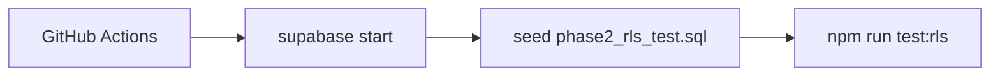

# Phase 2 RLS Test Plan

**Status:** Verification strategy for live Supabase (not implemented)  
**Addresses:** Phase 1 post-audit **failed** item — “RLS integration tests (mocked only)”  
**Related:** [PHASE_2_ARCHITECTURE.md](./PHASE_2_ARCHITECTURE.md) · [PHASE_2_API_PLAN.md](./PHASE_2_API_PLAN.md) · [MULTI_TENANT_ARCHITECTURE.md](./MULTI_TENANT_ARCHITECTURE.md)

---

## 1. Objectives

| Objective | Success criterion |
|-----------|-------------------|
| Cross-tenant read denial | User B cannot `SELECT` org A catalog rows |
| Cross-tenant write denial | User B cannot `UPSERT` org A catalog rows |
| API layer denial | User B receives 401/403/empty via RLS-backed routes |
| Membership revocation | Removed member loses access on next request |
| Anon denial | Unauthenticated client cannot read/write catalogs |

---

## 2. Scope

### 2.1 In scope

| Table | Operations |
|-------|------------|
| `hr_workforce_catalog` | SELECT, INSERT, UPDATE (after Phase 2.2 policies) |
| `service_architecture_catalog` | SELECT, INSERT, UPDATE (migration 006) |

### 2.2 Via API (integration)

| Route | Methods |
|-------|---------|
| `/api/org/hr-catalog` | GET, PUT |
| `/api/org/service-catalog` | GET, PUT |

### 2.3 Out of scope (Phase 2)

| Item | Reason |
|------|--------|
| `004` normalized HR tables | Not wired |
| `user_roles` | Deprecated path |
| Planning tables | Separate phase |
| Penetration / load testing | Future |

---

## 3. Test environment

### 3.1 Supabase local

```bash
# Conceptual CI setup
supabase start
supabase db reset   # applies migrations 001–006
psql -f supabase/seed/phase2_rls_test.sql
```

### 3.2 Seed data (`phase2_rls_test.sql` — proposed)

| Entity | Value |
|--------|-------|
| Org A | `00000000-0000-4000-8000-0000000000a1` |
| Org B | `00000000-0000-4000-8000-0000000000b2` |
| User Alice | auth user A — member of Org A only |
| User Bob | auth user B — member of Org B only |
| HR catalog A | Row with `payload.businessUnits: [{ id: "bu_a1", name: "BU A" }]` |
| HR catalog B | Row with distinct payload |
| Service catalog A/B | Similar |

Use `organization_members` (not `user_roles`).

### 3.3 Test runner

| Approach | Recommendation |
|----------|----------------|
| Vitest + `@supabase/supabase-js` | Service role for setup; user JWT for assertions |
| Separate job `npm run test:rls` | Not blocking unit tests if local Supabase unavailable |
| CI | Optional job with `supabase/cli` service container |

---

## 4. RLS policies to verify

### 4.1 `hr_workforce_catalog` (existing + new)

**Phase 1 (exists):**

```sql
-- hr_workforce_catalog_select_member
FOR SELECT USING (exists (
  select 1 from organization_members m
  where m.organization_id = hr_workforce_catalog.organization_id
    and m.user_id = auth.uid()
));
```

**Phase 2 (add):**

```sql
-- Proposed: hr_workforce_catalog_write_member
FOR INSERT WITH CHECK (exists (
  select 1 from organization_members m
  where m.organization_id = hr_workforce_catalog.organization_id
    and m.user_id = auth.uid()
));

FOR UPDATE USING (/* same */) WITH CHECK (/* same */);
```

### 4.2 `service_architecture_catalog` (new 006)

Mirror HR policies: SELECT/INSERT/UPDATE for members only.

---

## 5. Test matrix

### 5.1 Direct Supabase client (RLS)

| ID | Actor | Action | Target | Expected |
|----|-------|--------|--------|----------|
| R1 | Alice JWT | SELECT | hr_workforce_catalog org A | 1 row |
| R2 | Alice JWT | SELECT | hr_workforce_catalog org B | 0 rows |
| R3 | Bob JWT | SELECT | hr_workforce_catalog org A | 0 rows |
| R4 | Bob JWT | INSERT | hr_workforce_catalog org A | RLS error / 0 inserted |
| R5 | Bob JWT | UPDATE | hr_workforce_catalog org A | RLS error |
| R6 | Anon | SELECT | any catalog | 0 rows |
| R7 | Alice JWT | SELECT | service_architecture_catalog org A | 1 row |
| R8 | Bob JWT | SELECT | service_architecture_catalog org A | 0 rows |
| R9–R12 | Same pattern | INSERT/UPDATE | service catalog | Same as HR |

### 5.2 API routes (HTTP)

| ID | Actor | Request | Expected |
|----|-------|---------|----------|
| A1 | Alice | `GET /api/org/hr-catalog` | 200, org A payload |
| A2 | Bob | `GET /api/org/hr-catalog` | 200 Bob payload or 404 (never A) |
| A3 | Bob | `PUT /api/org/hr-catalog` with Alice session cookie swapped | 401/403 or writes only Bob org |
| A4 | No session | `GET /api/org/hr-catalog` | 401 (or dev bypass if env — **disable in RLS CI**) |
| A5 | Alice | `PUT /api/org/service-catalog` template BU `bu_a1` | 200 |
| A6 | Alice | `PUT /api/org/service-catalog` template BU `bu_b999` | 422 BU not in HR |
| A7 | Bob | `GET /api/org/service-catalog` | Never returns Alice data |

### 5.3 Membership revocation

| ID | Steps | Expected |
|----|-------|----------|
| M1 | Remove Bob from org B; Bob calls GET | 401 or empty |
| M2 | Alice remains on org A | Unchanged access |

---

## 6. Implementation sketch (Vitest)

```typescript
// tests/rls/catalog-isolation.test.ts — proposed location
describe("hr_workforce_catalog RLS", () => {
  it("denies cross-tenant select", async () => {
    const clientBob = createClientAsUser("bob@test.local");
    const { data } = await clientBob
      .from("hr_workforce_catalog")
      .select("*")
      .eq("organization_id", ORG_A_ID);
    expect(data ?? []).toHaveLength(0);
  });
});
```

**Setup helper:** Service role client inserts seed rows; user clients use anon key + signed-in session.

---

## 7. CI integration



| Job | Required? |
|-----|-------------|
| `npm run test` (unit) | Always |
| `npm run test:rls` | Phase 2 gate — required before 2.6 |

**Failure policy:** Phase 2 PRs touching `supabase/migrations/*` or `src/app/api/org/*` must pass RLS job.

---

## 8. Regression links to Phase 1

| Phase 1 gap | Phase 2 test |
|-------------|--------------|
| Mock-only catalog tests | R1–R12 live |
| No proof of PUT denial | R4–R5, A3 |
| `user_roles` unused | Seed uses `organization_members` only |

---

## 9. Manual QA checklist

- [ ] Two test users, two orgs in Supabase dashboard  
- [ ] Alice cannot see Bob's catalog in SQL editor with Alice's JWT  
- [ ] Browser: login Alice, save HR, login Bob in another profile — no shared catalog  
- [ ] `DEV_TENANT_ID` unset in staging RLS test environment  

---

## 10. Sign-off criteria

Phase 2 RLS work is **done** when:

1. Policies exist for HR write + full service catalog CRUD.  
2. Matrix R1–R12 pass in `test:rls` locally.  
3. API matrix A1–A7 pass against local Next + Supabase.  
4. Documented in CI README / IMPLEMENTATION_PHASES §4 gate.

---

*Policy SQL lives in migrations; this doc is the verification contract.*
