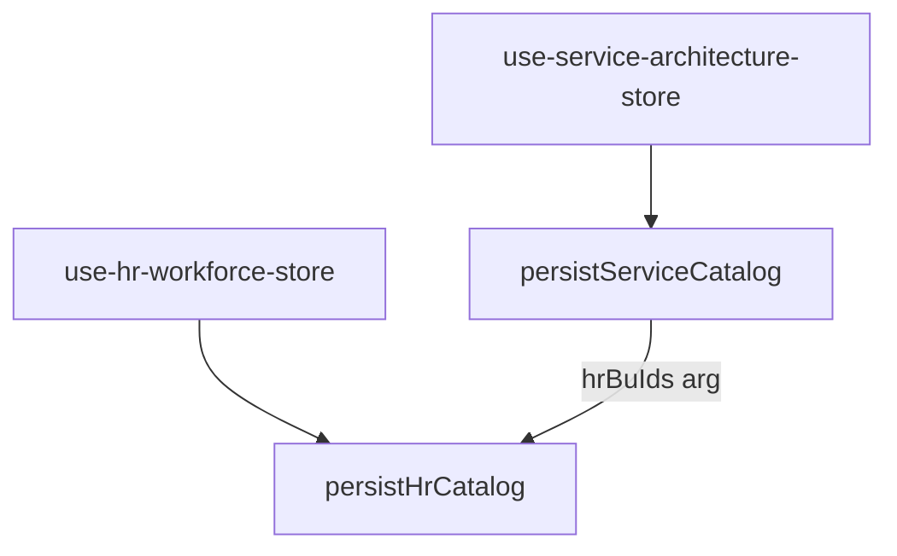
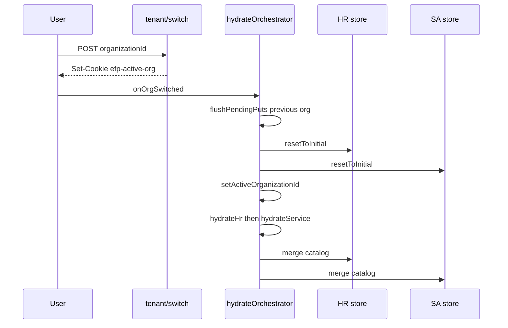

# Phase 2 State Management Plan

**Status:** Client-side persistence and sync design (not implemented)  
**Related:** [PHASE_2_ARCHITECTURE.md](./PHASE_2_ARCHITECTURE.md) · [PHASE_2_MIGRATION_STRATEGY.md](./PHASE_2_MIGRATION_STRATEGY.md) · [PHASE_2_API_PLAN.md](./PHASE_2_API_PLAN.md)

---

## 1. Goals

| Goal | Approach |
|------|----------|
| Tenant-safe client cache | Namespaced `localStorage` keys per `organizationId` |
| Server SOA for economics | HR + Service catalogs via PUT/GET |
| No hidden store coupling | Persistence repositories; no SA store inside HR repo |
| Preserve engines | Zustand remains read surface for `src/lib/**` |
| Org switch safety | Reset + hydrate sequence |
| Demo workspace untouched | `efp-workspace` unchanged |

---

## 2. Store and persist key inventory

| Store | File | Current key | Phase 2 key |
|-------|------|-------------|-------------|
| HR Workforce | [use-hr-workforce-store.ts](../src/stores/use-hr-workforce-store.ts) | `efp-hr-workforce` | `efp-{orgId}-hr-workforce` |
| Service Architecture | [use-service-architecture-store.ts](../src/stores/use-service-architecture-store.ts) | `efp-service-architecture-v1` | `efp-{orgId}-service-architecture-v1` |
| Cost simulation prefs | [use-service-cost-simulation-prefs-store.ts](../src/stores/use-service-cost-simulation-prefs-store.ts) | `efp-service-cost-simulation-prefs-v1` | `efp-{orgId}-service-cost-simulation-prefs-v1` |
| Commercial pricing prefs | [use-commercial-pricing-prefs-store.ts](../src/stores/use-commercial-pricing-prefs-store.ts) | `efp-commercial-pricing-prefs-v1` | `efp-{orgId}-commercial-pricing-prefs-v1` |
| Sales plan wizard | [use-sales-plan-wizard-store.ts](../src/stores/use-sales-plan-wizard-store.ts) | `efp-sales-plan-wizard` | `efp-{orgId}-sales-plan-wizard` (namespace only) |
| Executive workspace | [use-workspace-store.ts](../src/stores/use-workspace-store.ts) | `efp-workspace` | **unchanged** (demo) |

---

## 3. Persist mode feature flag

| Env | Values | Default (dev) | Default (prod) |
|-----|--------|---------------|----------------|
| `NEXT_PUBLIC_PERSIST_MODE` | `local_only` \| `dual_write` \| `server_authoritative` | `dual_write` | `dual_write` → later `server_authoritative` |

| Mode | localStorage | Server |
|------|--------------|--------|
| `local_only` | Namespaced read/write | Optional GET ignored for writes |
| `dual_write` | Namespaced read/write | Debounced PUT after mutations |
| `server_authoritative` | Cache only | GET on load; PUT on mutation; local optional |

---

## 4. Tenant-scoped storage adapter

### 4.1 Proposed module

`src/lib/persistence/tenant-storage.ts`

```typescript
export function tenantPersistKey(organizationId: string, baseKey: string): string {
  return `efp-${organizationId}-${baseKey}`;
}

export function createTenantJSONStorage(
  organizationId: string,
  baseKey: string
): StateStorage {
  const key = tenantPersistKey(organizationId, baseKey);
  return createJSONStorage(() => localStorage, { /* key override */ });
}
```

### 4.2 Dynamic persist name in Zustand

**Challenge:** Zustand `persist({ name })` is static at store creation.

**Options:**

| Option | Pros | Cons |
|--------|------|------|
| **A. Recreate store factory per org** | Clean | Heavy refactor |
| **B. Custom storage `getItem`/`setItem` reads active org from module singleton** | Single store | Must sync org id on switch |
| **C. `persist` wrapper hook `useHrWorkforceStoreForTenant()`** | Explicit | API change |

**Recommendation:** Option B — `getActiveOrganizationId()` from `src/lib/persistence/active-tenant.ts` updated by tenant context provider after `GET /api/tenant/context`.

---

## 5. Persistence repository pattern

### 5.1 No store-to-store imports



**Wrong:**

```typescript
// NEVER
import { useHrWorkforceStore } from "@/stores/use-hr-workforce-store";
// inside persistServiceCatalog
const bus = useHrWorkforceStore.getState().businessUnits;
```

**Right:**

```typescript
// orchestrator (e.g. after HR save or on SA save)
const hrBuIds = useHrWorkforceStore.getState().businessUnits.map((b) => b.id);
await persistServiceCatalog({
  catalog: partializeService(useServiceArchitectureStore.getState()),
  hrBusinessUnitIds: hrBuIds,
});
```

Or server-side: SA PUT route loads HR row from DB (preferred for authoritative validation).

### 5.2 `persistHrCatalog` flow

```typescript
async function persistHrCatalog(state: HrWorkforcePersistedSlice) {
  const orgId = requireActiveOrganizationId();
  writeLocal(orgId, "hr-workforce", state);
  if (mode === "local_only") return;
  queuePut(`/api/org/hr-catalog`, { catalog: state });
}
```

### 5.3 Debounce and sync metadata

Extend store (or parallel meta store) with:

```typescript
type PersistMeta = {
  syncStatus: "idle" | "pending" | "synced" | "error";
  lastLocalSaveAt: string | null;
  lastServerSyncAt: string | null;
  lastError?: string;
};
```

- Debounce: 500ms  
- Flush: `beforeunload`, org switch, manual "Save now" (optional UI)

---

## 6. Hydration strategy

### 6.1 When to hydrate

| Event | Action |
|-------|--------|
| App load (dashboard layout) | `GET /api/tenant/context` → `hydrateEconomicsStores()` |
| After `POST /api/tenant/switch` | Reset stores → hydrate |
| After login | Same |

### 6.2 Conflict resolution (load)

```typescript
async function hydrateHrStore(orgId: string) {
  const local = readLocal(orgId, "hr-workforce");
  const server = await fetch("/api/org/hr-catalog", { credentials: "include" });

  if (server.status === 404) {
    if (local) mergeHr(local);
    return;
  }
  if (!server.ok) return; // keep local

  const { catalog, meta } = await server.json();
  const serverTime = Date.parse(meta.updatedAt);
  const localTime = local?._meta?.savedAt ?? 0;

  if (serverTime >= localTime) {
    mergeHr(catalog);
  } else if (mode === "dual_write") {
  // One-time uplift: PUT local to server
    await putHr(local);
  }
}
```

### 6.3 Service hydrate

After HR hydrate completes:

1. `GET /api/org/service-catalog`  
2. Same timestamp logic  
3. Validate prefs: if selected `serviceTemplateId` missing, reset prefs slice

---

## 7. Org switch sequence



**Critical:** Flush pending PUTs for **previous** org before switching active org id in storage adapter.

---

## 8. HR → Service UI coupling (unchanged read path)

| Component | Stores read | Phase 2 note |
|-----------|-------------|--------------|
| [service-cost-intelligence-view.tsx](../src/components/service-architecture/service-cost-intelligence-view.tsx) | SA + HR + prefs | After hydrate, data is org-scoped |
| [commercial-pricing-intelligence-view.tsx](../src/components/service-architecture/commercial-pricing-intelligence-view.tsx) | SA + HR + prefs | Same |
| [service-templates-view.tsx](../src/components/service-architecture/service-templates-view.tsx) | SA + HR BUs | BU list from hydrated HR |
| [useServiceCostCatalogSlice](../src/hooks/use-service-cost-catalog-slice.ts) | SA fields only | Still valid |

No new cross-store **persistence** imports.

---

## 9. HR-specific concerns

### 9.1 Partialize shape (persisted)

From [use-hr-workforce-store.ts](../src/stores/use-hr-workforce-store.ts):

- `businessUnits`, `departments`, `teams`, `roles`
- `hrGlobalSettings`, `ohManualByBusinessUnitId`
- `importLogs`, `snapshots`

### 9.2 Not persisted (ephemeral)

- Import session fields (`importSession*`)
- `lastSnapshotRestoreError`

### 9.3 Hybrid dev disk

[hr-workforce-hybrid-persist-storage.ts](../src/lib/hr-workforce/hr-workforce-hybrid-persist-storage.ts) today mirrors to global file.

**Phase 2.6:** Disable client disk mirror in `server_authoritative` OR path:

`data/tenants/{organizationId}/hr-workforce-persist.json`

### 9.4 Snapshots

Remain in `snapshots[]` inside catalog JSONB — no separate client key. Restore flow uses existing [snapshot-slice.ts](../src/stores/hr-workforce/slices/hr-snapshot-slice.ts); after restore, trigger `persistHrCatalog`.

---

## 10. Service-specific concerns

### 10.1 Partialize shape

All catalog arrays from [use-service-architecture-store.ts](../src/stores/use-service-architecture-store.ts) `partialize`.

### 10.2 `businessUnitId` on templates

- Created in UI from HR `businessUnits` dropdown  
- Server PUT validates against HR catalog  
- Client-side: optional pre-flight before PUT using in-memory HR ids

### 10.3 Clear catalog / demo seed

[resetServiceArchitecture](../src/stores/use-service-architecture-store.ts) — after reset, call `persistServiceCatalog` to sync server.

---

## 11. Prefs stores (Phase 2.5)

| Pref | Risk on org switch |
|------|-------------------|
| `serviceTemplateId`, `serviceTierId` | May not exist in new org catalog |
| `scenarioId`, assumptions | Generally safe |

**On org switch:**

```typescript
if (!catalogHasTemplate(prefs.serviceTemplateId)) {
  resetCostSimulationPrefs();
}
```

Server table `user_module_prefs` optional if multi-device prefs sync required later.

---

## 12. Demo workspace isolation

| Store | Phase 2 |
|-------|---------|
| `use-workspace-store` | No server migration |
| `DEMO_ORG_ID` string in [demo-seed.ts](../src/data/demo-seed.ts) | Not tied to Supabase org UUID |

Document in UI: "Executive demo data is separate from HR/Service catalogs."

---

## 13. Testing (client)

| Test | Type |
|------|------|
| `tenantPersistKey` format | Unit |
| Org switch resets SA when HR BUs change | Integration |
| Debounce queues single PUT | Unit mock fetch |
| hydrate prefers newer server | Unit |
| partialize matches API zod schema | Contract |

---

## 14. Rollback (client)

| Flag | Effect |
|------|--------|
| `PERSIST_MODE=local_only` | Stop PUTs; namespaced local still works |
| Revert to global keys | Migration script copies namespaced → global once |

---

## 15. Implementation order (client)

1. `active-tenant.ts` + storage adapter (2.0)  
2. `persistHrCatalog` + hydrate (2.1–2.2)  
3. Wire store actions to repository (2.2)  
4. `persistServiceCatalog` + hydrate (2.3–2.4)  
5. Prefs namespaced + validation (2.5)  
6. `server_authoritative` branch (2.6)  

---

*Server contracts: [PHASE_2_API_PLAN.md](./PHASE_2_API_PLAN.md). Verification: [PHASE_2_RLS_TEST_PLAN.md](./PHASE_2_RLS_TEST_PLAN.md).*
