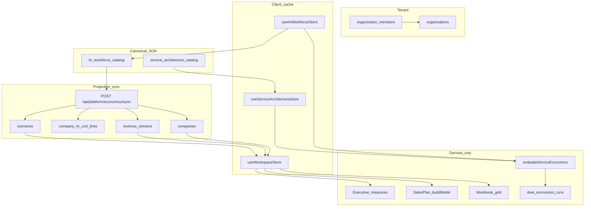
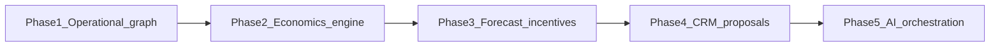

# Platform Architectural Audit

**Status:** Complete system structure + business truth audit (read-only)  
**Date:** 2026-05-17  
**Scope:** CRM-Dashboard operational platform after Phases 1–2, economics sync, RLS 012, operational workspace bootstrap  
**Related:** [DATA_OWNERSHIP.md](./DATA_OWNERSHIP.md) · [SYSTEM_BOUNDARIES.md](./SYSTEM_BOUNDARIES.md) · [IMPLEMENTATION_PHASES.md](./IMPLEMENTATION_PHASES.md) · [PHASE_1_AUDIT.md](./PHASE_1_AUDIT.md) · Pre-cleanup capability validation and safe merge sequence: [SYSTEM_SIMPLIFICATION_VALIDATION.md](./SYSTEM_SIMPLIFICATION_VALIDATION.md).

This document is **not** a feature plan. It audits what exists, what conflicts, and what should become canonical. **No code changes are implied by this file alone.**

---

## Canonical business model (reference)

```
Holding Company (organizations)
  → Business Units (HrBusinessUnit — HR catalog)
    → Departments (HrDepartment — seeds revenue_streams labels)
      → Teams
        → Roles (compensation, allocations)

Each BU eventually owns: HR structure, service architecture, sales planning,
deal economics, profitability views, forecasting, KPIs, AI context.
```

| Layer | Canonical owner | Must not own |
|-------|-----------------|--------------|
| Org structure & workforce cost | HR Workforce | Pricing, CRM deals |
| Planning projection anchor | `companies` + `company_hr_unit_links` | HR BU master |
| Delivery definitions | Service Architecture | BU creation |
| Revenue / funnel assumptions | Sales Plan (target) | HR structure names |
| Commercial / deal snapshots | Deal Economics (runs) | Operational catalog |
| Board / workbook analytics | Derived engines | Source of truth |

---

# A. Executive summary

## Biggest architecture risks

1. **Split-brain truth** — Three parallel persisted surfaces hydrate on different schedules: `hr_workforce_catalog`, `service_architecture_catalog`, and planning tables (`companies`, `revenue_streams`, …). Client mirrors them in separate Zustand stores. Workspace can lag HR until `bootstrapOperationalWorkspaceFromHr` completes (uplift → `POST /api/platform/economics/sync` → `GET /api/planning/workspace`).

2. **Demo contamination** — [`src/data/demo-seed.ts`](../src/data/demo-seed.ts) defines `DEMO_ORG_ID = "org-demo-001"` and fictional companies (Northwind, Aurora). Still referenced by default tier lines, sample-data orchestrator, and legacy workspace assumptions. Orthogonal to real Supabase tenant UUIDs (`DEV_TENANT_ID`).

3. **Naming debt** — UI and schema say **company**; business truth is **business unit**. Unused SQL: `public.portfolios`, `public.business_units` (001 scaffold). `companies.parent_company_id` unused by HR sync.

4. **Non-tenant client prefs** — `efp-sales-plan-wizard`, `efp-commercial-pricing-prefs-v1`, `efp-service-cost-simulation-prefs-v1` are **global** localStorage keys (no org namespace). Multi-tenant and AI context risk.

5. **Auth-gated projection sync** — Economics sync uses authenticated route client + RLS (`requireRouteSupabaseSession`). HR catalog can use dev service-role without session (`resolveHrCatalogSupabaseClient`). Planning sync fails until login; bootstrap must surface auth clearly (gate + middleware).

## Biggest duplication risks

1. **Three profitability stacks** — `runForecastEngine` + `workbook-engine` (Executive, grid), `buildSalesPlanModel` (Sales Plan), `evaluateServiceEconomics` + commercial pricing (Service Architecture). Same concepts (CM%, NP target, fixed cost, ROI) with different inputs; [`measure-catalog.ts`](../src/lib/planning/measures/measure-catalog.ts) orchestrates but does not unify math.

2. **Revenue / stream truth** — `revenue_streams` (Supabase, HR-dept seeded), Sales Plan `products` (wizard store), demo streams in seed. No single write path for “product mix.”

3. **Pricing layers** — Commercial Pricing Intelligence, Deal Economics (`evaluateDealEconomics` + `deal_economics_runs`), future Calculator UI. Boundaries documented in docs; not enforced in navigation or stores.

## Most stable modules

- HR Workforce catalog + `GET`/`PUT` `/api/org/hr-catalog` + dual-write
- Economics sync — [`sync-hr-to-planning.ts`](../src/server/platform-economics/sync-hr-to-planning.ts), migrations 007/012
- [`TenantPersistenceProvider`](../src/components/providers/tenant-persistence-provider.tsx) bootstrap sequence
- Executive measure layer — [`evaluateExecutiveWorkspaceMeasures`](../src/lib/planning/measures/executive-workspace-measures.ts) (composition over legacy engines)

## Most dangerous modules

- **Forecasts / Pipeline** — Mostly workspace-local / demo generators; not tied to HR-linked operational graph
- **Settings + sample-data** — Can overwrite tenant truth in development
- **Sales Plan `savePlanToWorkspaceAsNewCompany`** — Can create workspace companies without `hrBusinessUnitId` if misused

## Most urgent cleanup opportunities

1. Gate sample-data from all production paths when linked operational units exist (partially done).
2. Wire or label Forecasts/Pipeline as demo-only vs `linkedUnits` only.
3. Tenant-scope wizard and SA simulation prefs.
4. BU selector + `OperationalWorkspaceGate` on all economics modules (Executive, Companies done; SA layout + Sales Plan in progress).
5. Document and enforce: **planning never writes upstream to HR structure.**

---

# B. Page-by-page audit table

Locales: `en` | `ar` (`/[locale]/...`). Route group `(dashboard)` is omitted from URLs.

## B.1 Dashboard UI routes

| Route | File | Purpose | Owner module | Source of truth | Persistence | Key dependencies | Business layer | Operational layer | Canonical? |
|-------|------|---------|--------------|-----------------|-------------|------------------|----------------|-------------------|------------|
| `/` | [`page.tsx`](../src/app/[locale]/(dashboard)/page.tsx) | Executive KPI tower, charts | Executive / Planning | `useWorkspaceStore` + measure engines | Tenant LS + server workspace hydrate | HR sync, scenarios, streams, `OperationalWorkspaceGate` | Analytics | Linked BUs | **Keep but refactor** — measures orchestration is sound; underlying data transitional |
| `/companies` | [`companies/page.tsx`](../src/app/[locale]/(dashboard)/companies/page.tsx) | BU financial overlays, tier bands | Planning projection | Linked `companies` in workspace store | Supabase `companies` + hydrate | `useOperationalWorkspace`, HR sync metadata | Planning | Linked BUs | **Canonical** — overlay editor for projection |
| `/forecasts` | [`forecasts/page.tsx`](../src/app/[locale]/(dashboard)/forecasts/page.tsx) | Forecast series table | Executive | `buildDemoForecastSeries` / workspace | Workspace local persist | Selected company from workspace (not necessarily HR-linked) | Analytics | Weak | **Transitional / demo** |
| `/scenarios` | [`scenarios/page.tsx`](../src/app/[locale]/(dashboard)/scenarios/page.tsx) | Scenario comparison | Executive | Workspace `scenarios` | Supabase + hydrate | `evaluateExecutiveWorkspaceMeasures`, forecast engine | Planning | Linked via company | **Keep but refactor** |
| `/pipeline` | [`pipeline/page.tsx`](../src/app/[locale]/(dashboard)/pipeline/page.tsx) | Opportunity pipeline table | Executive (CRM placeholder) | Workspace `opportunities` | Workspace local | Demo stages/amounts | CRM (future) | Demo | **Deprecate → CRM** |
| `/grid` | [`grid/page.tsx`](../src/app/[locale]/(dashboard)/grid/page.tsx) | Forecast matrix + workbook panel | Planning workbook | Matrix + workspace | Partial API cell POST; mostly client | `PlanningWorkbookPanel`, workbook-engine | Analytics | Derived | **Convert to derived** |
| `/sales-plan` | [`sales-plan/page.tsx`](../src/app/[locale]/(dashboard)/sales-plan/page.tsx) | Sales Plan wizard | Sales Plan OS | `useSalesPlanWizardStore` + streams read | Global wizard LS | `streamsForCompany`, operational gate | Planning | Linked BUs | **Keep but refactor** |
| `/hr-workforce` | [`hr-workforce/page.tsx`](../src/app/[locale]/(dashboard)/hr-workforce/page.tsx) | HR dashboard | HR Workforce | HR catalog | Tenant HR + Supabase | None upstream | **Canonical** HR | Yes | **Canonical** |
| `/hr-workforce/import` | [`import/page.tsx`](../src/app/[locale]/(dashboard)/hr-workforce/import/page.tsx) | Import workforce | HR Workforce | HR catalog | HR persist + uplift | Bootstrap after import | **Canonical** | Yes | **Canonical** |
| `/hr-workforce/intelligence` | [`intelligence/page.tsx`](../src/app/[locale]/(dashboard)/hr-workforce/intelligence/page.tsx) | HR analytics | HR Workforce | Derived from HR store | HR catalog | `deriveWorkspaceProjection` | Derived | Yes | **Derived analytics** |
| `/hr-workforce/roles` | [`roles/page.tsx`](../src/app/[locale]/(dashboard)/hr-workforce/roles/page.tsx) | Roles / operational workspace | HR Workforce | HR catalog | HR persist | HR slices | **Canonical** | Yes | **Canonical** |
| `/hr-workforce/settings` | [`settings/page.tsx`](../src/app/[locale]/(dashboard)/hr-workforce/settings/page.tsx) | Org structure settings | HR Workforce | HR catalog | HR persist | BU/dept/team CRUD, triggers sync debounce | **Canonical** | Yes | **Canonical** |
| `/service-architecture` | [`service-architecture/page.tsx`](../src/app/[locale]/(dashboard)/service-architecture/page.tsx) | Service families | Service Architecture | SA store | Tenant SA + Supabase | HR BU list (global families) | Operational catalog | Gate + BU toolbar (layout) | **Canonical** (families global) |
| `/service-architecture/templates` | [`templates/page.tsx`](../src/app/[locale]/(dashboard)/service-architecture/templates/page.tsx) | Service templates | Service Architecture | SA store | Tenant SA | `selectedUnit.hrBusinessUnitId` | Operational | BU-scoped templates | **Canonical** |
| `/service-architecture/phases` | [`phases/page.tsx`](../src/app/[locale]/(dashboard)/service-architecture/phases/page.tsx) | Delivery phases | Service Architecture | SA store | Tenant SA | Catalog integrity | Operational | Yes | **Canonical** |
| `/service-architecture/deliverables` | [`deliverables/page.tsx`](../src/app/[locale]/(dashboard)/service-architecture/deliverables/page.tsx) | Deliverables | Service Architecture | SA store | Tenant SA | Catalog integrity | Operational | Yes | **Canonical** |
| `/service-architecture/role-allocation-matrix` | [`role-allocation-matrix/page.tsx`](../src/app/[locale]/(dashboard)/service-architecture/role-allocation-matrix/page.tsx) | Role allocation matrix | Service Architecture | SA store | Tenant SA | HR role ids | Operational | Yes | **Canonical** |
| `/service-architecture/cost-intelligence` | [`cost-intelligence/page.tsx`](../src/app/[locale]/(dashboard)/service-architecture/cost-intelligence/page.tsx) | Service cost simulation | Service cost engine | Ephemeral + prefs | Global cost prefs LS | HR rates, SA catalog, scoped `companies` | Derived | BU-scoped sim | **Convert to derived** |
| `/service-architecture/commercial-pricing` | [`commercial-pricing/page.tsx`](../src/app/[locale]/(dashboard)/service-architecture/commercial-pricing/page.tsx) | Commercial pricing intelligence | Commercial engine | Prefs + ephemeral | Global commercial prefs | Cost sim output | Derived | BU-scoped | **Convert to derived** |
| `/assistant` | [`assistant/page.tsx`](../src/app/[locale]/(dashboard)/assistant/page.tsx) | AI Q&A stub | AI (future) | Workspace context in prompt | None | Executive measures snapshot | Analytics | N/A | **Transitional** |
| `/settings` | [`settings/page.tsx`](../src/app/[locale]/(dashboard)/settings/page.tsx) | Workspace settings, sample controls | Platform admin | Mixed | Workspace + sample orchestrator | `PlatformSampleDataControls` | Admin | Risk in dev | **Keep but refactor** |
| `/login` | [`login/page.tsx`](../src/app/[locale]/login/page.tsx) | Authentication | Platform | Supabase Auth | Session cookies | Middleware `REQUIRE_AUTH` / dual_write | Platform | N/A | **Canonical** |

**Layouts (not pages):**

- [`(dashboard)/layout.tsx`](../src/app/[locale]/(dashboard)/layout.tsx) — `TenantPersistenceProvider` + `AppShell`
- [`hr-workforce/layout.tsx`](../src/app/[locale]/(dashboard)/hr-workforce/layout.tsx) — HR subnav, persist bar
- [`service-architecture/layout.tsx`](../src/app/[locale]/(dashboard)/service-architecture/layout.tsx) — `ServiceArchitectureShell` (gate, BU toolbar, empty state)

## B.2 API routes

| Route | Methods | Purpose | Auth / RLS | Writes SOA? |
|-------|---------|---------|------------|-------------|
| `/api/tenant/context` | GET | Active org, role, `authenticated` flag | Session or dev bypass | No |
| `/api/tenant/switch` | GET, POST | Switch active organization | Membership | Cookie only |
| `/api/org/hr-catalog` | GET, PUT | HR workforce catalog JSON | Member RLS (006) | **Yes — HR SOA** |
| `/api/org/service-catalog` | GET, PUT | Service architecture catalog JSON | Member RLS (008) | **Yes — SA SOA** |
| `/api/platform/economics/sync` | POST | HR → planning projection | Session required | **Yes — companies, links, streams, scenarios** |
| `/api/planning/workspace` | GET | Full planning DTO for hydrate | Member via company join | Read only |
| `/api/planning/matrix/cell` | POST | Matrix cell update | Member | Planning matrix |
| `/api/planning/export` | POST | Export planning data | Member | Read/export |
| `/api/planning/import` | POST | Import planning data | Member | Write planning |
| `/api/platform/planning/revenue-streams/[streamId]/service-link` | PATCH | Link stream to SA template | Member | Metadata on stream |
| `/api/platform/deal-economics/runs` | POST | Persist deal economics snapshot | Member (011) | **Append-only runs** |
| `/api/assistant` | POST | Assistant proxy | Auth | No |
| `/api/dev/hr-workforce-disk` | GET, PUT, DELETE | Dev HR disk mirror | Dev only | Local dev |
| `/auth/callback` | GET | Supabase OAuth callback | Public | Session |

---

# C. Entity ownership table

| Entity | Canonical owner module | Persistence owner | Hydration owner | Sync direction | Derived vs canonical | Duplication risk |
|--------|------------------------|-------------------|-----------------|----------------|----------------------|------------------|
| **Organization** (tenant) | Platform | `organizations` | `GET /api/tenant/context` | — | Canonical | Low |
| **OrganizationMember** | Platform | `organization_members` | Tenant context API | — | Canonical | Doc drift (`user_roles` mentioned in old docs; app uses `organization_members`) |
| **HrBusinessUnit** | HR Workforce | `hr_workforce_catalog.payload` | `hydrateHrCatalogFromServer` | → `companies` (one-way) | **Canonical** | Mirrored as company row |
| **HrDepartment** | HR Workforce | HR catalog | HR hydrate | → `revenue_streams.name` / metadata | Canonical structure; stream is projection | Stream row per dept |
| **HrTeam / HrRole** | HR Workforce | HR catalog | HR hydrate | — | Canonical | SA allocations reference role ids |
| **OH / loaded cost** | HR engine | Derived in memory; `fixed_costs_monthly` on company after sync | Economics sync | HR → company cost field | Derived | BU cost also in sales plan fixed lines |
| **Company** (projection) | Platform economics | `companies` | `GET /api/planning/workspace` | ← HR only | **Projection** — not a legal entity | Name collision with “company” UI |
| **CompanyHrUnitLink** | Platform economics | `company_hr_unit_links` | Workspace DTO | ← HR BU id | Canonical join | Low |
| **RevenueStream** | Planning | `revenue_streams` | Workspace hydrate | ← HR dept (insert/rename); financials editable in app | Semi-canonical | Wizard `products` duplicate |
| **Scenario** | Planning | `scenarios` | Workspace hydrate | Baseline inserted on sync | Semi-canonical | Executive scenario adj |
| **Opportunity** | Executive (demo) / future CRM | Workspace store | Local / demo | None | **Demo** today | Pipeline page |
| **Forecast** | Executive (demo) | Workspace / demo builders | Local | None | **Demo** / transitional | Forecasts page |
| **ServiceFamily / Tier / Template** | Service Architecture | `service_architecture_catalog` | SA hydrate | References `businessUnitId` = HR BU id | Canonical delivery | Not org-scoped table normalization |
| **ServiceRoleAllocation** | Service Architecture | SA catalog | SA hydrate | — | Canonical | Matrix views |
| **ServiceCostAssumptions** | Cost simulation UI | Global LS prefs | — | — | Should be org prefs | Global key risk |
| **CommercialPricingPrefs** | Commercial UI | Global LS prefs | — | — | Should be org prefs | Global key risk |
| **SalesPlanWizardState** | Sales Plan | Global LS `efp-sales-plan-wizard` | — | Optional write → workspace company | Should be derived / server | Products vs streams |
| **DealEconomicsRun** | Deal economics | `deal_economics_runs` | API POST only | Immutable snapshot | **Derived** audit trail | Correct pattern for calculator |
| **PlanningMatrixRow/Cell** | Planning engine | `planning_matrix_*` | Partial API | Company/scenario scoped | Canonical for workbook grid | Client/server split |
| **MeasureCatalog entries** | Planning lib (code) | Code registry | — | — | Metadata only | Engines still separate |
| **TierLineOverrides** | Workspace | Workspace store persist | Hydrate preserves | — | Client overlay | `default-tier-lines` demo coupling |
| **KpiSnapshot** (schema) | Future KPI engine | `kpi_snapshots` table | Not wired in app | — | Future | Unused in UI |

---

# D. Redundancy table

| # | Duplication | Modules involved | Risk | Current behavior | Future danger | Recommended canonical owner |
|---|-------------|------------------|------|------------------|---------------|----------------------------|
| 1 | Workbook vs Sales Plan profitability | `/grid`, `/sales-plan`, Executive measures | Different ROI/NP story on same BU | `workbook-engine` vs `buildSalesPlanModel` vs `runForecastEngine` | Board / investor distrust | Phase 2 unified economics engine + measure registry runs |
| 2 | Service cost vs deal economics | SA cost-intel, `deal-economics` | Two “cost of delivery” definitions | `evaluateServiceEconomics`; deal composes via gate | Calculator UI confusion | `evaluateDealEconomics` composes HR + SA + commercial snapshots |
| 3 | Stream / product mix | `revenue_streams`, wizard `products`, tier lines | Stale weights | Sync seeds streams; wizard seeds products once from streams | Forecasts wrong after HR rename | `revenue_streams` + read-only wizard view |
| 4 | Company list dual path | Supabase vs `useWorkspaceStore` | Stale UI after sync | Hydrate after bootstrap; local edits until refresh | Wrong BU selected | Supabase authoritative; store is cache |
| 5 | Demo org parallel universe | `demo-seed.ts`, sample-data | Tenant pollution | `org-demo-001` vs real UUID | Import/sample wipes real data | Remove from production paths |
| 6 | Global prefs keys | SA pricing, cost sim, sales wizard | Cross-tenant leak | `localStorage` without org prefix | Compliance / AI wrong tenant | Tenant-scoped prefs (DB or namespaced LS) |
| 7 | “Company” vs BU language | Companies page, schema, Executive | Product confusion | UI says company; HR says BU | Onboarding friction | UI copy “Business unit”; keep `company_id` FK until schema gate |
| 8 | Portfolio / business_units SQL | 001 schema | Dead code paths | Unused by app | Migration noise | Deprecate tables in docs; drop in Phase 5 gate |
| 9 | HR uplift vs sync | `ensureHrCatalogOnServerForSync`, dual-write | Race on fast edits | Debounced sync after HR changes | Partial projection | Single queue: uplift → sync → hydrate |
| 10 | Executive vs Scenarios pages | `/`, `/scenarios` | Overlap | Both use `evaluateExecutiveWorkspaceMeasures` | Maintenance | Single measures entry; scenarios page = lens |

---

# E. Platform flow map

## E.1 Operational graph (canonical write path)



## E.2 Module direction rules

| From | To | Allowed |
|------|-----|---------|
| HR catalog | companies, links, streams (initial), scenarios (baseline) | **Yes** (sync only) |
| HR catalog | service templates (BU id reference) | **Yes** (reference only) |
| companies / streams | HR catalog | **No** (names/structure) |
| companies | financial overlays (targets, fixed cost override policy) | **Yes** (app policy; sync may overwrite HR-driven cost) |
| SA catalog | HR BUs | **No** (select only) |
| Sales Plan wizard | revenue_streams | **Should** read; write only via defined APIs |
| Deal economics runs | any SOA | **No** (append-only snapshots) |
| Sample-data orchestrator | production tenant | **No** in prod |

## E.3 Upstream / downstream summary

| Module | Tier | Role |
|--------|------|------|
| HR Workforce | Upstream | Structure + cost inputs |
| Economics sync | Transform | HR → planning tables |
| Workspace hydrate | Downstream read | Client cache |
| Service Architecture | Parallel upstream (delivery) | References HR |
| Sales Plan | Downstream planning | Consumes streams |
| Executive / Grid | Downstream analytics | Must not own SOA |
| Deal economics | Downstream audit | Immutable runs |
| AI Assistant | Downstream read | No writes |

---

# F. Cleanup classification

| Classification | Modules / artifacts |
|----------------|---------------------|
| **KEEP AS CANONICAL** | HR Workforce (`/hr-workforce/*`), `hr_workforce_catalog`, economics sync + `company_hr_unit_links`, `organization_members` + RLS, Service Architecture catalog (families, templates, phases, deliverables, matrix), `/companies` as projection editor, `/login` + tenant APIs |
| **KEEP BUT REFACTOR** | Executive `/`, Scenarios, Sales Plan, SA shell (gate, BU toolbar), Settings, Companies+Executive BU selector pattern |
| **CONVERT TO DERIVED / ANALYTICS** | `/grid` workbook, SA cost-intelligence, SA commercial-pricing, Executive measure layer, `deal_economics_runs`, HR intelligence views |
| **DEPRECATE** | `/pipeline` demo CRM, `DEMO_ORG_ID` universe, SQL `portfolios` / `business_units` (unused), doc references to `user_roles` as membership |
| **MERGE INTO OTHER** | Forecasts → BU-keyed forecast versions on projection; wizard `products` → views over `revenue_streams` |
| **SAMPLE / DEMO CONTAMINATION** | `demo-seed.ts`, `loadAllSampleData`, `seedDemoCatalog`, HR demo seed banner, Settings sample panel (when linked units exist — hide implemented for key modules) |

---

# G. Persistence and hydration audit

## G.1 Zustand stores

| Store | Persist key (typical) | Tenant-scoped? | Server sync | Entities |
|-------|----------------------|----------------|-------------|----------|
| `useHrWorkforceStore` | `efp-{org}-hr-workforce` | Yes | GET/PUT `/api/org/hr-catalog`, dual-write | BUs, depts, teams, roles, OH |
| `useServiceArchitectureStore` | `efp-{org}-service-architecture-v1` | Yes | GET/PUT `/api/org/service-catalog`, dual-write | Full SA catalog |
| `useWorkspaceStore` | `efp-{org}-workspace` | Yes | GET `/api/planning/workspace`; sync via economics API | companies, streams, scenarios, opportunities, selection |
| `useSalesPlanWizardStore` | `efp-sales-plan-wizard` | **No** | Save to workspace only | Wizard steps, products, tiers |
| `useCommercialPricingPrefsStore` | global | **No** | None | Model, risks, thresholds |
| `useServiceCostSimulationPrefsStore` | global | **No** | None | Assumptions, scenario id |
| `useWorkspaceBootstrapStore` | none | — | — | Bootstrap status for UI gate |
| `useUiStore` | none | — | — | Sidebar, command palette |

## G.2 Hydration order (boot)

1. `fetchTenantContextClient` — may fall back to `NEXT_PUBLIC_DEV_TENANT_ID` only when not Supabase+dual_write without auth
2. `prepareEconomicsStoresForOrganization` — rehydrate tenant LS, legacy migrate (SA/workspace), GET HR + SA catalogs
3. `finishHrCatalogPersistenceSetup` / `finishServiceCatalogPersistenceSetup` — enable dual-write subscribers
4. `bootstrapOperationalWorkspaceFromHr` — `ensureHrCatalogOnServerForSync` → `POST /api/platform/economics/sync` → `GET /api/planning/workspace` if enabled

**Triggers for re-bootstrap:** HR structure debounced sync, org switch, manual retry, import completion.

## G.3 Environment / mode matrix

| Variable | Effect |
|----------|--------|
| `NEXT_PUBLIC_PERSIST_MODE` | `local_only` \| `dual_write` \| `server_authoritative` |
| `NEXT_PUBLIC_TENANT_NAMESPACED_PERSIST` | `efp-{orgId}-*` vs legacy global keys |
| `NEXT_PUBLIC_HR_SERVER_HYDRATE` | GET HR on load (default on) |
| `NEXT_PUBLIC_SA_SERVER_HYDRATE` | GET SA on load (default on) |
| `NEXT_PUBLIC_WORKSPACE_SERVER_HYDRATE` | GET workspace when Supabase configured |
| `NEXT_PUBLIC_REQUIRE_AUTH` | Force login |
| Middleware + Supabase + dual_write | Auto-redirect to login without session |

## G.4 RLS implications (stable vs risky)

| Area | Status |
|------|--------|
| `organization_members` + `is_organization_member()` | Stable (011) |
| `companies` INSERT/UPDATE member-scoped (012) | Stable for projection sync |
| Economics sync route | Requires real session (`auth.uid()`) |
| HR/SA catalog writes | Member-scoped (006, 008) |
| Dev service-role HR | **Bypasses RLS** — local dev only; must not confuse with prod path |

## G.5 What should become server-authoritative later

- Sales Plan wizard versions (per org / BU)
- Commercial and cost simulation prefs
- Opportunities and forecasts (CRM module)
- KPI facts and actuals feed
- AI conversation context (read from registry, not raw LS)

---

# H. Future architecture target

## H.1 Phase dependency graph



## H.2 Phase responsibilities

| Phase | Focus | Canonical truths | Derived UI |
|-------|-------|------------------|------------|
| **1 — Operational graph** | HR → sync → hydrate; BU parity; no demo leakage | HR catalog, links, projection rows | Executive/SA/Sales Plan gates |
| **2 — Canonical economics engine** | Single evaluate pipeline; versioned runs | `deal_economics_runs`, measure registry | Workbook, Sales Plan, SA pricing UIs |
| **3 — Forecasting + incentives** | BU forecasts, actuals, KPI registry | Forecast versions, KPI facts | Forecasts page, incentives |
| **4 — CRM + proposals** | Opportunities, contracts, proposals | CRM tables | Pipeline replacement |
| **5 — AI orchestration** | Read-only tools over registry + events | Event log, SOA registry | Assistant |

**Target rule:** UI stores are **caches**; no business truth invented in localStorage except offline draft (explicitly labeled).

---

# I. Cleanup priority list

| Priority | Item | Rationale |
|----------|------|-----------|
| P0 | Reliable auth + bootstrap (session before sync; clear gate errors) | Blocks all linked-BU UX |
| P0 | Sample-data hidden when `linkedUnits.length > 0` (all modules) | Prevents tenant wipe |
| P1 | `OperationalWorkspaceGate` + `OperationalBuToolbar` on SA, Sales Plan, Forecasts | Parity with Executive |
| P1 | Forecasts/Pipeline: require linked unit or show empty state | Stops demo misleading execs |
| P2 | Tenant-scope wizard + SA prefs | Multi-tenant safety |
| P2 | Sales Plan products driven from `revenue_streams` | Single mix truth |
| P3 | Unify profitability behind `evaluateDealEconomics` + registry | Reduce math drift |
| P3 | Replace demo opportunities with CRM or remove Pipeline | SOA clarity |
| P4 | Drop unused SQL scaffold / rename company → operational_unit (schema gate) | Long-term clarity |

---

# J. Recommended implementation order

1. **Stabilize boot path** — Document env matrix in [SUPABASE_LOCAL_DEV.md](./SUPABASE_LOCAL_DEV.md); verify middleware + gate (done in recent work).
2. **Operational UI parity** — SA layout shell, Sales Plan toolbar, fix HR-linked empty states on all nav items.
3. **Demo containment** — Audit `demo-seed.ts` references; remove from default code paths; keep behind `NEXT_PUBLIC_ENABLE_SAMPLE_DATA`.
4. **Forecasts/Pipeline decision** — Product call: wire to workspace linked BUs only **or** hide nav until CRM phase.
5. **Tenant-scope prefs** — Migrate three global LS stores to namespaced or Supabase prefs table.
6. **Sales Plan ↔ streams** — Read-only product list from `revenue_streams`; deprecate duplicate product creation where stream exists.
7. **Economics engine Phase 2** — Implement per [DEAL_ECONOMICS_GATE.md](./DEAL_ECONOMICS_GATE.md); wire Executive measures to runs where possible.
8. **CRM Phase 4** — Replace `opportunities` demo with real pipeline SOA.
9. **Schema gate** — [BU_SCHEMA_GATE.md](./BU_SCHEMA_GATE.md): optional `operational_unit` naming, drop dead tables.

---

# K. Final target architecture diagram

```
                    ┌─────────────────────────┐
                    │   Holding (Organization) │
                    │   organizations.id       │
                    └───────────┬─────────────┘
                                │ 1:N members (RLS)
        ┌───────────────────────┼───────────────────────┐
        ▼                       ▼                       ▼
┌───────────────┐     ┌─────────────────┐     ┌──────────────────┐
│ HR Workforce  │     │ Service Arch.   │     │ (Future CRM)     │
│ SOA: BUs,     │     │ SOA: templates│     │ opportunities    │
│ roles, OH     │     │ phases, matrix  │     │ contracts        │
└───────┬───────┘     └────────┬────────┘     └────────┬─────────┘
        │  economics sync         │ refs hrBusinessUnitId  │
        ▼                         │                        │
┌───────────────────────────────────────────────────────────┴──┐
│ Planning projection (companies + company_hr_unit_links)       │
│ revenue_streams (dept) · scenarios · forecasts (future)       │
└───────────────────────────┬────────────────────────────────┘
                            │ read / hydrate
        ┌───────────────────┼───────────────────┐
        ▼                   ▼                   ▼
┌───────────────┐   ┌───────────────┐   ┌───────────────────┐
│ Executive     │   │ Sales Plan    │   │ Deal economics    │
│ (measures)    │   │ (assumptions) │   │ (immutable runs)  │
└───────────────┘   └───────────────┘   └───────────────────┘
        │                   │                   │
        └───────────────────┴───────────────────┘
                            ▼
                  ┌───────────────────┐
                  │ AI orchestration   │
                  │ read-only registry │
                  └───────────────────┘
```

**Invariants in target state:**

- One HR BU → one linked `company_id` (projection).
- One department → at most one primary `revenue_stream` row (HR-seeded).
- Service templates never create BUs; they reference HR ids.
- All profitability views explain which **run** or **measure id** they used.
- No global localStorage SOA for production tenants.

---

## Document maintenance

Update this audit when:

- A new top-level nav route is added
- A new persisted store or Supabase table becomes SOA
- Economics sync changes write set
- Phase 2 economics engine lands

**Audit completeness checklist:** 21 dashboard routes + login = 22 UI routes; 14 API handler paths; 6 persisted Zustand stores; 5 future phases — all covered above.
