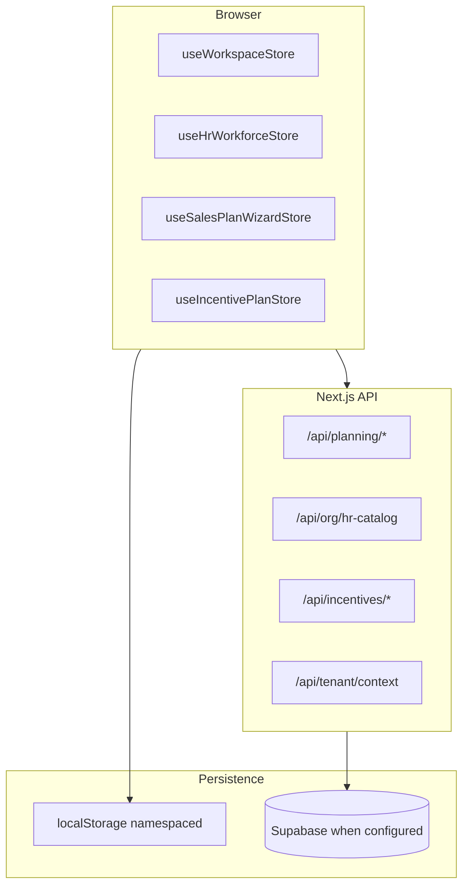

# Platform Testing Snapshot Package

**Document type:** Read-only system snapshot for QA, architecture verification, and regression tracking  
**Repository:** CRM-Dashboard (Enterprise Forecast Platform)  
**Snapshot date:** 2026-05-17  
**Scope:** Current codebase state after Incentive Design Studio + Phase 2 Critical (flat tabs, tier profile wiring)

---

## How to use this document

- Use as the **single source of truth** for manual QA sessions, onboarding testers, and release readiness reviews.
- **Do not** treat demo/local-only behavior as production behavior unless env vars explicitly enable Supabase.
- Re-verify after any migration apply, env change, or major module merge.

---

# SECTION 1 — System overview

## 1.1 Overall architecture

The platform is a **Next.js 15 App Router** application with:

- **Locale-aware UI** (`/[locale]/...`, `next-intl`, EN/AR + RTL)
- **Client state:** Zustand stores with optional `localStorage` persistence (tenant-namespaced)
- **Server APIs:** Route handlers under `src/app/api/*` with Supabase when configured
- **Deterministic planning math** in `src/lib/planning`, `src/lib/sales-plan`, `src/lib/calculations`
- **Operational economics graph** in `src/lib/platform-economics` + `src/lib/planning/measures`
- **Bounded context:** Sales incentives (`src/lib/incentives`, `/sales-incentives`) separate from HR payroll



## 1.2 Canonical business graph (BU-centric)

| Concept | Primary representation | Notes |
|---------|------------------------|-------|
| Organization (tenant) | `organizationId` from `/api/tenant/context` | Dev bypass via `DEV_TENANT_ID` |
| Business unit (HR) | `hrBusinessUnitId` on HR catalog + planning | Linked to demo `DemoCompany` |
| Company (planning anchor) | `DemoCompany` in `useWorkspaceStore` | Selected via operational workspace gate |
| Planning scenario | `DemoScenario` + `scenarioBundles` | Active scenario drives economics graph |
| Revenue streams | Per-company streams | Tie to service architecture |
| Opportunity tiers | `OpportunityTierDefinition[]` | tiny / standard / big / mega |
| HR org | Business units, departments, teams, roles | `operationalRoleType`: delivery vs indirect |

## 1.3 Operational hierarchy

1. **Tenant** → **HR Business Unit** → **Company (planning)** → **Scenario** → **Streams / opportunities**
2. **Sales Plan wizard** pushes targets and tier bands into workspace company
3. **Executive dashboard** consumes `useEconomicsGraph` / planning measures
4. **Incentives** scope to `hrBusinessUnitId` via operational workspace selection

## 1.4 Implementation maturity (honest)

| Area | Maturity | Evidence |
|------|----------|----------|
| UI shell, nav, i18n | High | `canonical-navigation.ts`, locale routes |
| Sales Plan OS | Medium–high | Wizard + `buildSalesPlanModel` |
| Executive / economics graph | Medium | `useEconomicsGraph`, measure evaluation |
| Scenario modelling | Medium | Heuristic bundles, compare on executive |
| HR workforce | Medium–high | Catalog UI + Supabase path when on |
| Service architecture | Medium | Catalog + commercial pricing |
| Incentives | Medium–high (simulation) | Engine v2, design studio, partial DB persist |
| Enterprise FP&A (actuals, cube) | Low | Not implemented |
| CRM as SoT | Low | Demo opportunities + fact projector stub |

**Overall product posture:** Advanced **planning demo / operational prototype** with real deterministic engines—not full multidimensional FP&A.

## 1.5 Core business modules

| Module | Route(s) | Engine / store |
|--------|----------|----------------|
| Executive | `/` | `useEconomicsGraph`, dashboard charts |
| Sales Plan | `/sales-plan` | `useSalesPlanWizardStore`, `buildSalesPlanModel` |
| Sales Incentives | `/sales-incentives` | `evaluateIncentiveRun`, `useIncentivePlanStore` |
| Service Architecture | `/service-architecture/*` | Service catalog store + APIs |
| HR Workforce | `/hr-workforce/*` | `useHrWorkforceStore`, hr-catalog API |
| Settings | `/settings` | Workspace / tier defaults |
| Scenarios (advanced) | `/scenarios` | Workspace scenarios |
| Pipeline | `/pipeline` | Opportunities weighted view |
| Grid | `/grid` | Planning matrix view |
| Assistant | `/assistant` | `/api/assistant` |

---

# SECTION 2 — Active routes and ownership

**Locale prefix:** All dashboard routes are under `/[locale]/` (e.g. `/en/sales-plan`). Below paths omit locale for brevity.

## 2.1 Primary navigation (canonical)

| Route | Purpose | Ownership | Status |
|-------|---------|-----------|--------|
| `/` | Executive dashboard, KPIs, rolling forecast, scenario compare hooks | Canonical executive surface | **Canonical** |
| `/sales-plan` | Sales Plan OS wizard, tier economics, apply to workspace | Canonical planning authoring | **Canonical** |
| `/sales-incentives` | Incentive plan design, simulation, explain, forecast bridge | Incentive bounded context | **Canonical** |
| `/service-architecture` | Service families, templates, deliverables hub | Service catalog | **Canonical** |
| `/service-architecture/commercial-pricing` | Commercial pricing calculator | Service architecture | **Canonical** |
| `/hr-workforce` | HR org structure, roles, headcount | HR catalog | **Canonical** |
| `/settings` | Platform / planning settings | Configuration | **Canonical** |

### Per-route dependencies (summary)

| Route | Upstream | Downstream | Persistence | Scenario | HR | Forecast |
|-------|----------|------------|---------------|----------|-----|----------|
| `/` | Workspace, HR slice, scenarios | Charts, measures | WS + optional planning API | Yes | Yes | Yes |
| `/sales-plan` | Wizard store, workspace | `applyPlanToWorkspace`, company tiers | Wizard persist + WS | Indirect | Yes | Indirect |
| `/sales-incentives` | HR roles, plan store, planning inputs | Engine runs, APIs | Plans/runs DB or memory | Yes | Yes | Yes |
| `/service-architecture` | Service catalog API | Pricing, planning streams | Catalog API / local | Partial | Partial | No |
| `/hr-workforce` | hr-catalog API | All BU-scoped modules | dual_write / server | No | Yes | No |

## 2.2 Advanced navigation

| Route | Purpose | Status |
|-------|---------|--------|
| `/grid` | Planning matrix grid | **Advanced utility** |
| `/scenarios` | Scenario list / management | **Advanced utility** |
| `/pipeline` | Pipeline opportunities view | **Advanced utility** |
| `/assistant` | AI assistant (API-backed) | **Advanced utility** |

## 2.3 HR sub-routes

| Route | Purpose |
|-------|---------|
| `/hr-workforce/roles` | Role management |
| `/hr-workforce/settings` | HR settings |
| `/hr-workforce/import` | Import flows |
| `/hr-workforce/intelligence` | Workforce intelligence views |

## 2.4 Service architecture sub-routes

| Route | Purpose |
|-------|---------|
| `/service-architecture/templates` | Templates |
| `/service-architecture/phases` | Delivery phases |
| `/service-architecture/deliverables` | Deliverables |
| `/service-architecture/role-allocation-matrix` | Role allocation |
| `/service-architecture/cost-intelligence` | Cost intelligence |

## 2.5 Transitional / deprecated

| Route | Behavior | Canonical target |
|-------|----------|------------------|
| `/companies` | Client redirect to `/sales-plan` | **Transitional** — comment in source |
| `/forecasts` | Client redirect to `/#rolling-forecast` on executive | **Transitional** |

## 2.6 Auth

| Route | Purpose |
|-------|---------|
| `/login` | Supabase auth login |
| `/auth/callback` | OAuth/code exchange redirect |

## 2.7 API routes (operational)

| API | Purpose |
|-----|---------|
| `GET/POST /api/tenant/context` | Tenant resolution |
| `POST /api/tenant/switch` | Tenant switch |
| `GET/PUT /api/org/hr-catalog` | HR catalog sync |
| `GET/PUT /api/org/service-catalog` | Service catalog |
| `GET/POST /api/planning/workspace` | Planning workspace DTO |
| `GET/POST /api/planning/scenarios`, `[id]` | Scenarios |
| `PUT /api/planning/matrix/cell` | Matrix cell updates |
| `GET/POST /api/planning/import`, `export` | Import/export |
| `POST /api/platform/economics/sync` | Economics sync |
| `GET/POST /api/platform/deal-economics/runs` | Deal economics runs |
| `GET/POST /api/incentives/plans`, `[id]`, approve, archive, versions | Incentive plans |
| `GET/POST /api/incentives/runs` | Incentive runs |
| `GET/POST /api/incentives/freezes` | Period freezes |
| `GET/POST /api/incentives/presets` | Simulator presets |
| `GET /api/incentives/audit` | Override audit log |
| `POST /api/assistant` | Assistant |
| `GET /api/dev/hr-workforce-disk` | Dev diagnostics |

---

# SECTION 3 — Persistence and database state

## 3.1 Supabase migrations (expected files)

Apply in order via `supabase db reset` or migration pipeline:

| Migration | Theme |
|-----------|--------|
| `001_initial_schema.sql` | Core org, organizations |
| `002_planning_engine.sql` | Planning matrix, scenarios |
| `003_revenue_stream_deal_tiers.sql` | Deal tier lines |
| `004_hr_workforce_planning.sql` | HR planning linkage |
| `005_hr_workforce_catalog.sql` | HR catalog tables |
| `006_hr_workforce_catalog_write_rls.sql` | HR write RLS |
| `007_company_hr_unit_links.sql` | Company ↔ HR BU |
| `008_service_architecture_catalog.sql` | Service catalog |
| `009_bu_operational_metadata.sql` | BU metadata |
| `010_deal_economics_runs.sql` | Deal economics |
| `011_rls_membership_helper.sql` | RLS helpers |
| `012_planning_projection_rls.sql` | Planning projection RLS |
| `013_incentive_operations.sql` | Incentive plans, runs, snapshots, freezes, audit, presets |

**Critical for incentives in production:** `013_incentive_operations.sql` must be applied.

## 3.2 Incentive persistence tables (`013`)

| Table | Role |
|-------|------|
| `incentive_plans` | Mutable plan JSON per org + BU |
| `incentive_plan_versions` | Immutable approved versions |
| `incentive_runs` | Run metadata, dedupe_key, lifecycle |
| `incentive_snapshots` | Immutable snapshot JSON |
| `incentive_payout_freezes` | BU + period_key freeze |
| `incentive_override_audit` | Override audit trail |
| `incentive_simulator_presets` | Named simulator presets |

**Server modules:** `src/server/incentives/persist-incentive-plan.ts`, `persist-incentive-run.ts`, facade `incentive-store.ts`.

**Fallback:** If Supabase client unavailable, in-memory `Map` per organization in `incentive-store.ts` (data lost on server restart).

## 3.3 Planning / scenario persistence

- Client: `useWorkspaceStore` (persist middleware, tenant namespaced keys)
- Server: `src/server/planning/workspace.ts` aggregates matrix when Supabase configured
- APIs: `/api/planning/workspace`, `/api/planning/scenarios`

## 3.4 HR persistence

- Modes: `NEXT_PUBLIC_PERSIST_MODE` = `local_only` | `dual_write` | `server_authoritative`
- Catalog API: `/api/org/hr-catalog`
- Hydration flags: `NEXT_PUBLIC_HR_SERVER_HYDRATE`, `NEXT_PUBLIC_WORKSPACE_SERVER_HYDRATE`

## 3.5 RLS and tenant assumptions

- RLS enabled on incentive tables (see migration `013` policies)
- APIs call `requireTenantContext()` — organization scoping
- Membership via `011_rls_membership_helper` patterns for HR/planning
- **Assumption:** Authenticated user belongs to `organizations` row used as tenant

## 3.6 Auth assumptions

| Mode | Behavior |
|------|----------|
| Production | `requireTenantContext` from session; no dev bypass |
| Development | `DEV_TENANT_ID` / `DEV_USER_ID` server bypass when configured |
| `NEXT_PUBLIC_REQUIRE_AUTH=true` | Login required |
| Supabase URL + dual_write | May auto-require auth for planning sync RLS |

## 3.7 Critical environment variables

From `.env.example`:

| Variable | Purpose |
|----------|---------|
| `NEXT_PUBLIC_SUPABASE_URL` | Supabase project URL |
| `NEXT_PUBLIC_SUPABASE_ANON_KEY` | Client anon key |
| `SUPABASE_SERVICE_ROLE_KEY` | Server writes (dev only on server) |
| `NEXT_PUBLIC_REQUIRE_AUTH` | Force login |
| `NEXT_PUBLIC_PERSIST_MODE` | local_only / dual_write / server_authoritative |
| `NEXT_PUBLIC_TENANT_NAMESPACED_PERSIST` | Namespaced localStorage |
| `NEXT_PUBLIC_HR_SERVER_HYDRATE` | Load HR from server on boot |
| `NEXT_PUBLIC_WORKSPACE_SERVER_HYDRATE` | Load planning workspace from server |
| `DEV_TENANT_ID`, `DEV_USER_ID` | Server dev tenant bypass |
| `NEXT_PUBLIC_DEV_TENANT_ID` | Client dev tenant hint |

## 3.8 Known persistence fallbacks

| Feature | Without Supabase | With Supabase |
|---------|------------------|---------------|
| Incentive plans/runs | In-memory per Node process | Durable |
| HR catalog | localStorage only | dual_write to API |
| Planning workspace | Zustand persist | + server hydrate |
| Incentive freeze | In-memory | DB unique constraint |

---

# SECTION 4 — Business flows

## 4.1 HR → BU → Planning projection

| | |
|-|-|
| **Inputs** | HR catalog (BUs, depts, roles), company link `hrBusinessUnitId` |
| **Outputs** | Headcount slices, indirect roles, feasibility HR snapshot |
| **Persistence** | hr-catalog API + local store |
| **Explainability** | HR intelligence views partial |
| **Limitations** | Payroll not incentive SoT; sync lag in local_only mode |

## 4.2 Sales Plan → Scenario → Executive

| | |
|-|-|
| **Inputs** | Wizard products, tier mix, CM cells, NP target, funnel rates |
| **Outputs** | `buildSalesPlanModel`, charts; `applyPlanToWorkspace` updates company |
| **Persistence** | Wizard store persist; workspace store |
| **Explainability** | Insights strings (rule-based) |
| **Limitations** | Dashboard may use different CM path than wizard unless aligned |

## 4.3 Scenario comparison

| | |
|-|-|
| **Inputs** | Multiple `DemoScenario`, bundles, active scenario id |
| **Outputs** | Executive compare UI, measure deltas |
| **Persistence** | Workspace scenarios |
| **Limitations** | Heuristic scenario application, not full versioning system |

## 4.4 Attribution

| | |
|-|-|
| **Inputs** | Planning measures, streams, opportunities |
| **Outputs** | Attribution views on executive (measure-driven) |
| **Persistence** | Client state |
| **Limitations** | Not full cost accounting attribution engine |

## 4.5 Operational feasibility

| | |
|-|-|
| **Inputs** | HR snapshot, planning targets, capacity heuristics |
| **Outputs** | Feasibility signals in planning evaluation |
| **Persistence** | Derived at read time |
| **Limitations** | Heuristic coefficients, not scheduling solver |

## 4.6 Forecasting

| | |
|-|-|
| **Inputs** | Economics graph, forward forecast path in measures |
| **Outputs** | `forwardForecast`, executive rolling forecast |
| **Persistence** | Scenario + matrix |
| **Limitations** | Not statistical forecast; deterministic projection |

## 4.7 Incentives (end-to-end)

| | |
|-|-|
| **Inputs** | `IncentivePlan`, deals (pipeline + synthetic), HR participants, scorecard bridge |
| **Outputs** | `IncentiveSnapshot`, explain lines, warnings |
| **Persistence** | Plan save API; auto-persist runs on evaluation |
| **Explainability** | Explain tab + tier resolution panel |
| **Limitations** | CRM actuals stub; payroll export out of scope |

**Workspace tabs:** Overview | Design | Simulate | Explain | Forecast | History

## 4.8 Incentive forecasting

| | |
|-|-|
| **Inputs** | `useEconomicsGraph`, active scenario, NP% |
| **Outputs** | Forecast panel projected pool/retained |
| **Persistence** | Runs optional |
| **Limitations** | Bridges forward forecast; does not re-implement planning engine |

## 4.9 Freeze / rerun lifecycle

| | |
|-|-|
| **Inputs** | `periodKey`, BU id, freeze POST |
| **Outputs** | 409 on run persist if frozen; freeze badge in UI |
| **Persistence** | `incentive_payout_freezes` or memory |
| **Limitations** | Rerun supersede policy UI partial |

## 4.10 Shadow actual flow

| | |
|-|-|
| **Inputs** | Run mode `shadow_actual`, forecast deals from forward forecast |
| **Outputs** | Separate run record; compare with simulation |
| **Persistence** | Runs table |
| **Limitations** | Fact ingest stub; not live CRM |

---

# SECTION 5 — Incentive system snapshot

## 5.1 Implemented

- Deterministic engine `evaluateIncentiveRun` (v1 parity + v2 flags)
- Plan types: layers, rules, scorecard, payout drivers, stacking, reserve
- **Design studio:** Team/HR, tier profiles per service, commission matrices, BD phases, scorecard, governance
- **tierProfiles** wired to pipeline/simulator via `opportunity-bridge` + `resolveDealTierContext`
- Tier resolution explain (`tier_resolution` explain lines + `IncentiveTierExplainPanel`)
- Operational warnings (`operational-warnings.ts`)
- Forecast bridge (`forecast-bridge.ts`)
- Scorecard bridge from sales plan / economics measures
- Manager team rule in engine (85% / over-team bonus)
- `referralRateByTier`, `layerMatrix`, `bdPhasePolicy`
- APIs: plans, runs, freezes, presets, audit (read)
- Supabase migration `013` + memory fallback
- Participant assignment from plan (`participantsFromPlan`)
- Mix simulator, scenario lab, what-if deal (Simulate tab)
- Run compare in History tab
- Vitest: 19+ tests under `src/lib/incentives` + tier profile tests

## 5.2 Partially implemented

| Capability | Gap |
|------------|-----|
| Design UX | Not full spreadsheet; nested forms vs bulk matrix |
| roleOverrides | Engine supports; no dedicated UI table |
| Override audit | API exists; no Design UI panel |
| global_default tier scope | Type + resolver; limited UI for BU/global profiles |
| Narrative explain | Formula tree yes; manager prose summaries no |
| CRM shadow actual | Projector stub + mode toggle |
| Collections delay slider | Payout drivers in plan; limited Simulate UI |
| Plan versioning UI | API versions route; minimal UI |
| Distribution preview | mean/median in Design; no chart |

## 5.3 Planned only / not started

- CRM as incentive fact SoT
- Payroll payout export
- Accounting ledger integration
- Per-person override editor at scale
- Full audit UI workflow

---

# SECTION 6 — Known limitations and risks

## 6.1 Technical

- Dual financial engines (`lib/calculations` vs `lib/planning` / `lib/sales-plan`) may disagree on CM/NP
- Server in-memory incentive fallback loses data on cold start
- Auto-persist incentive runs on every evaluation hash change (noise in DB)
- `engineVersion` 1 vs 2 depends on plan options flags
- No E2E Playwright suite documented in repo scripts

## 6.2 UX

- Companies / forecasts routes redirect (may confuse bookmarks)
- Advanced nav (`/grid`, `/scenarios`) less polished than primary
- Incentive Design matrix editing is dense for large BUs
- English hardcoded pockets outside `next-intl` (per architecture audit)

## 6.3 Operational assumptions

- Demo companies/opportunities seeded or loaded from localStorage
- Single active company per operational workspace session
- HR indirect roles must exist for BD incentive assignment
- Sales Plan wizard data improves tier stats but not required

## 6.4 Non-production shortcuts

- Dev tenant bypass without auth
- `local_only` persist mode default in `.env.example`
- Assistant route may use external API keys (verify deployment)

## 6.5 Future placeholders

- `incentive_fact_events` contract documented; ingest partial
- CRM lifecycle fields on opportunities incomplete
- Actuals vs plan variance not implemented

## 6.6 Scenario / forecasting limitations

- Scenario bundles are heuristic overlays
- Forward forecast is deterministic projection from graph state
- No Monte Carlo / confidence intervals

---

# SECTION 7 — Testing checklist

## 7.1 Auth / tenant

| Step | Expected | Failure indicator | Likely cause |
|------|----------|-------------------|--------------|
| Open app without Supabase | Loads demo tenant | Blank tenant | Missing seed / DEV_TENANT_ID |
| Login with REQUIRE_AUTH | Redirect to login | Open dashboard | Callback/env misconfig |
| `/api/tenant/context` | 200 + org id | 401 | Auth/cookies |

## 7.2 HR sync

| Step | Expected | Failure indicator | Likely cause |
|------|----------|-------------------|--------------|
| Edit role in HR | Reflects in store | Lost on refresh | local_only without dual_write |
| dual_write mode | PUT hr-catalog succeeds | Console 401 | RLS / auth |
| indirect roles visible | Listed in incentives Design | Empty | Wrong BU filter |

## 7.3 BU switching

| Step | Expected | Failure indicator | Likely cause |
|------|----------|-------------------|--------------|
| Change company in gate | All modules re-scope | Stale HR/incentive data | Store not resetting |
| Incentives | `resetForBuChange`, reload plans | Wrong plan | hrBuId mismatch |

## 7.4 Scenarios

| Step | Expected | Failure indicator | Likely cause |
|------|----------|-------------------|--------------|
| Create/select scenario | Executive measures update | Blocked state | `resolvePlanningEvaluation` reason |
| Duplicate scenario | New id in list | Missing | UI not wired |

## 7.5 Sales Plan

| Step | Expected | Failure indicator | Likely cause |
|------|----------|-------------------|--------------|
| Complete wizard | Model + charts render | Validation errors | Cell/tier incomplete |
| Apply to workspace | Company tiers/NP update | No change | applyPlan not run |

## 7.6 Executive

| Step | Expected | Failure indicator | Likely cause |
|------|----------|-------------------|--------------|
| Load `/` | KPIs populate | Empty charts | No company/scenario |
| Compare mode | Delta visible | Same numbers | Single scenario |

## 7.7 Incentives — Design

| Step | Expected | Failure indicator | Likely cause |
|------|----------|-------------------|--------------|
| Save plan | Version increments | 4xx/ store error | Validation / API |
| Tier force override | tierProfiles updated | Tier unchanged on pipeline | Save not run / wrong service |
| Matrix sum | Validation message if >100% | Silent accept | validate-plan gap |

## 7.8 Incentives — Simulate

| Step | Expected | Failure indicator | Likely cause |
|------|----------|-------------------|--------------|
| Scenario lab sliders | Totals update | Zero pool | No participants |
| Mix apply | Overview run changes | No change | mixDeals not in activeDeals |
| What-if tier text | Shows resolution sentence | Missing | plan.tierProfiles empty |

## 7.9 Incentives — Explain / Forecast / History

| Step | Expected | Failure indicator | Likely cause |
|------|----------|-------------------|--------------|
| Explain waterfall | Tree of lines | Empty | No successful run |
| Tier panel | Per-deal sentences | Empty | No tierResolution on deals |
| Forecast tab | Panel with NP context | Blocked message | economics graph blocked |
| History compare | Two runs diff | No second run | Runs not persisted |

## 7.10 Freeze / persistence refresh

| Step | Expected | Failure indicator | Likely cause |
|------|----------|-------------------|--------------|
| Hard refresh | Plans reload | Empty plans | Supabase off + cold memory |
| Freeze period | Badge + persist 409 | Still saves | memory freeze only |
| Migration 013 applied | Data survives restart | Lost | Migration not applied |

## 7.11 Warnings / engine v2

| Step | Expected | Failure indicator | Likely cause |
|------|----------|-------------------|--------------|
| High mega mix | NP_EXPOSURE or MEGA warning | No warnings | thresholds disabled |
| v2 plan | reserve + engineVersion 2 | v1 only | options flags off |

## 7.12 Tier overrides (Phase 2)

| Step | Expected | Failure indicator | Likely cause |
|------|----------|-------------------|--------------|
| Service profile tiny bands | Pipeline deal tier changes | Always default tiers | tierProfiles not saved |
| Explain scope=service | Label in tier panel | company_default only | Wrong serviceId on opp |

---

# SECTION 8 — Final readiness assessment

## 8.1 Estimates (May 2026 snapshot)

| Dimension | Estimate (1–5) | Notes |
|-----------|----------------|-------|
| Implementation maturity | **3.5** | Strong demos; gaps in actuals/CRM |
| Architecture stability | **3.5** | Clear boundaries emerging; dual engines remain |
| Operational readiness (internal pilot) | **3** | Needs Supabase + auth configured |
| Production readiness | **2–2.5** | In-memory fallbacks, CRM stub, audit UI gaps |

## 8.2 Biggest remaining risks

1. **Persistence split-brain** — localStorage vs Supabase vs in-memory incentives  
2. **Numeric drift** — Sales Plan vs Executive vs Incentives margin sources  
3. **Incentive data loss** — forgetting migration `013` or running without Supabase  
4. **Freeze/rerun** — incomplete operational UX for finance sign-off  
5. **CRM actuals** — shadow mode not business-realistic yet  

## 8.3 Recommended next milestone

**Milestone: Operational pilot package**

1. Enforce Supabase + `013` in staging; disable in-memory incentive fallback in staging  
2. `dual_write` + `server_authoritative` for HR and planning in pilot tenant  
3. Incentive: audit UI + roleOverrides table + persisted freeze workflow  
4. Single **numbers reconciliation** script: Sales Plan NP vs Executive vs Incentive pool for one BU  
5. Manual QA sign-off using Section 7 of this document  

---

## Appendix A — Key file map

| Area | Path |
|------|------|
| Navigation | `src/config/canonical-navigation.ts` |
| Workspace store | `src/stores/use-workspace-store.ts` |
| Incentives UI | `src/components/incentives/sales-incentives-workspace.tsx` |
| Incentive engine | `src/lib/incentives/evaluate-incentive-run.ts` |
| Tier resolver | `src/lib/planning/resolve-opportunity-tier-profile.ts` |
| Economics graph hook | `src/hooks/use-economics-graph.ts` |
| Tenant context | `src/server/tenant/context.ts` |
| Architecture audit | `PROJECT-ARCHITECTURE-AUDIT.md` |
| Incentive architecture | `docs/INCENTIVE_ECONOMICS_ARCHITECTURE.md` |

## Appendix B — Verification commands

```bash
npm run typecheck
npm run test
npm run supabase:status   # when using local Supabase
npm run dev             # default port 3001 per package.json
```

## Appendix C — Operational pilot hardening (2026-05-17)

### Persistence backend semantics

| `INCENTIVE_ALLOW_MEMORY_FALLBACK` | Supabase configured | Backend |
|-----------------------------------|---------------------|---------|
| unset / false | yes + client | `supabase` |
| unset / false | yes, no client | `unavailable` (503) |
| true | no | `memory` |
| true | yes, no client | `memory` (fallbackActive) |

- No silent write to in-memory Maps after a failed Supabase upsert.
- Incentive API responses include `meta.persistenceBackend` and `meta.fallbackActive`.

### Environment (pilot)

- Do **not** set `INCENTIVE_ALLOW_MEMORY_FALLBACK` in staging/production.
- Prefer `NEXT_PUBLIC_PERSIST_MODE=dual_write` when Supabase URL is set.
- Apply migration `013_incentive_operations.sql` before incentive persistence QA.

### Dev tooling

| Tool | Location |
|------|----------|
| Persistence banner | Top of dashboard (`PersistenceStatusBanner`) |
| QA debug panel | Bottom-right drawer (`QaDebugPanel`; dev or `NEXT_PUBLIC_SHOW_QA_PANEL=true`) |
| Persistence truth API | `GET /api/dev/persistence-truth` |
| Persistence status API | `GET /api/dev/persistence-status` (404 when QA instrumentation off) |
| Platform debug global | `window.__EFP_PLATFORM_DEBUG` |
| Numeric reconciliation | `src/lib/planning/reconciliation/compare-canonical-outputs.ts` |

### Recommended structured QA order

1. Auth + tenant context  
2. HR catalog hydrate (`dual_write`)  
3. Workspace bootstrap (no auth errors)  
4. Sales Plan apply → Executive measures  
5. Reconciliation warnings (dev banner / QA panel)  
6. Incentives plan save + run persist (Supabase)  
7. Freeze → 409 on persist  
8. Rerun supersede → History lineage  
9. Hard refresh + server restart persistence  

## Appendix D — Pilot lockdown & persistence truth (2026-05-17)

### Lockdown manifest

See [`docs/PILOT_LOCKDOWN.md`](PILOT_LOCKDOWN.md) for frozen hydration order, incentive backend rules, reconciliation tolerances, and scenario API contract.

### Readiness report

See [`docs/PILOT_READINESS_REPORT.md`](PILOT_READINESS_REPORT.md) for domain table, server-authoritative verdict, and explicit answer on server-safe critical data.

### QA panel (dev + staging)

Enable with `NEXT_PUBLIC_SHOW_QA_PANEL=true` or `NODE_ENV=development`.

| Tab | Content |
|-----|---------|
| Truth | Per-domain backend, restart-safe, migration, durability checklist |
| Session | Tenant, bootstrap, hydration order |
| Drift | Reconciliation items with `DriftCategory` + `recommendedAction` |
| Errors | Incentive + scenario persist failures |

API: `GET /api/dev/persistence-truth` (404 when QA instrumentation disabled).

Banner shows one-line `pilotVerdict` from `resolvePersistenceTruth` (client snapshot; probes on Truth tab fetch).

---

*End of Platform Testing Snapshot Package.*
