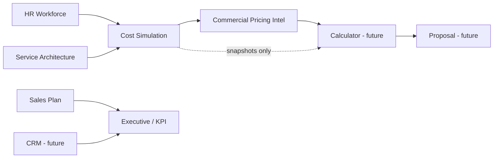

# System Boundaries

**Status:** IS / IS NOT matrix per platform layer  
**Extends:** [PLATFORM_ARCHITECTURE_MASTER_REPORT.md](../PLATFORM_ARCHITECTURE_MASTER_REPORT.md) §14  
**Related:** [PLATFORM_PRINCIPLES.md](./PLATFORM_PRINCIPLES.md) · [DATA_OWNERSHIP.md](./DATA_OWNERSHIP.md)

---

## 1. How to use this document

For each layer, **IS** defines ownership and **IS NOT** prevents scope creep during implementation and sales conversations. When in doubt, check [FUTURE_MODULES.md](./FUTURE_MODULES.md) for deferred scope.

---

## 2. HR Workforce & economics

| IS | IS NOT |
|----|--------|
| Org structure, roles, grades, compensation inputs | CRM account or opportunity ownership |
| Business units (operational), departments, headcount | Tenant (`organizations`) record |
| Overhead loading, fully loaded hourly cost | Commercial price or quote line items |
| Import/snapshot of workforce master | General ledger or payroll system of record (integration future) |
| Intelligence views on cost and structure | Service deliverable definitions |

**Module paths:** `src/lib/hr-workforce/**`, `use-hr-workforce-store`, `/hr-workforce/*`  
**Doc:** [HR-WORKFORCE-MODULE.md](./HR-WORKFORCE-MODULE.md)

---

## 3. Service Architecture

| IS | IS NOT |
|----|--------|
| Service families, templates, phases, deliverables | Pricing to customer |
| Role allocation matrix per template | HR role master (references HR BU ids) |
| BU-scoped templates (via HR business units) | Creating business units (HR Settings owns BU) |
| Catalog import foundation | Production workflow execution |
| Validation / stress catalog for QA | Forecast engine |

**Module paths:** `src/lib/service-architecture/**`, `use-service-architecture-store`, `/service-architecture/*`

---

## 4. Service Cost Simulation

| IS | IS NOT |
|----|--------|
| Operational delivery cost from blueprint + HR rates | Selling price |
| Scenario comparison on hours, mix, OH sensitivity | Proposal document |
| `ServiceCostBaselineSnapshot` for downstream modules | Revenue recognition |
| Explainable cost breakdown by role/phase | CRM delivery tracking |

**Doc:** [SERVICE_COST_SIMULATION_ARCHITECTURE.md](../SERVICE_COST_SIMULATION_ARCHITECTURE.md)

---

## 5. Commercial Pricing Intelligence

| IS | IS NOT |
|----|--------|
| Pricing models (fixed, T&M, retainer, etc.) | Full Commercial Calculator UI |
| Risk stacks, margin targets, scenario pricing | Signed proposal or contract |
| `CommercialPricingSnapshot` adapter output | Operational cost recompute (consumes cost, does not replace it) |
| BD intelligence and sensitivity | Incentive payout calculation |

**Doc:** [COMMERCIAL_PRICING_INTELLIGENCE_ARCHITECTURE.md](../COMMERCIAL_PRICING_INTELLIGENCE_ARCHITECTURE.md)

---

## 6. Sales Plan OS

| IS | IS NOT |
|----|--------|
| Sales planning wizard, build model, measures bridge | HR master data |
| Plan versions and wizard state | Actuals ingestion (future) |
| Alignment with `MEASURE_CATALOG` where bridged | Service catalog editor |
| Executive planning input track | CRM pipeline system of record |

**Doc:** [SALES-PLAN-OS-FULL.md](./SALES-PLAN-OS-FULL.md)

---

## 7. Executive workspace & planning measures

| IS | IS NOT |
|----|--------|
| Demo P&L tower, forecasts, scenarios, pipeline views | Authoritative multi-tenant facts store |
| `evaluateExecutiveWorkspaceMeasures` convergence | Full KPI registry with alerts (future) |
| Workspace Zustand demo state | Replacement for sales plan or HR modules |
| Measure catalog metadata | Event-driven monitoring |

**Doc:** [ARCHITECTURE-CONVERGENCE-MIGRATION.md](./ARCHITECTURE-CONVERGENCE-MIGRATION.md)

---

## 8. Planning API (scaffold)

| IS | IS NOT |
|----|--------|
| Optional server routes for planning artifacts | Primary HR/service persistence |
| Future org-scoped reads/writes | Client-only economics source of truth |

---

## 9. Supabase / auth (scaffold)

| IS | IS NOT |
|----|--------|
| `organizations`, `user_roles`, `app_role`, RLS policies | Application-enforced BU permissions (not wired) |
| Identity when env configured | Module-level authorization today |
| Future tenant spine | HR or service catalog storage (not primary today) |

---

## 10. AI assistant (current)

| IS | IS NOT |
|----|--------|
| `/api/assistant` rule-based stub | LLM orchestration |
| Placeholder for future co-pilot | Proactive monitoring or tool registry |
| | Cross-module write actions |

**Target:** [AI_ORCHESTRATION_VISION.md](./AI_ORCHESTRATION_VISION.md)

---

## 11. Future — Commercial Calculator

| IS | IS NOT |
|----|--------|
| Quantity, packaging, BD-facing price build | Operational OH math (uses snapshots) |
| Consumes cost + pricing intelligence | Proposal PDF / e-sign |
| Explainable line structure | CRM opportunity stage machine |

**Status:** Not implemented — adapters only.

---

## 12. Future — CRM

| IS | IS NOT |
|----|--------|
| Accounts, opportunities, delivery, collections | Workforce or service blueprint editor |
| Operational customer lifecycle | Sales plan version authoring |
| Feeds events and actuals | Pricing model definition |

**Status:** Demo `opportunities` in workspace only.

---

## 13. Future — Workflow / tasks / SOP

| IS | IS NOT |
|----|--------|
| Task assignment, SOP checklists, escalations | Financial formula engine |
| Subscribes to domain events | Replacement for HR approvals |

**Status:** Not implemented.

---

## 14. Future — KPI governance

| IS | IS NOT |
|----|--------|
| KPI registry, targets, ownership, alerts | Ad-hoc chart metrics in UI |
| Actuals vs plan binding | Duplicate measure formulas in pages |
| Phased DAG execution | Raw spreadsheet as SOA |

**Status:** Partial — measure catalog only. See [KPI_ENGINE_ARCHITECTURE.md](./KPI_ENGINE_ARCHITECTURE.md).

---

## 15. Future — Event system

| IS | IS NOT |
|----|--------|
| Domain events, outbox, webhooks | Synchronous cross-module store updates |
| Audit trail and reactive AI feed | User-facing notification UI only |

**Status:** Not implemented. See [EVENT_SYSTEM_ARCHITECTURE.md](./EVENT_SYSTEM_ARCHITECTURE.md).

---

## 16. Boundary diagram

---

## 17. Implemented today vs target

| Boundary | Enforced in code today | Target enforcement |
|----------|------------------------|-------------------|
| Cost ≠ price | Yes (separate engines) | Same + audit events |
| Price ≠ proposal | Yes (no proposal module) | Calculator gate |
| HR BU ≠ tenant | Conceptual only | API + docs + types |
| Measures ≠ full KPI | Partial catalog | KPI registry DB |
| Demo CRM ≠ real CRM | Yes (workspace demo) | Separate module |

---

*Update this matrix when a future module ships or when a boundary is intentionally merged (requires ADR in GOVERNANCE_RULES).*
