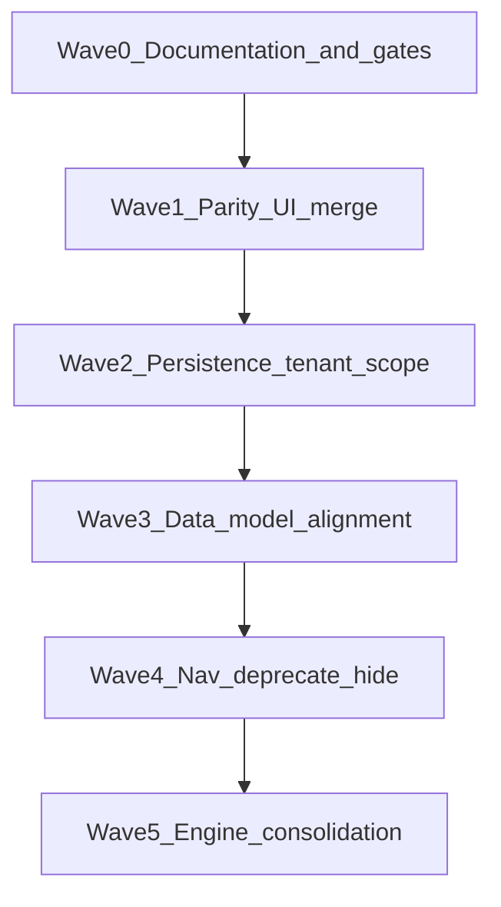
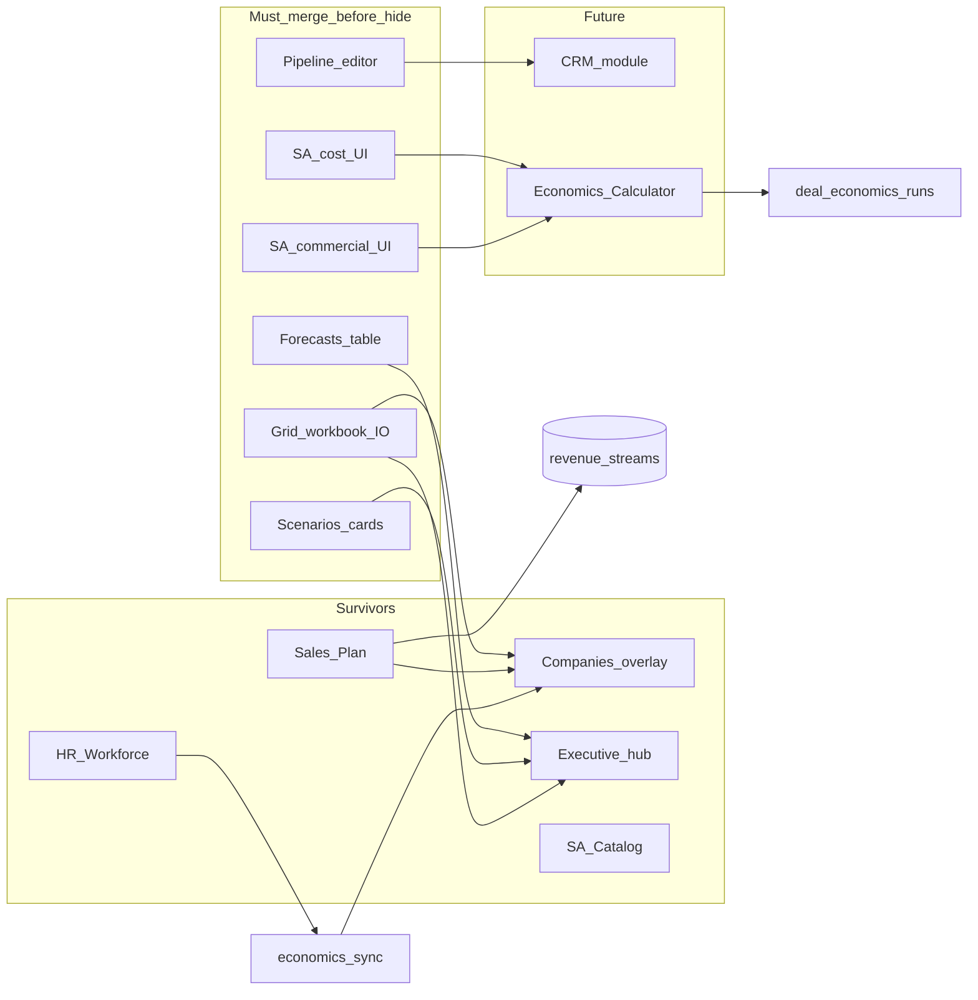

# System Simplification + Canonicalization — Validation Report

**Status:** Pre-implementation validation (read-only)  
**Date:** 2026-05-17  
**Purpose:** Preserve all business capabilities while eliminating duplicated/transitional architecture. **No destructive cleanup is authorized by this document alone.**

**Canonical references:**

- [PLATFORM_ARCHITECTURAL_AUDIT.md](./PLATFORM_ARCHITECTURAL_AUDIT.md) — structure, classification, risks
- [DATA_OWNERSHIP.md](./DATA_OWNERSHIP.md) — entity SOA registry
- [IMPLEMENTATION_PHASES.md](./IMPLEMENTATION_PHASES.md) — phased target architecture

**Critical rule:** Before removing, merging, refactoring, hiding, or deprecating any page/module/component/store, complete capability extraction (Phase 1), merge into a surviving canonical module (Phase 2 gates), and pass survivability validation (Phase 4).

---

## Executive summary

| Finding | Implication |
|---------|-------------|
| **3 highest-risk removals** | Pipeline (only `updateOpportunity` UI), Grid (only `PlanningWorkbookPanel` + planning I/O), Sales Plan save path (only full wizard → workspace mapping) |
| **Low-risk removals** | Forecasts route (duplicate table of `buildDemoForecastSeries`), Scenarios route (duplicate lens; bar chart on Executive insufficient alone) |
| **Survivors** | HR Workforce, Companies overlay, Executive hub, Sales Plan wizard, SA catalog routes, Login |
| **Derived consolidation target** | Single “Economics lab” (cost → commercial → deal runs) + workbook panel on Companies/Executive |
| **Not routes today** | KPI (Executive + HR intelligence), Calculator UI (adapters only), Deal Economics UI (API only), Onboarding (gates + sample panels) |

---

## Scope

### Modules in audit classification

| Classification | Modules |
|----------------|---------|
| **REFACTOR** | Executive `/`, Scenarios, Sales Plan, Settings, Companies (overlay parity) |
| **MERGE** | Forecasts → Executive/Companies; wizard `products` → `revenue_streams` read model |
| **DERIVED** | Grid/workbook, SA cost-intelligence, SA commercial-pricing, HR intelligence, measure layer, deal-economics API |
| **DEPRECATE** | Pipeline (demo CRM), `DEMO_ORG_ID` paths, dead SQL `portfolios` / `business_units` |
| **DEMO / TRANSITIONAL** | Forecasts page, demo opportunities/forecasts, sample-data orchestrator surfaces |

### Out of scope for removal (document only)

HR Workforce routes (`/hr-workforce`, import, roles, settings), SA catalog routes (families, templates, phases, deliverables, role-allocation-matrix), Login, Companies overlay editor.

### Non-route surfaces (must appear in canonical matrix)

| Surface | Where it lives today |
|---------|---------------------|
| **KPI** | Executive [`page.tsx`](../src/app/[locale]/(dashboard)/page.tsx) (`KpiCard` × 11); HR [`hr-workforce-intelligence-view.tsx`](../src/components/hr-workforce/hr-workforce-intelligence-view.tsx) |
| **Calculator** | JSON adapters on commercial-pricing; [`sales-calculator-adapter.ts`](../src/lib/commercial-pricing-intelligence/sales-calculator-adapter.ts); no `/calculator` route |
| **Deal economics** | [`evaluateDealEconomics`](../src/lib/deal-economics/evaluate.ts); `POST /api/platform/deal-economics/runs`; measure catalog entries only |
| **Onboarding** | [`OperationalWorkspaceGate`](../src/components/operational-workspace/operational-workspace-gate.tsx), [`SampleDataPanel`](../src/components/sample-data/sample-data-panel.tsx), HR import — no `/onboarding` route |

---

# Phase 1 — Deep Cleanup Audit Validation

Each module: **A** capability extraction, **B** canonical destination, **C** merge requirements.

---

## 1. Executive `/` — REFACTOR

**Classification:** Keep but refactor. Primary analytics hub (derived UI over projection + engines).

**Files:** [`src/app/[locale]/(dashboard)/page.tsx`](../src/app/[locale]/(dashboard)/page.tsx), [`executive-workspace-measures.ts`](../src/lib/planning/measures/executive-workspace-measures.ts), [`kpi-card.tsx`](../src/components/dashboard/kpi-card.tsx), [`insight-bulb.tsx`](../src/components/planning/insight-bulb.tsx)

### A. Capability extraction

| Category | Feature / function | Unique to this page? | Dependencies |
|----------|-------------------|----------------------|--------------|
| **UI** | Landing cockpit: 11× `KpiCard` with tooltips | Yes (only consumer of `KpiCard`) | `useOperationalWorkspace`, workspace store |
| **UI** | Recharts 12-month area (revenue + net profit) | Yes (Forecasts is table-only) | `buildDemoForecastSeries` |
| **UI** | Recharts scenario comparison bar chart | Partial (Scenarios has card grid) | `evaluateExecutiveWorkspaceMeasures.scenarioCompare` |
| **UI** | Operating snapshot (GP, EBITDA, margin, blended CM) | Yes (layout) | measures orchestrator |
| **UI** | Scenario dropdown (`setScenario`) | **Yes** — only route calling `setScenario` in UI | `useWorkspaceStore` |
| **UI** | Linked-BU company picker | Pattern shared; home is primary entry | `useOperationalWorkspace` |
| **UI** | `InsightBulb` measure education strip (3 bulbs) | Yes | i18n `measures.*` |
| **UI** | `OperationalWorkspaceGate` + `SampleDataPanel` moduleId `workspace` | Yes for default landing onboarding | sample-data |
| **Calculation** | `evaluateExecutiveWorkspaceMeasures` full strip | Orchestrator shared; **full UI wiring unique** | `runForecastEngine`, `applyScenario`, `computeWorkbookPlanningSlice`, pipeline lib |
| **Calculation** | `buildDemoForecastSeries` in charts | No | [`demo-seed.ts`](../src/data/demo-seed.ts) |
| **Calculation** | Pipeline KPIs: health, coverage, weighted pipeline | Display only; data from workspace `opportunities` | [`pipeline.ts`](../src/lib/calculations/pipeline.ts) |
| **State** | Reads `selectedScenarioId`, `tierLineOverrides`, `opportunities` | — | `useWorkspaceStore` |
| **Persistence** | None on page (inherits tenant workspace hydrate) | — | `TenantPersistenceProvider` |
| **Import/export** | None | — | — |
| **Workflow** | Default route `/`; command-menu entry | Yes | [`app-shell.tsx`](../src/components/layout/app-shell.tsx), [`command-menu.tsx`](../src/components/command-menu.tsx) |

**Hidden logic:** Measure lineage map (`measureLineageById`) computed but not all IDs surfaced in UI; workbook KPIs depend on `tierLineOverrides` edited only on Grid today.

### B. Canonical destination

| Capability | Permanent home | Role |
|------------|----------------|------|
| KPI tower + charts | **Executive** (survivor) | Derived analytics |
| Scenario switcher | **Executive** | Controls active scenario for all derived views |
| Forecast table (from Forecasts merge) | Executive tab or section | Derived |
| Scenario card lab (from Scenarios merge) | Executive “Scenario lab” section | Derived |
| Engines | `lib/planning/measures/*` (internal) | Phase 2 unified registry |

### C. Merge requirements

| Action | Blocker if skipped |
|--------|-------------------|
| Refactor: all company selection via `linkedUnits` only | Orphan companies skew KPIs |
| Merge Forecasts table before hiding `/forecasts` | Loss of tabular 12-mo view |
| Merge Scenarios cards before hiding `/scenarios` | Loss of per-scenario lever metadata |
| Replace Assistant duplicate engine calls with same orchestrator | Context drift vs Executive |
| **Cannot remove Executive route** | Platform has no other board cockpit |

**Persistence risk:** Low — read-mostly. **Graph risk:** Pipeline KPIs stale if Pipeline removed without replacement. **Hydration risk:** Must wait for bootstrap before showing KPIs (gate already present).

---

## 2. Companies `/companies` — REFACTOR (canonical overlay)

**Classification:** **Canonical** planning projection editor for BU financial overlays.

**Files:** [`companies/page.tsx`](../src/app/[locale]/(dashboard)/companies/page.tsx), [`use-workspace-store.ts`](../src/stores/use-workspace-store.ts) (`updateCompany`), [`opportunity-tiers-defaults.ts`](../src/data/opportunity-tiers-defaults.ts)

### A. Capability extraction

| Category | Feature | Unique? | Notes |
|----------|---------|---------|-------|
| **UI** | Financial overlay form: fixed costs, revenue monthly, growth, margin, NP%, CM% | **Yes** (persist) | Zod schema; `updateCompany` |
| **UI** | Opportunity tier bands editor | **Yes** | `OpportunityTierDefinition[]` |
| **UI** | Revenue streams list (read-only per company) | **Yes** | `streamsForCompany` |
| **UI** | Orphan vs linked unit warnings | **Yes** | `isOrphanOperationalUnit` |
| **UI** | Link to Sales Plan wizard | **Yes** | locale-aware href |
| **UI** | `OperationalWorkspaceGate`, `SampleDataPanel` | Shared | |
| **Calculation** | Display formatting only | No engines on page | `formatCurrency`, `formatPct` |
| **State** | Writes `companies` slice in workspace store | Canonical overlay path | dual-write when enabled |
| **Import/export** | None | — | |
| **Workflow** | Select BU → edit overlays → save | **Yes** | Survivor for projection edits |

### B. Canonical destination

**Companies remains canonical** for: financial targets on `companies` row, opportunity tier definitions, stream visibility.

**Absorb from Grid:** `PlanningWorkbookPanel` tier line overrides (`tierLineOverrides`, `setTierLinesForStream`, `resetTierLinesForCompany`) — these affect Executive workbook KPIs globally.

### C. Merge requirements

| Must merge first | From |
|------------------|------|
| Workbook tier panel | Grid |
| Optional: stream-level CM/mix editors | Grid matrix + panel |
| Planning import/export toolbar | Grid (or Executive) |

**Cannot remove** Companies route. **Hydration risk:** Edits must survive `GET /api/planning/workspace` refresh — today client persist + hydrate merge policy must be verified per wave.

---

## 3. Forecasts `/forecasts` — MERGE / DEMO

**Classification:** Transitional / demo presentation. **Delete route only after merge.**

**Files:** [`forecasts/page.tsx`](../src/app/[locale]/(dashboard)/forecasts/page.tsx), [`bu-forecast-context.ts`](../src/lib/planning/measures/bu-forecast-context.ts)

### A. Capability extraction

| Category | Feature | Unique? |
|----------|---------|---------|
| **UI** | Read-only 12-month TanStack table (Period, Revenue, GP, NP) | **Yes** |
| **UI** | BU subtitle via `buildBuForecastContext` | **Yes** (display only; does not change numbers) |
| **Calculation** | `buildDemoForecastSeries(company, scenarioId)` | **No** — same as Executive chart |
| **State** | `activeOperationalUnits` for company pick | Different resolver than Executive hook |
| **Import/export** | None | — |

**No unique business logic** — only presentation.

### B. Canonical destination

| Capability | Destination |
|------------|-------------|
| 12-mo table | Executive tab “Forecast table” or Companies sub-tab |
| BU identity subtitle | Executive header (reuse `buildBuForecastContext`) |
| Company selection | `useOperationalWorkspace` (align with Executive) |

### C. Merge requirements

| Requirement | Risk |
|-------------|------|
| Port table component to survivor **before** nav hide | Users lose tabular forecast view |
| Use linked units only | Currently may differ from Executive |
| **Safe to delete route** after table parity | **Do not delete** `buildDemoForecastSeries` |

---

## 4. Scenarios `/scenarios` — REFACTOR

**Classification:** Keep but refactor → merge into Executive as derived lens.

**Files:** [`scenarios/page.tsx`](../src/app/[locale]/(dashboard)/scenarios/page.tsx)

### A. Capability extraction

| Category | Feature | Unique? |
|----------|---------|---------|
| **UI** | All-scenarios responsive card grid | **Yes** |
| **UI** | Per-card lever subtitle: `npTargetPct`, `growthAdj`, `fixedCostAdj` | **Yes** |
| **UI** | Baseline vs Alt badges | Partial (Executive has active scenario badge) |
| **UI** | Framer Motion staggered entrance | **Yes** |
| **UI** | Per-scenario metrics: revenue, NP, ROI, sales gap | Shared data; unique layout |
| **Calculation** | `evaluateExecutiveWorkspaceMeasures` per `scenariosForCompany` | Shared orchestrator |
| **State** | Raw `companies.find` — **no operational gate** | Tech debt |
| **Import/export** | None | — |

### B. Canonical destination

| Capability | Destination |
|------------|-------------|
| Scenario comparison cards | Executive “Scenario lab” section |
| Scenario SOA | Supabase `scenarios` + workspace hydrate (unchanged) |
| Active scenario switch | Executive dropdown (already exists) |

### C. Merge requirements

| Must do first | Cannot remove until |
|---------------|---------------------|
| Add `OperationalWorkspaceGate` on Scenarios **or** merge only into gated Executive | Orphans shown |
| Port card grid + lever copy to Executive | Bar chart alone is insufficient |
| Preserve `setScenario` behavior | Scenario switching breaks |

---

## 5. Pipeline `/pipeline` — DEPRECATE → CRM

**Classification:** Highest merge risk in program.

**Files:** [`pipeline/page.tsx`](../src/app/[locale]/(dashboard)/pipeline/page.tsx), workspace store `updateOpportunity`, [`pipeline.ts`](../src/lib/calculations/pipeline.ts) (`stageLeakage`)

### A. Capability extraction

| Category | Feature | Unique? |
|----------|---------|---------|
| **UI** | Editable table: Client, Opportunity, Stage, Prob %, Value | **Yes** |
| **UI** | Inline `Select` for stage, `Input` on blur for prob/value | **Yes** |
| **UI** | `stageLeakage` column | **Yes** (only UI surfacing this) |
| **UI** | Weighted value column | Duplicates `weightedRevenue` formula |
| **Calculation** | `stageLeakage(stage)` | Used here; engine uses health/coverage elsewhere |
| **State** | **`updateOpportunity` — only caller in entire app** | Critical |
| **Persistence** | `opportunities[]` in tenant workspace LS + hydrate | Demo SOA today |
| **Downstream** | Executive pipeline KPIs; Assistant keyword context | Regression if editor removed |

**Stages:** `discovery` … `closed_lost` — [`DemoOpportunity`](../src/types/domain.ts)

### B. Canonical destination

| Phase | Destination |
|-------|-------------|
| **Interim** | Read-only pipeline on Executive + hidden admin editor OR Companies sub-panel |
| **Phase 4 CRM** | `opportunities` table (future); canonical CRM module |

### C. Merge requirements

**Cannot hide nav or delete page until one of:**

1. CRM tables + full editor with `updateOpportunity` equivalent, OR  
2. Read-only pipeline view + explicit product sign-off to remove pipeline KPIs from Executive measures, OR  
3. Seed-only opportunities with no user edit (regresses workflow)

| Dependency risk | Detail |
|-----------------|--------|
| Executive measures | `weightedPipeline`, `pipelineHealth`, `coverage` need `opportunities` data |
| Assistant API | Hardcoded links to `/pipeline` in [`assistant/route.ts`](../src/app/api/assistant/route.ts) |
| Measure catalog | Pipeline-sourced measure IDs |

---

## 6. Grid `/grid` — DERIVED

**Classification:** Convert to derived; delete route only after workbook + I/O merge.

**Files:** [`grid/page.tsx`](../src/app/[locale]/(dashboard)/grid/page.tsx), [`planning-workbook-panel.tsx`](../src/components/planning/planning-workbook-panel.tsx), [`workbook-engine.ts`](../src/lib/planning/workbook-engine.ts), APIs: import/export/workspace/matrix/cell

### A. Capability extraction

| Category | Feature | Unique? |
|----------|---------|---------|
| **UI** | `PlanningWorkbookPanel` — tier lines, stream CM/mix, block weights, fixed cost | **Only mount site in repo** |
| **UI** | CSS grid matrix: editable revenue per period | **Yes** (local React state) |
| **UI** | Revenue → GP → NP cascade on edit | **Yes** (page-local formulas, not `runForecastEngine`) |
| **UI** | PostgreSQL vs local badge | **Yes** |
| **UI** | Toolbar: Import file, Export CSV/XLSX/PDF, Reset model | **Yes** |
| **I/O** | `POST /api/planning/import` | **Only UI caller** |
| **I/O** | `POST /api/planning/export` | **Only UI caller** |
| **I/O** | `GET /api/planning/workspace` | Badge only; does not hydrate grid |
| **I/O** | `POST /api/planning/matrix/cell` | **Not wired from UI** |
| **State** | `tierLineOverrides` mutations | Affects Executive globally |
| **State** | Matrix rows | **Session-only** — not in workspace store |
| **Workflow** | Import spreadsheet → edit matrix → export | **Yes** |

### B. Canonical destination

| Capability | Destination |
|------------|-------------|
| Workbook panel | **Companies** (primary) or Executive secondary tab |
| Import/export | Same survivor as workbook panel |
| Matrix editing | Phase 3 forecast versions OR wire `matrix/cell` API |
| Engines | Keep in `lib/planning/*` | Internal |

### C. Merge requirements (mandatory order)

1. Mount `PlanningWorkbookPanel` on Companies or Executive.  
2. Move import/export toolbar; verify E2E round-trip.  
3. Document ephemeral matrix vs `tierLineOverrides` persistence.  
4. Decide matrix persistence strategy before deleting Grid.  
5. Update nav + command-menu.

**Cannot remove** until steps 1–2 pass Phase 4 grid import/export scenario.

---

## 7. Sales Plan `/sales-plan` — REFACTOR

**Classification:** Canonical planning OS for revenue assumptions (target state).

**Files:** [`sales-plan/page.tsx`](../src/app/[locale]/(dashboard)/sales-plan/page.tsx), [`sales-plan-wizard.tsx`](../src/components/sales-plan/sales-plan-wizard.tsx), [`use-sales-plan-wizard-store.ts`](../src/stores/use-sales-plan-wizard-store.ts), [`build-model.ts`](../src/lib/sales-plan/build-model.ts), [`engine.ts`](../src/lib/sales-plan/engine.ts)

### A. Capability extraction

| Category | Feature | Unique? |
|----------|---------|---------|
| **UI** | 18-step wizard (meta, tiers, fixed costs, products, shares, tier mix, contribution matrix, funnel, quarterly weights, segments, blended CM, NP target, charts, insights, advanced panel) | **Yes** |
| **UI** | `OperationalWorkspaceGate`, `OperationalBuToolbar` | Shared |
| **UI** | Stream seed button (`seedProductsFromStreams`) | **Yes** |
| **Calculation** | `buildSalesPlanModel` — targets, ADV, awards, funnel, capacity heuristic, 10 insight IDs, chart series | Lib — keep |
| **Calculation** | `computeTargetsFromPlan` → workbook-engine | Shared |
| **Calculation** | Live preview: `weightedBlendedCm`, `breakEvenRevenue`, `yearlyBurnFromMonthly` | Wizard |
| **State** | `efp-sales-plan-wizard` global LS v2 | **Tenant leak** |
| **Save** | `savePlanToSelectedOperationalUnit` → `applySalesPlanToOperationalUnit` | **Only full wizard→workspace mapping** |
| **Save** | `applyPlanToWorkspace` (partial: fixed cost, NP%, tiers) | **Yes** |
| **Save** | Deprecated alias `savePlanToWorkspaceAsNewCompany` | Orphan risk if misused |
| **Import/export** | No plan JSON export | Gap |
| **Dependencies** | Measure bridge, `sales-plan-wizard` sample module, Companies link | |

### B. Canonical destination

| Entity | Owner |
|--------|-------|
| Wizard UX | **Sales Plan** (survivor) |
| Built model / engines | `lib/sales-plan/*` + Phase 2 registry |
| Products | Read model over `revenue_streams` (merge target) |
| Wizard state | Org-scoped server or namespaced LS |

### C. Merge requirements

| Before any deprecation | Action |
|------------------------|--------|
| Tenant-scope `efp-sales-plan-wizard` | Wave 2a |
| Products from streams read-only | Wave 2b |
| Block orphan company creation | Code guard on save alias |
| Keep `applySalesPlanToOperationalUnit` | Required for stream/scenario sync |

**Do not remove wizard** — canonical planning capability.

---

## 8. SA cost-intelligence + commercial-pricing — DERIVED

**Classification:** Convert UI to derived; **never delete engines**.

**Files:**

- [`cost-intelligence/page.tsx`](../src/app/[locale]/(dashboard)/service-architecture/cost-intelligence/page.tsx) → [`service-cost-intelligence-view.tsx`](../src/components/service-architecture/service-cost-intelligence-view.tsx)
- [`commercial-pricing/page.tsx`](../src/app/[locale]/(dashboard)/service-architecture/commercial-pricing/page.tsx) → [`commercial-pricing-intelligence-view.tsx`](../src/components/service-architecture/commercial-pricing-intelligence-view.tsx)
- Stores: [`use-service-cost-simulation-prefs-store.ts`](../src/stores/use-service-cost-simulation-prefs-store.ts), [`use-commercial-pricing-prefs-store.ts`](../src/stores/use-commercial-pricing-prefs-store.ts)
- Engines: [`evaluateServiceEconomics`](../src/lib/service-economics/), [`runCommercialPricingIntelligence`](../src/lib/commercial-pricing-intelligence/engine.ts)

### A. Capability extraction

| Cost intelligence | Commercial pricing |
|-------------------|-------------------|
| Template + tier picker; cost scenario presets | Pricing models (cost_plus, value_based, retainer, etc.) |
| Editable simulation assumptions (all keys in defaults) | Risk toggles, commercial scenario, margin thresholds |
| `evaluateServiceEconomics` → phase/role/deliverable tables | `runCommercialPricingIntelligence` on operational basis |
| Tier compare, top phases | Sensitivity, tier/family/model comparisons |
| JSON **export/import** assumptions | Calculator adapter JSON display (`toCommercialPricingSnapshot`) |
| Sales Plan cost adapter snapshot (display) | `buildCommercialPricingPresetImportPreview` (**lib only, no UI**) |
| `SampleDataPanel` module prefs | `SampleDataPanel` module prefs |
| Prefs: `efp-service-cost-simulation-prefs-v1` (**global**) | Prefs: `efp-commercial-pricing-prefs-v1` (**global**) |

**Deal economics** composes these libs without these pages — [`evaluateDealEconomics`](../src/lib/deal-economics/evaluate.ts).

### B. Canonical destination

| Capability | Destination |
|------------|-------------|
| Catalog CRUD | SA routes (families, templates, …) — **unchanged** |
| Cost + commercial UI | **Economics lab** shell (Phase 2) or SA subnav “Economics” |
| Engines | `lib/service-economics`, `lib/commercial-pricing-intelligence` |
| Prefs | Org-scoped table or `efp-{orgId}-*` |
| Calculator UI | New route Phase 2 — uses existing adapters |

### C. Merge requirements

| Must preserve | Before hiding routes |
|---------------|---------------------|
| Assumption import/export (cost) | Relocate to Economics lab |
| Preset import UI (commercial) | Wire `buildCommercialPricingPresetImportPreview` |
| Tenant-scope prefs | Wave 2a |
| BU scoping via `selectedUnit` | Already on views |

---

## 9. HR intelligence `/hr-workforce/intelligence` — DERIVED

**Files:** [`intelligence/page.tsx`](../src/app/[locale]/(dashboard)/hr-workforce/intelligence/page.tsx), [`hr-workforce-intelligence-view.tsx`](../src/components/hr-workforce/hr-workforce-intelligence-view.tsx), [`deriveWorkspaceProjection`](../src/lib/hr-workforce/)

### A. Capability extraction

| Category | Feature | Unique? |
|----------|---------|---------|
| **UI** | HR-specific executive KPIs (headcount, loaded cost, OH rollups) | **Yes** vs planning Executive |
| **Calculation** | `deriveWorkspaceProjection`, workforce model | HR engine |
| **State** | Read-only from HR store | — |
| **Import/export** | None | — |

### B. Destination

Keep as **HR derived analytics** route OR merge into HR dashboard home — **do not delete** KPIs.

### C. Merge requirements

Port widgets to HR home before route removal (optional). No impact on operational graph.

---

## 10. Assistant `/assistant` — TRANSITIONAL

**Files:** [`assistant/page.tsx`](../src/app/[locale]/(dashboard)/assistant/page.tsx), [`api/assistant/route.ts`](../src/app/api/assistant/route.ts)

### A. Capability extraction

| Category | Feature | Unique? |
|----------|---------|---------|
| **UI** | Question input, answer display | **Yes** |
| **Calculation** | `runForecastEngine`, `applyScenario`, `weightedRevenue` — **duplicates Executive** | Should use orchestrator |
| **API** | Keyword rules (ROI, NP, scenario, pipeline, margin); context guards | **Yes** |
| **State** | Ephemeral Q&A | — |
| **Persistence** | None | — |

### B. Destination

Phase 5: Executive embed or floating copilot. **Keep API** for LLM swap.

### C. Merge requirements

Relocate UI entry; refactor API context to `evaluateExecutiveWorkspaceMeasures`; update deep links if Pipeline/Scenarios nav changes.

---

## 11. Settings `/settings` — REFACTOR

**Files:** [`settings/page.tsx`](../src/app/[locale]/(dashboard)/settings/page.tsx), [`platform-sample-data-controls.tsx`](../src/components/sample-data/platform-sample-data-controls.tsx), [`orchestrator.ts`](../src/lib/sample-data/orchestrator.ts)

### A. Capability extraction

| Category | Feature | Unique? |
|----------|---------|---------|
| **UI** | Read-only `dealSizeTiers` table | **Yes** (from demo-seed; not wizard tiers) |
| **UI** | Env documentation (Supabase, REQUIRE_AUTH) | **Yes** |
| **UI** | `PlatformSampleDataControls` — load/clear **all** modules | **Yes** (bulk) |
| **Workflow** | Ordered load: HR → SA → workspace → wizard → prefs | Orchestrator |
| **Risk** | Can overwrite tenant truth in dev | — |

### B. Destination

**Hidden admin** route (env-gated). Relocate bulk sample controls; move deal tier taxonomy to Companies when editable.

### C. Merge requirements

**Cannot delete** `lib/sample-data/*` — embedded panels use it. Hide Settings nav in production; keep orchestrator.

---

## 12. Demo / sample contamination — DEMO

**Files:** [`demo-seed.ts`](../src/data/demo-seed.ts), [`default-tier-lines.ts`](../src/data/default-tier-lines.ts), sample modules under [`lib/sample-data/modules/`](../src/lib/sample-data/modules/), `seedDemoCatalog` in SA store

### A. Capability extraction

| Feature | Purpose |
|---------|---------|
| `DEMO_ORG_ID = "org-demo-001"` | Parallel universe vs tenant UUID |
| Fictional companies (Northwind, Aurora) | Demo workspace |
| `loadAllSampleData` / `clearAllSampleData` | Dev onboarding |
| Per-module SampleDataPanel | Partial hide when `linkedUnits.length > 0` |

### B. Destination

Dev-only behind `NEXT_PUBLIC_ENABLE_SAMPLE_DATA`. Production path: empty tenant → HR import only.

### C. Merge requirements

**Cannot delete** until alternate onboarding documented and enforced. Contain — do not mass-delete in early waves.

---

## 13. Canonical modules (no removal) — reference

Brief validation that survivors are not candidates for deletion:

| Module | Unique capabilities to preserve |
|--------|-----------------------------------|
| **HR dashboard** | BU/dept/team structure views, cost rollups, sync triggers |
| **HR import** | Bulk ingest, uplift, post-import bootstrap |
| **HR roles/settings** | Role CRUD, org structure settings, debounced economics sync |
| **SA families/templates/phases/deliverables/matrix** | Full delivery catalog SOA; template `businessUnitId` → HR BU |
| **Login** | Supabase auth, session, middleware redirect |
| **Deal economics API** | Immutable `deal_economics_runs`; client evaluate + POST |
| **Measure layer** | `measure-catalog.ts`, executive orchestrator — refactor only |

---

# Phase 2 — Safe Simplification Plan

## Principles

1. **Merge before remove** — every row in Phase 1.C must be satisfied.  
2. **One wave per PR** — easier rollback.  
3. **Parity checklist gates** — no Wave N+1 until Wave N passes Phase 4 scenarios for touched modules.  
4. **No feature loss** — if a capability has no new home, the old route stays.

## Wave diagram



## Wave detail

| Wave | Actions | Parity gate (must pass) |
|------|---------|-------------------------|
| **0** | Publish this doc; transitional badges on Forecasts/Pipeline; `OperationalWorkspaceGate` on Scenarios | Manual QA: boot, login, linked BUs |
| **1a** | Merge Forecasts table → Executive tab | 12-mo table visible for selected BU; same numbers as old `/forecasts` |
| **1b** | Mount `PlanningWorkbookPanel` on Companies | Tier edit changes Executive workbook KPIs |
| **1c** | Move planning import/export to Companies/Executive | CSV/XLSX/PDF round-trip unchanged |
| **1d** | Merge Scenarios card grid → Executive “Scenario lab” | All scenario levers visible; `setScenario` works |
| **2a** | Namespace wizard + SA prefs to `efp-{orgId}-*` | Tenant switch: no cross-tenant prefs |
| **2b** | Sales Plan products read-only from `revenue_streams` | No duplicate product create when stream exists |
| **3** | Pipeline: read-only mode OR CRM stub | Executive pipeline KPIs still computable; edit path documented |
| **4a** | Hide `/forecasts`, `/scenarios` (redirects) | Command-menu + no 404 |
| **4b** | Hide `/pipeline` only if Wave 3 complete | `updateOpportunity` path exists elsewhere |
| **4c** | Hide `/grid` only if Wave 1b–1c complete | Workbook + I/O on survivor |
| **4d** | Hide SA cost/commercial when Economics lab exists | Engines + import/export on new shell |
| **5** | Unified `evaluateDealEconomics` / registry in UI | Measure catalog single calculation path |

## Explicitly NOT in early waves

- Deleting `demo-seed.ts` or demo companies  
- Dropping SQL `portfolios` / `business_units`  
- Removing `opportunities` from workspace store  
- Removing Sales Plan wizard  
- Removing `lib/service-economics` or commercial-pricing engines  

## Per-wave regression checklist (summary)

| Wave | Run Phase 4 scenarios |
|------|------------------------|
| 0 | Hard refresh, login, HR sync |
| 1 | All above + tier workbook edit, grid import/export |
| 2 | Tenant switch, Sales Plan save |
| 3 | Pipeline edit or read-only sign-off |
| 4 | Full matrix for hidden routes (redirects) |
| 5 | Deal economics POST + Executive measures |

---

# Phase 3 — Final Canonical Page Matrix

| Module / Page | Final role | Canonical? | Derived? | Merge source | Delete route? | Why |
|---------------|------------|------------|----------|--------------|---------------|-----|
| **HR Workforce** (`/hr-workforce`) | Structure, cost, dashboard | Yes | No | — | No | Upstream operational graph SOA |
| **HR import** | Bulk workforce ingest + bootstrap | Yes | No | — | No | Only file/bulk HR ingest path |
| **HR roles** | Role / operational workspace slice | Yes | No | — | No | Canonical role definitions |
| **HR settings** | BU/dept/team CRUD | Yes | No | — | No | Triggers debounced sync |
| **HR intelligence** | HR analytics KPIs | No | Yes | — | Optional merge to HR home | Derived from HR catalog |
| **Companies** | BU financial + tier overlay editor | Yes (projection) | No | Grid workbook panel | No | Planning overlay SOA |
| **Executive** | Board cockpit, measures, charts | No | Yes (UI) | Forecasts, Scenarios | No | Primary derived read model |
| **Sales Plan** | Revenue planning wizard + save | Yes (assumptions) | No | products→streams | No | Canonical planning OS |
| **SA families** | Service family catalog | Yes | No | — | No | Delivery SOA |
| **SA templates** | BU-scoped templates | Yes | No | — | No | References HR BU id |
| **SA phases / deliverables / matrix** | Delivery structure | Yes | No | — | No | Catalog integrity |
| **SA cost-intelligence** | Cost simulation UI | No | Yes | — | Hide after Economics lab | Engines remain in lib |
| **SA commercial-pricing** | Commercial intelligence UI | No | Yes | — | Hide after Calculator | Adapter to deal economics |
| **Grid / Workbook** | Tier matrix + import/export | No | Yes | — | Yes (post Wave 1b–c) | Duplicate presentation |
| **Forecasts** | 12-mo table | No | Yes | — | Yes (post Wave 1a) | Duplicate of Executive data |
| **Scenarios** | Scenario comparison lab | No | Yes | — | Yes (post Wave 1d) | Duplicate lens |
| **Pipeline** | Opportunity editor | No (future CRM) | Demo today | — | Yes (Phase 4 / Wave 3 only) | Only demo CRM write UI |
| **Assistant** | AI Q&A stub | No | Yes | — | Hide until Phase 5 | No LLM yet |
| **Settings** | Admin / sample / env docs | No | Admin | — | Hide in prod | Tenant overwrite risk |
| **Login** | Authentication | Yes | No | — | No | Platform |
| **KPI** (no route) | Metrics on Executive + HR intelligence | — | Yes | — | N/A | Not a standalone page |
| **Calculator** (no route) | Deal/commercial compose UI | No | Yes | commercial-pricing | Add Phase 2 | Engine + adapters exist |
| **Deal economics** (API) | Immutable run snapshots | Yes (runs) | Yes (output) | — | No API | POST-only audit trail |
| **Onboarding** (gates/panels) | Empty → HR import | No | Flow | sample-data | No | Not a route |

---

# Phase 4 — Survivability Validation

## Simulation matrix

Run before and after each wave. **Fail the wave** if any pass criterion breaks.

| # | Scenario | Steps | Modules exercised | Regression signals |
|---|----------|-------|-------------------|-------------------|
| 1 | **Hard refresh** | Load app on `/` while authenticated | `TenantPersistenceProvider`, gates, LS rehydrate | Infinite loading; wrong org data; empty linked units while HR has BUs |
| 2 | **Login / logout** | Log out → hit protected route → log in | Middleware, `requireRouteSupabaseSession`, bootstrap | Sync 401; `sync.errors` not iterable; no login CTA |
| 3 | **Tenant switch** | Switch org in UI (if enabled) | Namespaced LS, HR/SA GET, workspace hydrate | Wizard/commercial/cost prefs from other tenant |
| 4 | **Workspace hydrate** | After sync, verify companies/streams | `GET /api/planning/workspace` | Stale companies; missing streams; wrong scenario baseline |
| 5 | **Operational graph sync** | Edit HR BU → wait debounce → check Companies | uplift, `POST /api/platform/economics/sync` | RLS violation; missing `company_hr_unit_links`; stream names stale |
| 6 | **HR import** | Import file on HR import page | import slice, bootstrap | Partial projection; duplicate streams |
| 7 | **Sales Plan save** | Complete wizard → save to linked BU | `applySalesPlanToOperationalUnit` | Orphan company; streams not updated; scenario name drift |
| 8 | **Sales Plan light apply** | `applyPlanToWorkspace` | Partial company patch | NP/tiers not persisted |
| 9 | **SA template save** | Edit template on BU-scoped templates | `PUT /api/org/service-catalog` | Wrong `businessUnitId`; version conflict |
| 10 | **Deal economics flow** | Run evaluate + POST run (test or future UI) | `evaluateDealEconomics`, persist API | 400 validation; measure catalog mismatch |
| 11 | **Grid import/export** | Import CSV/XLSX → export same format | planning import/export routes | Data loss; wrong company scope |
| 12 | **Pipeline edit** | Change stage/prob/value on Pipeline | `updateOpportunity` | Executive pipeline KPIs unchanged |
| 13 | **Tier workbook edit** | Change tier line on Grid/Companies panel | `tierLineOverrides` | Executive workbook KPIs unchanged |
| 14 | **Scenario switch** | Change scenario on Executive | `setScenario` | Charts/KPIs don't update |
| 15 | **Cost assumption import** | Export JSON → paste import on cost-intel | cost simulation lib | Assumptions not applied |
| 16 | **Sample load (dev)** | Load all sample data from Settings | orchestrator | Production tenant polluted when linked units exist |

## Pass criteria (global)

No loss of:

1. Opportunity editing path until CRM replacement (or explicit KPI removal sign-off)  
2. Tier override editing (`PlanningWorkbookPanel` capability)  
3. Planning file import/export  
4. Sales Plan full save to linked BU  
5. HR import + post-import bootstrap  
6. SA cost assumption import/export  
7. Executive scenario switching  
8. Economics sync for authenticated session  
9. Service catalog BU-scoped templates  

## Post-wave sign-off template

```markdown
Wave: ___
Date: ___
Tester: ___
Scenarios run: [ ] 1–16 as applicable
Regressions: none / list
Parity notes: Forecasts table / Workbook panel / etc.
Approved for next wave: yes / no
```

---

# Merge dependency map

## Visual



## Dependency table

| Source module | Capability | Blocked by | Must merge into | Before action |
|---------------|------------|------------|-----------------|---------------|
| Forecasts | 12-mo table | — | Executive | Hide `/forecasts` |
| Scenarios | Card grid + levers | Operational gate | Executive | Hide `/scenarios` |
| Grid | Workbook panel | — | Companies | Hide `/grid` |
| Grid | Import/export APIs | Workbook relocation | Companies or Executive | Hide `/grid` |
| Grid | Local matrix | Persistence decision | Phase 3 forecasts or matrix API | Optional hide |
| Pipeline | `updateOpportunity` | CRM or interim editor | CRM / admin panel | Hide `/pipeline` |
| SA cost | Assumption I/O | Economics lab shell | Calculator / lab | Hide cost route |
| SA commercial | Preset import UI | Wire lib to UI | Calculator / lab | Hide commercial route |
| Sales Plan | `products[]` | streams read model | `revenue_streams` view | Stop duplicate SOA |
| Wizard/SA prefs | Global LS keys | Tenant namespace | `efp-{orgId}-*` | Multi-tenant prod |
| Settings | Bulk sample load | Dev-only gate | Hidden admin | Hide Settings in prod |
| Assistant | Keyword API | Copilot on Executive | Executive embed | Hide `/assistant` |
| demo-seed | Demo org | HR-only onboarding | Dev flag only | Delete demo paths |

---

# Final canonical module architecture

## Target dependency graph

```
Tenant (organizations + members)
  └── HR Workforce [CANONICAL]
        └── economics sync [TRANSFORM]
              └── Planning projection: companies, links, revenue_streams, scenarios [CANONICAL overlay via Companies]
                    ├── Service Architecture catalog [CANONICAL]
                    ├── Sales Plan assumptions [CANONICAL]
                    ├── Deal economics runs [CANONICAL snapshots]
                    └── Derived UI layer
                          ├── Executive (measures, charts, scenario lab, forecast table)
                          ├── Companies (financial overlays + workbook panel)
                          ├── Economics lab (cost → commercial → calculator)
                          ├── HR intelligence (workforce KPIs)
                          └── CRM (future): opportunities, pipeline
```

## UI store rules (target)

| Store | Target role |
|-------|-------------|
| `useHrWorkforceStore` | Cache of HR SOA; dual-write to server |
| `useServiceArchitectureStore` | Cache of SA SOA |
| `useWorkspaceStore` | Cache of planning projection; **not** authoritative for opportunities long-term |
| `useSalesPlanWizardStore` | Draft assumptions; server/org scoped |
| Cost/commercial prefs | Org-scoped only |
| `useUiStore` | Chrome only |

## Engine consolidation (Wave 5 target)

| Concept | Current engines | Target |
|---------|-----------------|--------|
| NP / CM / fixed cost | forecast, workbook, sales-plan, service-economics | Single evaluate registry |
| Pipeline weighting | pipeline page, executive measures | CRM + shared lib |
| Deal price / cost | commercial-pricing, deal-economics | `evaluateDealEconomics` composes all |

---

## Cross-route capability matrix

| Capability | Executive | Companies | Forecasts | Scenarios | Pipeline | Grid | Sales Plan |
|------------|-----------|-----------|-----------|-----------|----------|------|------------|
| `evaluateExecutiveWorkspaceMeasures` | Full | — | — | Cards | — | Panel only | — |
| `buildDemoForecastSeries` | Chart | — | Table | — | — | Matrix | — |
| `updateOpportunity` | — | — | — | — | **Only** | — | — |
| `setScenario` UI | **Only** | — | — | — | — | — | — |
| `PlanningWorkbookPanel` | — | — | — | — | — | **Only** | — |
| Planning import/export | — | — | — | — | — | **Only** | — |
| `applySalesPlanToOperationalUnit` | — | — | — | — | — | — | **Only** |
| `KpiCard` | **Only** | — | — | — | — | — | — |
| `updateCompany` overlay | — | **Only** | — | — | — | — | Partial via save |

---

## Coverage verification checklist

| Item | Covered in doc |
|------|----------------|
| All 12 Phase 1 classified module groups | Yes (§1–12 + §13 canonical reference) |
| REFACTOR: Executive, Scenarios, Sales Plan, Settings, Companies | Yes |
| MERGE: Forecasts, products→streams | Yes |
| DERIVED: Grid, SA cost/commercial, HR intelligence, measures, deal API | Yes |
| DEPRECATE: Pipeline, DEMO_ORG, dead SQL | Yes |
| DEMO: sample-data, forecasts demo data | Yes |
| KPI (no route) | Yes — matrix + § scope |
| Calculator (no route) | Yes — matrix + SA §8 |
| Deal economics (API only) | Yes — matrix + §13 |
| Onboarding (gates/panels) | Yes — matrix + scope |
| Phase 2 waves 0–5 | Yes |
| Phase 3 canonical matrix | Yes |
| Phase 4 survivability (16 scenarios) | Yes |
| Merge dependency map | Yes |
| No destructive implementation in this task | Yes |

---

## Document maintenance

Update this validation report when:

- A wave completes (append sign-off to wave section or external log)  
- A new route is added or classification changes in PLATFORM_ARCHITECTURAL_AUDIT  
- CRM or Calculator routes are introduced (re-run Pipeline / commercial merge sections)  
- A capability is discovered that exists only on a route marked for deletion  

**Next step after approval:** Execute Wave 0 in a dedicated PR (badges + Scenarios gate only), then Wave 1a in a separate PR.

---

## Wave 0 implementation log (2026-05-17)

Completed (foundation + visibility only):

- `TransitionalArchitectureBanner` + `OperationalPlanningPageShell` on Forecasts, Pipeline, Grid, Scenarios
- Derived banners on SA cost-intelligence and commercial-pricing views
- `useWave0DevWarnings` / `emitWave0DevWarnings` (dev console, non-production)
- i18n `architectureCleanup` (en/ar)
- No route/nav/store/persistence/graph changes
